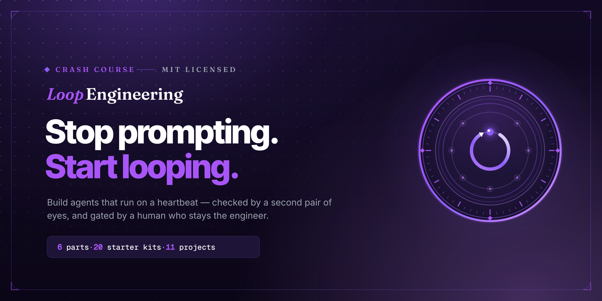

<!-- ─────────────────────────────  HERO BANNER  ───────────────────────────── -->
<p align="center">
  <a href="https://ayeshakhalid192007-dev.github.io/loop-lab/">
    
  </a>
</p>

<!-- ─────────────────────────────  TAGLINE  ───────────────────────────── -->
<h1 align="center">Loop Engineering — Landing Site</h1>

<p align="center">
  <strong>The front door to the Loop Engineering crash course.</strong><br />
  A fast, fully-static Next.js site that teaches one idea: <em>stop prompting, start looping.</em>
</p>

<!-- ─────────────────────────────  BADGES  ───────────────────────────── -->
<p align="center">
  <a href="https://github.com/ayeshakhalid192007-dev/loop-lab/actions/workflows/deploy.yml">
    
  </a>
  
  
  
  
  
  
</p>

<!-- ─────────────────────────────  QUICK LINKS  ───────────────────────────── -->
<p align="center">
  <a href="https://ayeshakhalid192007-dev.github.io/loop-lab/"><b>Live Demo</b></a> &nbsp;·&nbsp;
  <a href="https://github.com/ayeshakhalid192007-dev/LoopEngineering-CrashCourse"><b>Course Repo</b></a> &nbsp;·&nbsp;
  <a href="#-getting-started"><b>Getting Started</b></a> &nbsp;·&nbsp;
  <a href="#-project-structure"><b>Structure</b></a> &nbsp;·&nbsp;
  <a href="#-contributing"><b>Contributing</b></a>
</p>

---

## 📖 Table of Contents

- [Overview](#-overview)
- [Features](#-features)
- [Preview](#-preview)
- [Tech Stack](#-tech-stack)
- [Getting Started](#-getting-started)
- [Available Scripts](#-available-scripts)
- [Project Structure](#-project-structure)
- [The Autonomous Build System](#-the-autonomous-build-system)
- [What the Course Teaches](#-what-the-course-teaches)
- [Deployment](#-deployment)
- [Contributing](#-contributing)
- [License](#-license)
- [Acknowledgements](#-acknowledgements)
- [Contact](#-contact)

---

## 🔭 Overview

**Loop Engineering** is a hands-on crash course in building agents that run themselves — on a
heartbeat, checked by a second pair of eyes, and gated by a human who stays the engineer. The
course itself lives in a [separate repository](https://github.com/ayeshakhalid192007-dev/LoopEngineering-CrashCourse);
**this repository is its landing site** — the polished, single-page front door that invites people in
and points them at the material.

The site is a **fully static Next.js export** with no runtime backend, so it deploys anywhere and
loads instantly. Every word of copy and every outbound link is defined as typed data in
[`lib/`](lib/), which keeps the components presentation-only and the content easy to audit.

> **In one line:** a considered, accessible, theme-aware marketing page for a course about
> autonomous agent loops — designed to look as engineered as the subject it teaches.

---

## ✨ Features

| | |
|---|---|
| 🎨 **Distinctive brand system** | A warm olive / brass / sand palette, an editorial serif wordmark, and a hand-built loop-instrument emblem — no default template look. |
| 🌗 **Light & dark, done right** | Theme-aware via `next-themes`, with every colour token contrast-checked against WCAG AA in both modes. |
| ⚡ **Static & instant** | `output: "export"` produces plain HTML/CSS/JS — zero server, deployable to any static host. |
| ♿ **Accessible by default** | Semantic landmarks, a skip link, reduced-motion support, and a verified **0 axe-core violations**. |
| 🧩 **Content as typed data** | All copy and URLs live in [`lib/content.ts`](lib/content.ts) and [`lib/links.ts`](lib/links.ts) — components stay dumb. |
| 🎞️ **Purposeful motion** | Scroll reveals and a live loop terminal via `framer-motion`, all gated behind `prefers-reduced-motion`. |
| 📱 **Responsive to 375px** | Verified clean with zero horizontal overflow on small screens. |
| 🤖 **Built by an autonomous loop** | Assembled step-by-step by a self-paced build pipeline — [see below](#-the-autonomous-build-system). |

---

## 🖼 Preview

<p align="center">
  <a href="https://ayeshakhalid192007-dev.github.io/loop-lab/">
    
  </a>
</p>

<p align="center"><em>▶ &nbsp;<a href="https://ayeshakhalid192007-dev.github.io/loop-lab/">View the live site</a></em></p>

The page is composed of nine focused sections — hero, loop anatomy, building blocks, an
architecture schematic, the curriculum, the pattern library, a get-started walkthrough, a final
call-to-action, and the footer.

---

## 🛠 Tech Stack

| Layer | Choice |
|-------|--------|
| **Framework** | [Next.js 16](https://nextjs.org) (App Router, static export) |
| **Language** | [TypeScript 5](https://www.typescriptlang.org/) |
| **UI** | [React 19](https://react.dev/) |
| **Styling** | [Tailwind CSS v4](https://tailwindcss.com/) |
| **Animation** | [Framer Motion](https://www.framer.com/motion/) |
| **Theming** | [next-themes](https://github.com/pacocoursey/next-themes) |
| **Icons** | [lucide-react](https://lucide.dev/) |
| **Command palette** | [cmdk](https://cmdk.paco.me/) · [react-hotkeys-hook](https://react-hotkeys-hook.vercel.app/) |
| **Fonts** | Inter Tight · Inter · Fraunces · Geist Mono (via `next/font`) |
| **Tooling** | ESLint 9 · PostCSS |

---

## 🚀 Getting Started

### Prerequisites

- **Node.js 20+** (the deploy pipeline builds on Node 20)
- **npm** (or `yarn` / `pnpm` / `bun`)

### Installation

```bash
# 1. Clone the repository
git clone https://github.com/ayeshakhalid192007-dev/loop-lab.git
cd loop-lab

# 2. Install dependencies
npm install

# 3. Start the dev server
npm run dev
```

Open **[http://localhost:3000](http://localhost:3000)** in your browser. The page hot-reloads as
you edit — start with `app/page.tsx` or the content in `lib/content.ts`.

### Building for production

```bash
npm run build      # static export → ./out
npx serve out      # preview the real deployed artifact
```

---

## 📜 Available Scripts

| Script | What it does |
|--------|--------------|
| `npm run dev` | Start the local development server with hot reload. |
| `npm run build` | Produce the fully-static export in `out/` (must pass with zero warnings). |
| `npm run start` | Serve a production build. |
| `npm run lint` | Run ESLint — must be clean before any commit. |
| `npx serve out` | Serve the static export exactly as it will be deployed. |

---

## 🗂 Project Structure

```
loop-lab/
├── app/                    # Next.js App Router
│   ├── layout.tsx          # Root layout, fonts, metadata, theme provider
│   ├── page.tsx            # Page composition (nine sections)
│   ├── globals.css         # Design tokens + Tailwind layer
│   └── opengraph-image.tsx # Generated OG / social image
├── components/             # Presentation-only React components
│   ├── Hero.tsx            # Headline, CTAs, live loop terminal
│   ├── LoopAnatomy.tsx     # The six parts of a loop
│   ├── Architecture.tsx    # Layered system schematic
│   ├── Curriculum.tsx      # Six-part course outline
│   ├── PatternGrid.tsx     # Reusable loop patterns
│   ├── GetStarted.tsx      # Clone-and-go walkthrough
│   └── ui/                 # Primitives (buttons, emblem, spotlight card…)
├── lib/
│   ├── content.ts          # All copy, as typed data
│   └── links.ts            # All outbound URLs, single source of truth
├── assets/                 # README banner (PNG + SVG source)
├── public/                 # Static assets
├── next.config.ts          # Static export + GitHub Pages basePath
└── .github/workflows/      # Deploy to GitHub Pages
```

---

## 🤖 The Autonomous Build System

This site was not hand-assembled top to bottom — it was built by a **sequenced pipeline of
autonomous loops**, the very pattern the course teaches. The governance files at the repo root
(`LOOP.md`, `STATE.md`, `loop-constraints.md`, `loop-budget.md`) drive three loops:

```
build-loop ──(10 steps done)──▶ deploy-loop ──(verified)──▶ triage-loop
 self-paced                      human-gated deploy          daily, forever
```

- **build-loop** — implemented the site one plan step per iteration, each gated by an independent
  `loop-verifier` before commit.
- **deploy-loop** — builds and QAs the static export; a public deploy stays **human-gated**.
- **triage-loop** — a daily, report-only scan once the site is live.

It's a working example of the course's core thesis: agents that run on a heartbeat, verified by a
checker, with a human holding the gate.

---

## 🎓 What the Course Teaches

The [course repository](https://github.com/ayeshakhalid192007-dev/LoopEngineering-CrashCourse)
holds the real material — **6 parts, 20 starter kits, 11 projects**. The curriculum:

| Part | Title | Focus |
|:----:|-------|-------|
| **1** | The Shift | From prompting to looping; the four layers; anatomy of a loop |
| **2** | Heartbeat | In-session, conditional, scheduled, and event-driven loops |
| **3** | The Body | Worktrees, skills, MCP connectors, and maker–checker |
| **4** | The Spine | State that survives between runs |
| **5** | Complete Loop | Building a full loop twice, with real walkthroughs |
| **6** | Human Control | Staying the engineer, verification, and cost management |

**Pattern library:** PR Babysitter · Daily Triage · CI Sweeper · Dependency Sweeper ·
Issue Triage · Changelog Drafter — each with a ready-to-run starter kit.

---

## 🌐 Deployment

The site ships automatically to **GitHub Pages** on every push to `main`, via
[`.github/workflows/deploy.yml`](.github/workflows/deploy.yml):

1. `npm ci` and `npm run build` with `PAGES_BASE_PATH=/loop-lab` (so `/_next` assets resolve
   under the project subpath).
2. The static `out/` directory is uploaded as a Pages artifact.
3. `actions/deploy-pages` publishes it.

Because the export is 100% static, it deploys just as happily to **Vercel**, **Netlify**, **Cloudflare
Pages**, or any object store. For hosts that serve from the domain root, simply leave
`PAGES_BASE_PATH` unset.

---

## 🤝 Contributing

Contributions are welcome! To keep the project healthy:

1. **Fork** the repository and create a branch: `git checkout -b feature/your-idea`.
2. Make your change. Keep copy and links in `lib/` — components stay presentation-only.
3. **Verify before you commit:**
   ```bash
   npm run lint     # must be clean
   npm run build    # must pass with zero warnings
   ```
4. Commit with a clear message and **open a pull request** describing the change.

Please respect the accessibility and reduced-motion guarantees documented in
[`loop-constraints.md`](loop-constraints.md) — they are non-negotiable.

---

## 📄 License

Released under the **MIT License**. You are free to use, modify, and distribute this project with
attribution. See the [course repository's LICENSE](https://github.com/ayeshakhalid192007-dev/LoopEngineering-CrashCourse/blob/main/LICENSE)
for full terms.

---

## 🙏 Acknowledgements

- Loop anatomy after **Panaversity**.
- Starter-kit shape after **[cobusgreyling/loop-engineering](https://github.com/cobusgreyling)**.
- Built with **[Next.js](https://nextjs.org)** and the **[Geist](https://vercel.com/font)** &
  **[Fraunces](https://fonts.google.com/specimen/Fraunces)** typefaces.

---

<p align="center">
  <sub>Built on a heartbeat — checked, and human-gated. &nbsp;·&nbsp; <b>Stop prompting. Start looping.</b></sub>
</p>
