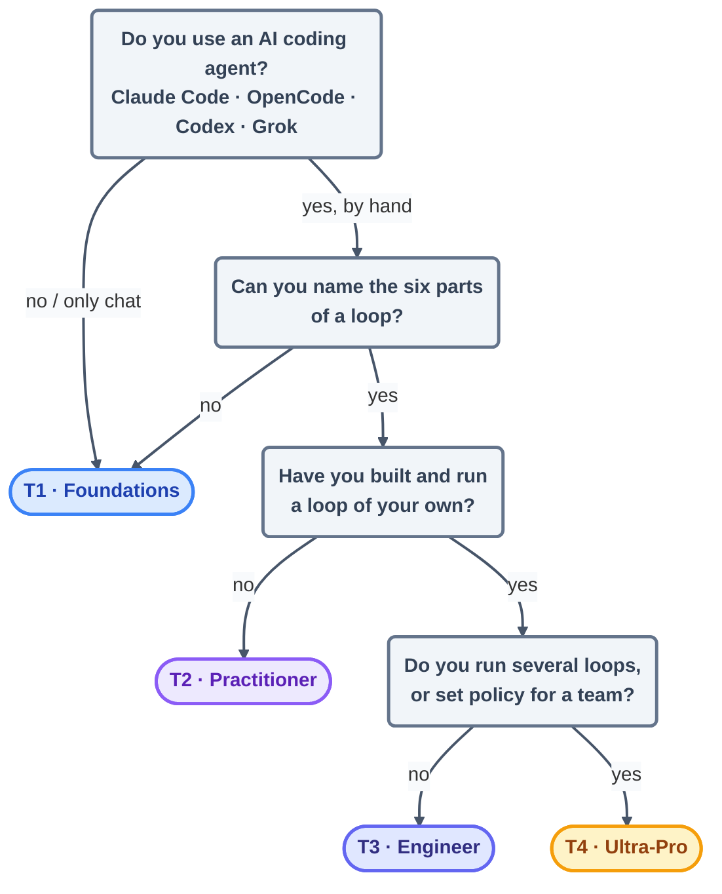

# Start Here — the 60-second router

> You are one honest answer away from knowing exactly where to begin. No account, no
> sign-up, no placement test — just read the four questions below and follow the arrow.

## The hook

Picture two developers opening this course on the same morning. One has never let an AI
agent take a single step unsupervised. The other already has a cron job quietly triaging
issues while they sleep. Send them both to "page one" and you fail them both: the first
drowns, the second yawns. This router exists so that neither of those is you.

## How the course is organized (plain English)

Think of this course as a **graded curriculum with four tracks**, not a flat stack of
pages you grind top to bottom. Each track is a small contract: an entry check ("here's
what you already know"), a body of study, hands-on labs, and an exit assessment. And here
is the important part — you don't graduate a track by *reading* it. You graduate by
*building* the thing it asks for.

## Find your track



| Your answer | Go to | First stop |
| --- | --- | --- |
| "I prompt an AI by hand (or not at all)" | **T1 · Foundations** | [01-prerequisites/environment-setup.md](../01-prerequisites/environment-setup.md) |
| "I know the six parts, never shipped a loop" | **T2 · Practitioner** | Part 2 · The Heartbeat *(opens Day 2)* |
| "I've shipped one loop" | **T3 · Engineer** | Part 5 · A Complete Loop *(opens Day 2)* |
| "I run fleets / set team policy" | **T4 · Ultra-Pro** | `advanced/` *(opens Day 3)* |

Want the full map — every entry check and every exit assessment spelled out?
[learning-tracks.md](learning-tracks.md)

## Check your tool is ready

Whatever track you land on, the price of admission is the same: one agent installed.
Confirm it in ten seconds.

```claude
# Claude Code
claude --version
```

```opencode
# OpenCode
opencode --version
```

Nothing installed yet? → [01-prerequisites/environment-setup.md](../01-prerequisites/environment-setup.md)

> [!NOTE]
> **Going deeper:** if the phrase "the six parts of a loop" means nothing to you yet,
> relax — that is not a gap, it is a *signal*. It points straight at T1, and the whole
> vocabulary gets built up gently, one piece at a time, in
> [02-foundations/mental-models.md](../02-foundations/mental-models.md).

## Check yourself

**Q: You've used Claude Code every day for months, but every single run is you typing a
prompt and watching it work. Which track?**

<details><summary>Answer</summary>

**T2 · Practitioner.** Daily hand-driven use means the prerequisites and foundations will
be fast review for you — but you have not yet built an autonomous loop, and that is
precisely what T2 exists to teach. (If "the six parts of a loop" still reads as a foreign
phrase, skim T1's foundations pages first; it costs you minutes.)

</details>

## Try With AI

Open any repo you genuinely do not care about, and ask your agent:

> "Read this repo and propose ONE task you could safely do repeatedly on a schedule,
> with a provable condition for when to stop."

Notice what you are *not* doing: you are not running anything yet. You are checking
whether **you** can tell a real stopping condition from a vague one. That judgment — not
the tool, not the prompt — is the skill this whole course is built to sharpen.

## When it goes wrong

| Symptom | Cause | Fix |
| --- | --- | --- |
| "Every track feels partly right" | Your skills are lopsided (deep on tools, new to loops) | Take the *lowest* track that still has something new; the entry checks are fast |
| "T1 feels too slow" | You skipped the entry check | Each track lists what you may skip — skip *pages*, never *labs* |
| "I picked T3 and I'm lost" | You're missing the Part 2–4 vocabulary | Drop back one track; the exit assessment will tell you when you're ready |

---

*Glossary terms used on this page:* **loop**, **heartbeat**, **stopping condition** —
all defined in [02-foundations/glossary.md](../02-foundations/glossary.md).

*Sources:* the graded-track structure follows the curriculum backbone of Panaversity's
*Loop Engineering: A Crash Course* ([S1](https://agentfactory.panaversity.org/docs/loop-engineering-crash-course)).
Full attribution: [resources/sources.md](../../resources/sources.md).
