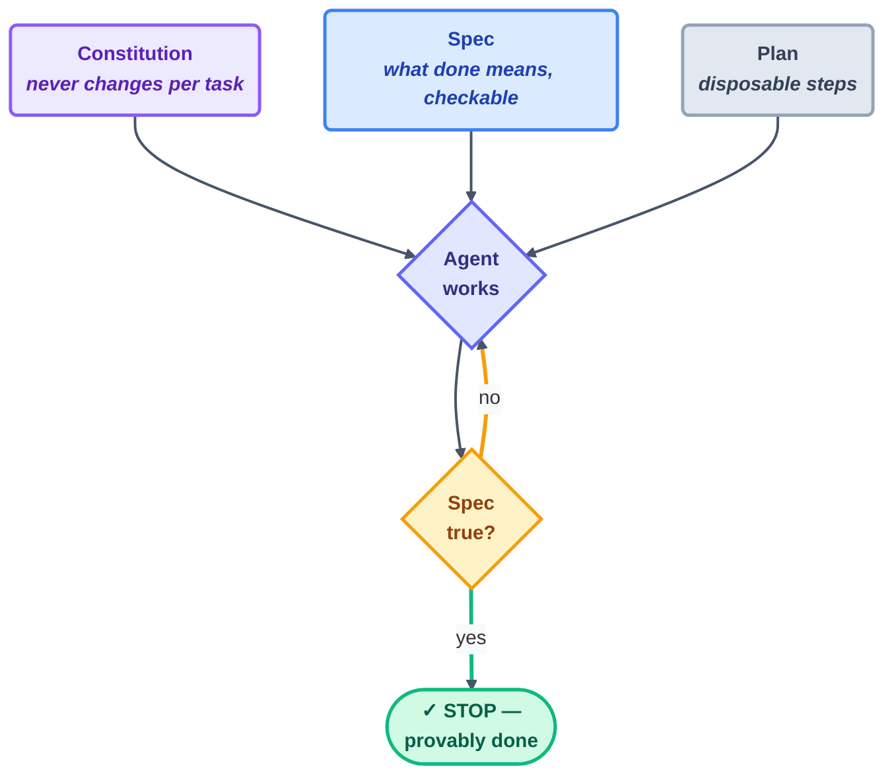

# Spec-Driven Primer

> Why "make it better" fails and "make this condition true" works — the thinking behind
> every stopping condition in this course.

## The hook

Two engineers hand the same bug to the same agent. One says: *"fix the flaky auth test."*
The other says: *"make `npm test` pass 10 consecutive runs with no changes to the test
files."* The first gets back something that *looks* fixed. The second gets back something
that **provably is** — and, crucially, can walk away from the keyboard while it happens.
Every bit of that difference is a spec.

## Vibe vs. spec (plain English)

**Vibe-driven** work steers by feel: prompt, squint at the result, prompt again. It's
perfectly fine while you're sitting there — and fatal the moment you're not. A loop
cannot ask your gut anything at 3 a.m.

**Spec-driven** work says out loud, up front and in checkable terms, what "done" actually
means. A spec has three layers, and keeping them separate is half the skill:

1. **The constitution** — standing rules that never change from task to task (your rules
   file: "never disable tests," "never touch `.env`").
2. **The spec** — what must become true for *this* task ("all links in `docs/` resolve").
3. **The plan** — the steps the agent proposes to satisfy the spec. Disposable by design;
   throw it away and regenerate it whenever you like.



## The 4-phase method

| Phase | You produce | Test of quality |
| --- | --- | --- |
| 1 · Specify | What & why, in checkable statements | Could a machine grade it? |
| 2 · Plan | How — architecture, constraints | Does it honor the constitution? |
| 3 · Tasks | Small, independently verifiable chunks | Can each be checked alone? |
| 4 · Implement | Working output, checked per task | Does the spec pass — not "does it feel done"? |

## Write one now

```claude
# Claude Code: plan mode is the spec-writing surface (shift+tab or /plan)
claude
> /plan Make every relative link in docs/ resolve. Done = a link checker
> exits 0. Constraint: never edit files outside docs/.
```

```opencode
# OpenCode: use the plan agent before letting the build agent touch files
opencode
> switch to plan: define done for "fix the docs links" as a command that exits 0,
> list the tasks, then wait for my approval.
```

> [!NOTE]
> **Going deeper:** in loop terms, the spec *is* the stopping condition — Part 2 takes
> this one idea and turns it into the three stops every loop declares (success, limit,
> no-progress). This repo's own Day 1 spec lives in `shared/goal.md`, and notice what it
> is: a definition of done, not a to-do list.

## Check yourself

**Q: "Stop when the code is clean." What's wrong with that spec, and what is the smallest
fix that repairs it?**

<details><summary>Answer</summary>

"Clean" is not machine-checkable — so the loop either never stops, or stops on a feeling.
Smallest fix: *name the checker* — e.g. "stop when `npm run lint` exits 0." The test is
brutal but reliable: if no tool can verify it, it's a vibe, not a spec.

</details>

## Try With AI

Take any small chore in your sandbox repo and write it three times over:

> 1. As a vibe: "improve the error handling."
> 2. As a spec: "every `catch` block logs the error and the process never exits 0 on failure — verified by `npm test`."
> 3. Ask your agent to critique both and say which one it could work on *unattended*, and why.

Keep the agent's answer somewhere. It is the very same reasoning you'll use to grade
every loop you design across the rest of this course.

## When it goes wrong

| Symptom | Cause | Fix |
| --- | --- | --- |
| Agent declares victory, work isn't done | The spec wasn't checkable ("feels done") | Restate done as a command with an exit code |
| Agent satisfies the letter, breaks the spirit | A spec with no constitution behind it | Add standing rules: what must never change |
| Perfect spec, chaotic execution | You skipped the plan/tasks phases | Break the work into independently verifiable chunks |
| Spec keeps growing mid-run | Scope creep wearing a disguise | Freeze the spec; new wants become the *next* spec |

---

*Attribution: this page condenses ideas from Panaversity's Spec-Driven Development
chapter ([S3](https://agentfactory.panaversity.org/docs/spec-driven-development-crash-course);
see also [../../resources/sources.md](../../resources/sources.md)).*

*Glossary terms used on this page:* **spec**, **constitution**, **stopping condition** —
see [../02-foundations/glossary.md](../02-foundations/glossary.md).
