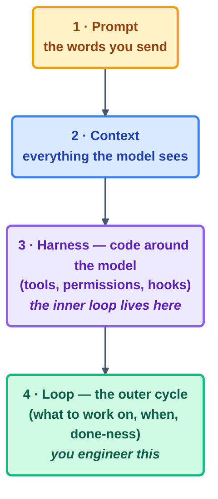

# Core Concepts

> Intent debt, comprehension debt, and the harness-vs-loop distinction — the three ideas
> that explain most loop failures *before* they happen.

## The hook

A team ships a flawless-looking week of agent-written code. Fast-forward to month two:
nobody can explain why a certain module exists, the loop keeps "fixing" something nobody
asked it to touch, and the one engineer who understood the whole setup is on vacation.
Nothing crashed. Nothing threw an error. And yet two invisible debts just came due on the
same afternoon.

## Intent debt (plain English)

**Intent debt** is the accumulated gap between what you *meant* and what you actually
*specified*. A hand-driven session pays this off constantly — you see each result and
quietly course-correct. A loop pays off nothing. It faithfully executes the written goal,
at scale, unattended. Every vague word in your spec is a small loan the loop will one day
collect on, with interest.

**You pay it down by:** writing stopping conditions a machine can check, and keeping a
constitution of things that must never change (see the
[spec-driven primer](../01-prerequisites/spec-driven-primer.md)).

## Comprehension debt

**Comprehension debt** is shipping changes that no human on the team understands. Loops
rack it up faster than any human coder ever could — because they never *need* to
understand, and, quietly, neither do you. It is the debt hiding behind that dreaded
sentence: "the code works and nobody knows why."

**You pay it down by:** small beats (one reviewable unit per run), human gates placed
exactly where understanding matters (PR review, checkpoint declarations), and run logs
that tell you what changed and why.

## Harness vs. loop

The **harness** is the software shell your agent vendor built for you: tool execution,
error handling, permissions. The **loop** is the management system *you* build around it.
Confuse the two and you get real design bugs — expecting the harness to know when work is
finished (it can't; that's the loop's stopping condition), or hand-rolling tool plumbing
the harness already does better than you will.

The rule of thumb worth taping to your monitor: **guarantees live in the harness**
(permissions, hooks); **judgment lives in the loop** (what, when, done, checked).

> [!NOTE]
> **Going deeper:** the full four-layer stack this sits inside gets its own page —
> [the-four-layers.md](the-four-layers.md). The two debts get told as war stories in
> Part 6 (Day 2).

## Check yourself

**Q: Overnight, a loop renamed 40 functions "for clarity," and every single rename is
defensible. The team is furious anyway. Which debt is this, and which loop part was
missing?**

Answer

**Comprehension debt** — defensible or not, the team no longer recognizes its own
codebase. The missing part is the **human gate** (backed by a scope-limiting spec): "one
fix per run, nothing unrelated" belongs in the loop's constitution, and a human should
approve sweeping changes *before* they land.

## Try With AI

Take a task you'd genuinely trust an agent with, and ask it:

> "Before doing anything: list every way your interpretation of this task could
> differ from what I probably mean."

Every item in its answer is intent debt, priced *before* you borrowed it. Keep tightening
the task statement until that list gets boring.

## When it goes wrong

| Symptom | Cause | Fix |
| --- | --- | --- |
| Loop does the goal, result feels wrong | Intent debt — spec ≠ intent | Tighten the spec; add the missing constraint to the constitution |
| "Works, but nobody can review it" | Comprehension debt from giant beats | Shrink the unit of work; gate on human review |
| Loop "can't tell it's finished" | Done-ness expected from the harness | Stopping conditions are loop-layer; write one that exits 0 |
| Guardrail keeps getting talked around | The guarantee was placed in prose | Move it to permissions/hooks — the harness can't be persuaded |

---

*Glossary terms used on this page:* **intent debt**, **comprehension debt**,
**harness**, **human gate** — see [glossary.md](glossary.md).

*Sources:* this concept set condenses the fifteen concepts of Panaversity's *Loop
Engineering: A Crash Course*
([S1](https://agentfactory.panaversity.org/docs/loop-engineering-crash-course)). Full
attribution: [resources/sources.md](../../resources/sources.md).
