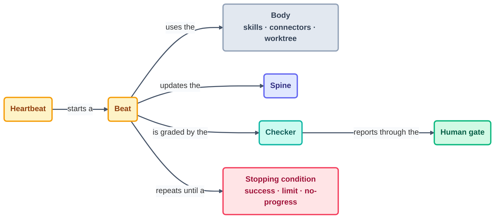

# Glossary

> Every term this course leans on, defined once and linked from everywhere. Keep this page
> open in a spare tab — the popovers on the website are generated straight from these
> entries.

## Core

**Loop Engineering** — the practice of designing the *system* that prompts an AI agent
(its trigger, instructions, guardrails, verification, state, and logging) rather than
prompting it by hand.

**Loop** — a system that repeatedly runs an agent toward a spec'd outcome without a
human driving each run. Declared by its six parts (below).

**The six parts** — every production loop declares: a **heartbeat** (when it runs), a
**body** (what it can do), a **spine** (what it remembers), a **stopping condition**
(when it's done), a **checker** (who verifies), and a **human gate** (where a person
decides).

**Beat** — one iteration of a loop: wake, do one unit of work, update the spine, log,
sleep.

**Agent** — the AI coding tool doing the work inside the loop (Claude Code, OpenCode,
Codex, Grok). The agent is the engine; the loop is the vehicle.

**Harness** — the software shell around the model: permissions, tools, hooks, context
management. Guarantees live in the harness; intent lives in prompts and rules.

## The six parts, expanded

**Heartbeat** — the trigger that starts a beat: in-session, conditional
(run-until-done), scheduled, or event-driven.

**Body** — the capabilities a loop may use: files it can write, tools it can call,
skills it has, connectors (MCP) it reaches.

**Spine** — durable state between runs (a state file). An interrupted loop with a
spine *resumes*; without one it *restarts*.

**Stopping condition** — a machine-checkable definition of done. The three valid
stops: **success** (condition met), **limit** (run cap hit), **no-progress** (nothing
changed for N beats). "Feels done" is not a stop.

**Checker** — the separate reviewer of the loop's output. **Maker ≠ checker:** a loop
never grades its own work.

**Human gate** — the placed decision a person must make (approve a PR, review
findings, declare a checkpoint). Loops draft; humans stand behind what ships.

## Operating vocabulary

**L1 / L2 / L3** — permission levels for a loop's first weeks: **L1 report-only**
(observe and write findings), **L2 assisted** (propose or apply fixes with review),
**L3 unattended** (act within guardrails). Every loop starts at L1.

**Spec** — a checkable statement of what must become true. See the
[spec-driven primer](../01-prerequisites/spec-driven-primer.md).

**Constitution** — standing rules that never change per task ("never disable tests");
lives in the rules file.

**Rules file** — standing instructions loaded every session (`CLAUDE.md`,
`AGENTS.md`).

**Run log** — one appended line per beat, the loop's flight recorder. Silent runs are
a failure mode.

**Budget** — the token/run ceiling a loop respects; at 80% it goes report-only, at
100% it stops.

**Kill switch** — a flag (here: `loop-pause-all`) that makes every loop exit at the
start of its next beat.

**Doom loop** — a loop stuck re-attempting the same failing change; broken by run
limits and no-progress stops.

**Intent debt** — accumulated gap between what you meant and what you specified; the
loop faithfully executes the wrong thing.

**Comprehension debt** — shipping changes nobody on the team understands; prevented
by human gates and small beats.

**Hill-climbing loop** — a loop that measurably improves something each beat (T4
material), not just maintains it.

**Loopcraft** — the layered stack: agent loop → verification loop → event loop →
hill-climbing loop.

**Loop Ready** — this course's certification bar: a loop with all six parts declared,
operated within budget, with a human gate that held.

## Tool vocabulary (mechanical layer — look up, don't memorize)

**Skill** — a packaged instruction set an agent can invoke by name.
**Hook** — code the harness runs on an event (pre-edit, post-run); unbypassable.
**Subagent** — a scoped worker session spawned for a subtask.
**MCP (Model Context Protocol)** — the standard for connecting agents to external
tools and data ("connectors").
**Worktree** — an isolated git checkout so a loop's changes can't collide with yours.
**Plan mode** — the agent proposes before acting; the rehearsal space for specs.

## How the vocabulary fits together

Open any page in this course, and every bold term on it lands somewhere on this one
picture. That's the whole point of learning the vocabulary first.

## Check yourself

**Q: Cover the "six parts" section above and name all six from memory — with the job of
each.**

Answer

Heartbeat (when it runs) · body (what it can do) · spine (what it remembers) · stopping
condition (when it's done) · checker (who verifies) · human gate (where a person decides).
That right there is the lasting layer of this entire course.

## Try With AI

Paste any three definitions from this page into your agent and ask:

> "Which of these three does *your* harness already give me for free, and which would
> I have to build in the outer loop?"

Its answer sorts the vocabulary into harness-given vs. loop-engineered — the exact
boundary [concepts.md](concepts.md) is built to teach.

## When it goes wrong

| Symptom | Cause | Fix |
| --- | --- | --- |
| Team uses "loop" for both cycles | The inner/outer distinction isn't shared | Point everyone at **beat**: one inner run = one outer beat |
| "It has a stopping condition" (it means "when it looks done") | A vibe wearing a spec's name | A stop must be one of the three: success, limit, no-progress |
| Glossary drift — pages redefine terms locally | Definitions duplicated instead of linked | Define once here; pages link, never restate |

---

*Sources:* terminology adapted from Panaversity's *Loop Engineering: A Crash Course*
([S1](https://agentfactory.panaversity.org/docs/loop-engineering-crash-course)), Addy
Osmani's *Loop Engineering* ([S5](https://addyosmani.com/blog/loop-engineering/)), Sydney
Runkle's *The Art of Loop Engineering*
([S6](https://www.langchain.com/blog/the-art-of-loop-engineering)), and
cobusgreyling/loop-engineering ([S7](https://github.com/cobusgreyling/loop-engineering)).
Full attribution: [../../resources/sources.md](../../resources/sources.md).
