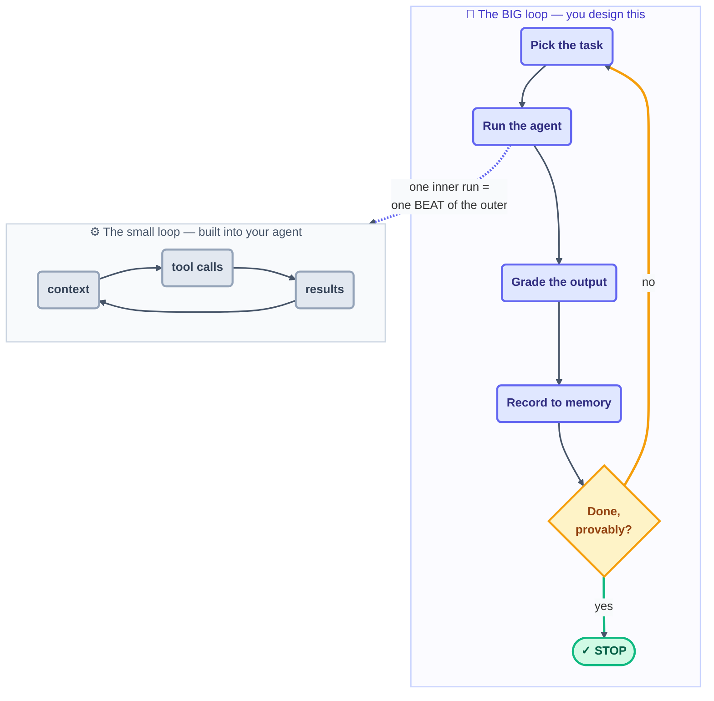

# Mental Models

> Three pictures to carry in your head for the whole course: the operator you're
> replacing, the two loops that unfortunately share one name, and the body a loop is
> built like.

## The hook

For roughly two years, "using a coding agent" meant nursing the tool one turn at a time:
write a prompt, read the result, type the next thing. Now zoom out and watch the person
doing that all day — finding the work, handing it out, checking it, recording what
happened, deciding what comes next. **Loop engineering replaces that operator with a
small system you design once.** The agent didn't suddenly get smarter. The *management*
around it did.

## Model 1 — you move up one seat (plain English)

Here's the reassuring part: your value doesn't evaporate when the operator is automated.
It *concentrates* — at the two ends a loop can never own for you.

- **Intent** — stating what you want precisely enough that the result can be *checked*.
- **Accountability** — standing behind whatever ships.

Everything in between — triggering, doing, verifying, logging — is now the loop's job,
not yours.

## Model 2 — two loops share the name

The **small/inner loop** is the agent's own `context → tool calls → results → repeat`
cycle. Its only native way to stop is the model's own self-assessment — which is the
source of every confident-but-wrong "Done!" you have ever been handed. The **big/outer
loop** is the manager wrapped around it: it chooses the task, sets the timing, does the
grading, keeps the memory. Hold onto this one line: one inner-loop run is exactly **one
beat** of the outer loop.

## Model 3 — the loop as a body

| Body part | Loop part | Job |
| --- | --- | --- |
| Heart | **Heartbeat** | starts each beat (schedule, event, condition) |
| Spine | **State file** | durable memory so runs compound, not restart |
| Hands | **Connectors (MCP)** | act on the world, not just suggest |
| Immune system | **Checker** | grades output; maker never grades itself |
| Skeleton | **Worktree/isolation** | parallel work that can't collide |
| Trained reflexes | **Skills** | project knowledge written once, read each run |

> [!NOTE]
> **Going deeper:** the body metaphor comes from Addy Osmani's *Loop Engineering*
> ([S5](https://addyosmani.com/blog/loop-engineering/)), and the six-part anatomy from
> the Panaversity backbone ([S1](https://agentfactory.panaversity.org/docs/loop-engineering-crash-course)).
> Part 1 (Day 2) takes each part apart in depth.

## Check yourself

**Q: Your agent announces "All tests pass, task complete!" — which loop produced that
claim, and why shouldn't the outer loop take it at face value?**

Answer

The **inner** loop: it stopped on the model's self-assessment. The outer loop treats that
as a *signal to verify*, never as a verdict — its checker runs the tests itself
(maker ≠ checker). Green from the maker is a claim. Green from the checker is a fact.

## Try With AI

Ask your agent:

> "Walk me through your own loop: what starts your turn, what do you see, what tools
> can you call, and what makes you decide you're finished?"

Now map its answer onto the inner-loop diagram above. Pay special attention to the last
part of its reply — *how it decides it's finished*. That single gap is the entire reason
the outer loop exists.

## When it goes wrong

| Symptom | Cause | Fix |
| --- | --- | --- |
| "The agent said done but it isn't" | You trusted the inner loop's self-stop | Add an outer-loop checker with a machine-checkable stop |
| Same mistake every morning | No spine — each run starts amnesiac | Add a state file; read it first, update it every beat |
| You babysit every run anyway | Intent was never made checkable | Rewrite the goal as a spec (see the [spec-driven primer](../01-prerequisites/spec-driven-primer.md)) |

---

*Glossary terms used on this page:* **beat**, **spine**, **checker**, **heartbeat** —
see [glossary.md](glossary.md).

*Sources:* the two-loop and body metaphors come from Addy Osmani's *Loop Engineering*
([S5](https://addyosmani.com/blog/loop-engineering/)) and the six-part anatomy of
Panaversity's *Loop Engineering: A Crash Course*
([S1](https://agentfactory.panaversity.org/docs/loop-engineering-crash-course)). Full
attribution: [resources/sources.md](../../resources/sources.md).
