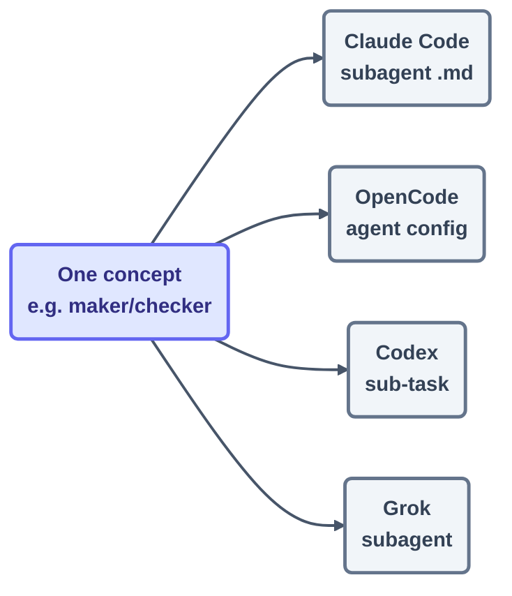

# Primitives Matrix — cross-tool mapping

> One table that translates any lesson in this course into *your* agent's dialect.

## The hook

Every lesson here shows Claude Code and OpenCode side by side — but your team runs Codex,
or Grok, or honestly all four. Good news: the concepts transfer perfectly, and only the
names change. This matrix is the phrasebook that makes the translation trivial.

## How to read it (plain English)

Rows are the eight primitives from [primitives.md](primitives.md). Columns are tools. Each
cell holds the tool's *name* for the idea — deliberately not the current command, which
belongs to the tool's live docs (linked in the header). The discipline in one line:
**memorize rows, look up cells.**

## The matrix

| Primitive | Claude Code ([docs](https://docs.claude.com/en/docs/claude-code)) | OpenCode ([docs](https://opencode.ai/docs)) | Codex (OpenAI docs) | Grok (xAI docs) |
| --- | --- | --- | --- | --- |
| **Rules file** | `CLAUDE.md` | `AGENTS.md` | `AGENTS.md` | `.grok/GROK.md` |
| **Permissions** | permission modes, `/permissions` | `opencode.json` → `permission` | approval modes / sandbox | permission prompts |
| **Plan mode** | plan mode (shift+tab) | `plan` agent | plan/suggest mode | read-only mode |
| **Skills** | `.claude/skills/*/SKILL.md` | `skills/` directory | skills / custom prompts | `.grok/skills/` |
| **Hooks** | `settings.json` → hooks | plugin hooks | lifecycle hooks | — (use CI as the guard) |
| **Subagents** | `.claude/agents/*.md` | `agent` config | sub-tasks | subagents |
| **MCP / connectors** | `claude mcp add` | `opencode.json` → `mcp` | MCP config | MCP config |
| **Headless / loop driver** | `claude -p`, `/loop`, Cron tools | `opencode run` + cron/Actions | `codex exec` + cron | `grok --prompt` + cron |

> [!WARNING]
> **Cells rot; rows don't.** Tool vocabularies shift monthly — when a cell disagrees with
> the tool's live docs, trust the docs and open a `content-fix` issue. The row itself —
> *that every serious agent has this primitive* — is the part that lasts.

> [!NOTE]
> **Going deeper:** the per-tool cheatsheets (Day 3) expand each column into a printable
> page, and every prebuilt loop in the library ships configs for at least two columns.
> The coverage policy lives in `loop-plan.md` §16.

## Check yourself

**Q: A teammate says "we can't adopt this course — we're a Codex shop and the examples are
Claude Code." What's the two-sentence rebuttal this page hands you?**

Answer

Every lesson teaches primitives that all four tools share — the matrix maps each one to
Codex's names, and the lasting layer (the rows) is identical across tools. Only the
cell-level commands differ, and those you'd be looking up in live docs no matter which
tool you were on.

## Try With AI

Paste the matrix into your agent and ask:

> "Audit this row-by-row for [your tool]. Which cells are out of date against your
> current documentation, and what's the correct current name?"

File anything it catches as a `content-fix` issue — and just like that, you've made your
first attribution-grade contribution to this repo.

## When it goes wrong

| Symptom | Cause | Fix |
| --- | --- | --- |
| Command from a cell fails | Cell rot — the mechanics moved on | Tool's live docs win; file a `content-fix` issue |
| A tool "has no" primitive you need | Different name, same shape | Read the whole column; check the tool's changelog |
| Team split across tools can't share loops | Loops written in one dialect | Write loops as six-part declarations; port per-column |

---

*Sources:* cross-tool comparisons adapted from cobusgreyling/loop-engineering's per-tool
examples ([S7](https://github.com/cobusgreyling/loop-engineering), MIT). Full attribution:
[../../resources/sources.md](../../resources/sources.md).

*Glossary terms used on this page:* **primitive**, **lasting vs mechanical layer** —
see [glossary.md](glossary.md).
