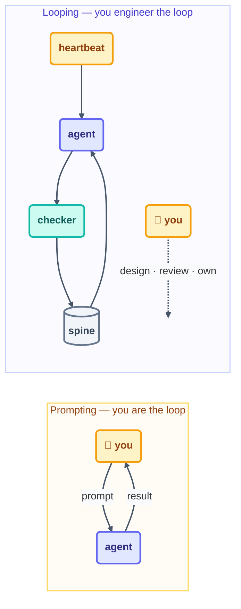

# Step 1 · From Prompting to Looping

> The single shift this entire course hangs on: stop sending instructions one at a time,
> and start engineering the system that sends them for you.

## The hook

It's 9:14 am. You've typed "now fix the failing test" for the eleventh time today, pasted
the same stack trace twice, and re-explained the project layout the agent quietly forgot
overnight. Be honest about what that is: it isn't engineering. It's *dispatch* — and
dispatch is precisely the job a loop was born to hold.

## The shift (plain English)

**Prompting** is driving the agent by hand. You pick the next unit of work, you send it,
you read the result, and you decide again. The intelligence lives in the model. The
management lives in you — and every single cycle spends your attention.

**Looping** lifts that management out of your head and into a system you design once. A
heartbeat decides *when* the agent runs. A spine decides *what* it works on. A provable
stop decides *when* it's finished. None of it needs you in the chair. You stop dispatching
work and start engineering the dispatcher.

And here's the part people miss: the shift deliberately keeps two things with you —
**intent and accountability**. The loop inherits your typing, never your judgment. You
still decide what "good" means. You still review what ships. You still answer for the
result.

## Prompting vs. looping

| | Prompting (by hand) | Looping (engineered) |
| --- | --- | --- |
| Who picks the next task | you, every time | the spine (state file) |
| When work happens | when you're at the keyboard | on a heartbeat you chose |
| When it stops | when you stop | when a provable condition is met |
| Who checks the work | you, informally | a separate checker, every beat |
| What survives a crash | your memory | the spine + run log |
| Your role | dispatcher | engineer, reviewer, owner |



## The same task, both ways

Here is one task — fix the first failing test — written both ways, in each tool. The
prompting version you type every cycle. The looping version you type once, and walk away.

```claude
# Claude Code — live docs: https://docs.claude.com/en/docs/claude-code
# Prompting: you type this, wait, read, type the next one…
> fix the first failing test in tests/

# Looping: you type this ONCE; the loop manages the cycle
> /loop Run the test suite. Fix the FIRST failing test only. Log one
  line to loop-run-log.md. Stop when the suite passes.
```

```opencode
# OpenCode — live docs: https://opencode.ai/docs
# Prompting: one instruction per session, by hand
opencode run "fix the first failing test in tests/"

# Looping: a capped shell loop carries the cycle instead of you
for i in $(seq 1 10); do
  opencode run "Run the tests. Fix the FIRST failure only. Exit if green."
done
```

> [!NOTE]
> **Going deeper:** the loop above already carries four of the six parts you'll meet in
> [Step 3](03-anatomy-of-a-loop.md) — a heartbeat, a body, a stop, and a limit. The same
> shift is approached from the spec side in the
> [spec-driven primer](../01-prerequisites/spec-driven-primer.md).

## Check yourself

**Q: "I prompt the agent 40 times a day, so I'm basically already looping." What's missing
from that picture?**

<details><summary>Answer</summary>

The *system* is missing. Those 40 prompts have no heartbeat, so they only fire when you're
free. They have no spine, so each one starts from your memory. They have no provable stop
and no checker but your tired eyes. Prompting a lot is not looping. Looping is when the
deciding, remembering, and stopping are engineered to happen **without you in the chair**.

</details>

## Try With AI

Pick a task in a throwaway repo that you'd normally do in 5–10 manual prompts — say, "add
docstrings to every function in `src/`." Do three of them by hand first, and watch closely
what *you* decide between prompts. Now write those decisions down as one loop prompt with a
stop ("stop when every function has a docstring") and a limit ("max 10 runs"), and run it.
Compare the two transcripts. Everything you stopped typing is exactly what the loop now
owns.

## When it goes wrong

| Symptom | Cause | Fix |
| --- | --- | --- |
| Loop runs but results miss the point | You automated the typing, not the intent | Write the goal + constraints into the prompt/spec before looping it |
| "It never knows when it's finished" | The stop condition lives in your head | Make the stop provable: a file state, a green suite, an empty checklist |
| You check every beat anyway | No trusted checker | Add a separate checker (Step 11) and a human gate where judgment matters |
| Fires while you're away, work is wrong by morning | Looping before proving | Start report-only (L1); earn autonomy one level at a time |

---

*Glossary terms used on this page:* **loop**, **heartbeat**, **spine**, **intent
debt**, **human gate** — see the [glossary](../02-foundations/glossary.md).

*Sources:* the shift and the prompting-vs-looping contrast come from Panaversity's *Loop
Engineering: A Crash Course*
([S1](https://agentfactory.panaversity.org/docs/loop-engineering-crash-course)) and Addy
Osmani's *Loop Engineering* ([S5](https://addyosmani.com/blog/loop-engineering/)); the
origin quotes from Peter Steinberger & Boris Cherny's public statements
([S8](https://x.com/steipete)). Full attribution:
[resources/sources.md](../../resources/sources.md).
