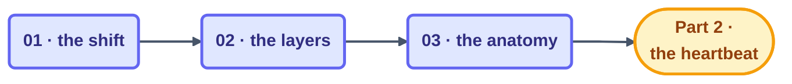

# Part 1 · The Shift

> From prompting to looping: what actually changes, which layer you're standing in, and
> the six-part anatomy every loop shares. This part is pure mental model — the machinery
> gets switched on in [Part 2](../04-part-2-heartbeat/README.md).

## The steps

| Step | Page | One-line takeaway |
| --- | --- | --- |
| 01 | [From Prompting to Looping](01-from-prompting-to-looping.md) | Move the management, keep the intent and the accountability |
| 02 | [The Four Layers](02-the-four-layers.md) | Prompt → context → harness → loop; fix problems at the right layer |
| 03 | [Anatomy of a Loop](03-anatomy-of-a-loop.md) | Six parts, every loop: heartbeat, body, spine, stop, checker, gate |

## Before you start

Comfortable driving an AI coding agent by hand? If not, take the short detour through the
[agentic coding primer](../01-prerequisites/agentic-coding-primer.md) first — this part
assumes it. And keep the [glossary](../02-foundations/glossary.md) open in a tab; the bold
terms below all live there.

## Check your understanding

Once the three steps are behind you: [take the Part 1 quiz](quiz.md) ·
[drill the flashcards](flashcards.md).

*This part belongs to track [T1 · Foundations](../00-start-here/learning-tracks.md).*

*Sources:* Part 1 draws on Panaversity's *Loop Engineering: A Crash Course*
([S1](https://agentfactory.panaversity.org/docs/loop-engineering-crash-course)), Addy
Osmani's *Loop Engineering* ([S5](https://addyosmani.com/blog/loop-engineering/)), Sydney
Runkle's *The Art of Loop Engineering*
([S6](https://www.langchain.com/blog/the-art-of-loop-engineering)), and Peter Steinberger
& Boris Cherny's public statements ([S8](https://x.com/steipete)). Full attribution:
[resources/sources.md](../../resources/sources.md).
