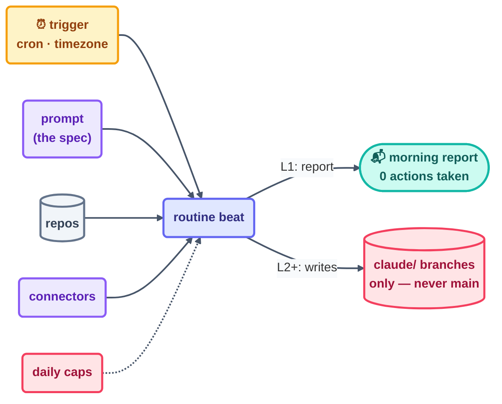

# Step 6 · Unattended Schedules

> The first heartbeat that beats while you sleep. Everything you practiced in-session now
> runs with nobody watching — which is exactly why the guardrails come first, not last.

## The hook

Monday, 7:00 am: a triage report is already sitting in your inbox — every new issue
labeled, duplicates linked, one flaky test flagged with its suspect commit. Nobody was
awake to do it. And the report closes with the single line that makes this reassuring
rather than spooky: *"3 findings, 0 actions taken — awaiting your review."* Report-only, on
a schedule.

## Unattended schedules (plain English)

An **unattended schedule** runs your loop at fixed times with no session and no human
present. The canonical shape is the cloud-side **routine** — and every routine, in any
tool, decomposes into the same four parts:

1. **The prompt** — the beat's job, written like a spec (it will be read by a worker with
   no memory of you and no chance to ask a follow-up).
2. **The repos** — what code or content the beat may see and touch.
3. **The connectors** — what external systems it may reach (issues, mail, chat).
4. **The trigger** — the schedule itself: cron expression, timezone, cadence.

"Unattended" means *ungated in the moment*. So the gates have to move into the design
up front:

- **Daily run caps**, so a stuck trigger can't quietly run all night.
- **A guardrail branch namespace** — schedules that may only push to `claude/`-prefixed
  branches, never `main`.
- **L1 report-only** until the loop has earned writes, with a human watching its output
  across real mornings.



## The mechanics in each tool

Each tool schedules the same four parts — prompt, repos, connectors, trigger — with a
cloud option and a local-cron fallback:

```claude
# Claude Code — live docs: https://docs.claude.com/en/docs/claude-code
# Cloud routines (scheduled agents): prompt + repos + connectors + trigger,
#   with daily caps and the claude/ branch guardrail — see the /schedule
#   flow or the live docs "scheduled agents" page.
# Local fallback — headless mode under your OWN cron:
#   0 7 * * 1-5  claude -p "Triage new issues. Report only." >> triage.log
# Desktop app scheduled tasks cover the same shape on a personal machine.
```

```opencode
# OpenCode — live docs: https://opencode.ai/docs
# Same shape via system cron:
#   0 7 * * 1-5  opencode run "Triage new issues. Report only."
# …or GitHub Actions as the scheduler (runs even when your machine is off):
#   on: { schedule: [ { cron: "0 7 * * 1-5" } ] }
#   jobs: { triage: { steps: [ run: opencode run "..." ] } }
```

> [!NOTE]
> **Going deeper:** the full field-by-field routine walkthrough lives in the Routines
> appendix (Day 3). But the dogfooding version is in this repo *right now*:
> [`loops/day1/link-check/`](../../loops/day1/link-check/loop.md) is a 30-minute schedule
> that was later promoted into CI — the natural end of a schedule that proves itself out.

## Check yourself

**Q: Your overnight routine has permission to push. Why does "it may only push to
`claude/`-prefixed branches" beat "it will be careful with `main`" — and which layer is
each guarantee living in?**

<details><summary>Answer</summary>

The prefix rule lives in the **harness/platform layer** — enforced by machinery that
cannot be persuaded, so the worst overnight outcome is a weird branch you delete over
coffee. "Careful with `main`" lives in the **prompt layer** — a polite request to a worker
under no supervision. Guarantees in the harness, judgment in the loop
([Step 2](../03-part-1-the-shift/02-the-four-layers.md)). At 3 am, only the first kind
holds.

</details>

## Try With AI

Design — don't run — your first morning routine on paper: write the four parts (the prompt
as a report-only spec, the one repo it may read, zero connectors, and a weekday 7 am
trigger with a daily cap of 1). Then ask your agent to red-team it: "What's the worst thing
this routine could do as written?" If the honest answer is worse than "send a useless
report," tighten it before it ever runs for real.

## When it goes wrong

| Symptom | Cause | Fix |
| --- | --- | --- |
| Woke to 40 identical PRs | No daily cap + a retrying trigger | Caps on runs *and* on outputs; dedupe against the spine |
| Routine pushed straight to main | Missing branch guardrail | `claude/`-style prefix enforcement; protected branches; PR-only |
| Report was green, work was wrong | Green ≠ done | Read the *output*, not the status; keep the human gate on results |
| Ran overnight before ever running watched | Trust skipped a level | L1 for real mornings first; promote one level at a time |

---

*Glossary terms used on this page:* **routine**, **trigger**, **L1/L2/L3**, **human
gate**, **green ≠ done** — see the [glossary](../02-foundations/glossary.md).

*Sources:* Routines and unattended scheduling come from Panaversity's *Loop Engineering: A
Crash Course* ([S1](https://agentfactory.panaversity.org/docs/loop-engineering-crash-course))
and *Scheduled Tasks: The Loop Skill & Cron Tools*
([S4](https://agentfactory.panaversity.org/docs/loop-engineering-crash-course)), plus the
`cobusgreyling/loop-engineering` reference repo
([S7](https://github.com/cobusgreyling/loop-engineering), MIT). Full attribution:
[resources/sources.md](../../resources/sources.md).
