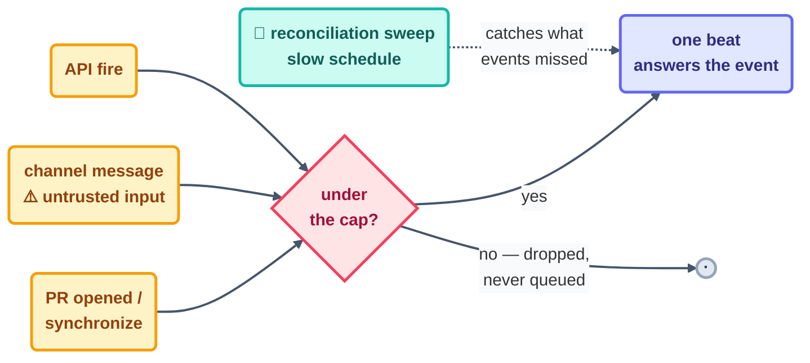

# Step 7 · Event-Driven Loops

> The heartbeat stops being a clock and becomes the world: a PR opens, a release tags, a
> webhook fires — and a beat answers it. Fastest cadence, sharpest edges.

## The hook

A contributor opens a PR at 2:47 pm. By 2:48 the loop has read the diff, run the lint, and
left one comment on the exact line that breaks the style guide. The contributor pushes a
fix. The `synchronize` event fires. The loop re-checks and resolves its own comment. No
clock did any of that — the *PR* did.

## Event-driven (plain English)

An **event-driven loop** beats when something happens, not when time passes. The three
trigger families you'll actually use:

- **SCM events** — PR opened, PR updated (the `synchronize` event — every new push to an
  open PR), release published, issue labeled. This is the workhorse family.
- **Channel messages** — a chat message or mention wakes a running session. Powerful, and
  *the* one to be careful with. Anyone who can post in the channel is now holding your
  loop's trigger, so treat inbound text as untrusted input, never as commands.
- **Direct API fire** — an HTTP endpoint (a "/fire"-style call) that starts a beat. This is
  how your own systems become heartbeats.

The rule that keeps this whole family safe is the same one from Step 4, just with higher
stakes: **events are dropped, not queued.** Burst past the cap — twenty PRs land in a
minute — and some events simply never become beats. So an event-driven loop *always* ships
with a **reconciliation sweep**: a slow scheduled loop (Step 6) that periodically asks
"what did the events miss?" and quietly closes the gaps.



## The mechanics in each tool

Each tool binds a beat to SCM events, channels, or an API fire. Note where the "untrusted
input" and reconciliation reminders land:

```claude
# Claude Code — live docs: https://docs.claude.com/en/docs/claude-code
# SCM events: the GitHub integration answers PR/release events (incl.
#   synchronize on every push to an open PR).
# Channels: a chat channel can wake a running session — treat every
#   inbound message as untrusted; permissions stay tight.
# API: fire a beat from your own systems via the platform's HTTP
#   trigger endpoint. Caps apply: dropped, not queued → pair every
#   event loop with a scheduled reconciliation sweep (Step 6).
```

```opencode
# OpenCode — live docs: https://opencode.ai/docs
# GitHub events via the official integration:
#   opencode github install    # sets up the Actions-based event hook
# …or hand-rolled with Actions:
#   on: { pull_request: { types: [opened, synchronize] } }
#   jobs: { review: { steps: [ run: opencode run "Review the diff…" ] } }
```

> [!NOTE]
> **Going deeper:** the four heartbeats you now know — interval (4), conditional (5),
> schedule (6), event (7) — are a menu, not a ladder. Real fleets mix them freely: this
> repo pairs run-until-done makers with scheduled checkers (see
> [`LOOP.md`](../../LOOP.md)). Choosing among them is the pattern-picker's job in
> [methods](../09-methods/pattern-picker.md).

## Check yourself

**Q: Your PR-review loop worked perfectly for a month, then silently skipped three PRs
during Friday's release rush. Nothing errored. What happened, and what was missing from the
design?**

<details><summary>Answer</summary>

The burst blew past the event cap and the overflow events were **dropped, not queued** — no
error, because nothing actually failed. The beats simply never existed. What was missing is
the **reconciliation sweep**: a slow scheduled loop asking "any open PRs without a review
from me?" It exists for exactly this — turning silent gaps into caught gaps.

</details>

## Try With AI

Wire the simplest event loop you can in a throwaway repo: a GitHub Action on
`pull_request` that runs your agent in report-only mode ("comment a one-line summary of the
diff — take no other action"). Open a PR, push twice, and watch `synchronize` fire the beat
again. Then write, on paper, the reconciliation sweep this loop would need in production.

## When it goes wrong

| Symptom | Cause | Fix |
| --- | --- | --- |
| Events silently skipped during bursts | Dropped-not-queued past the cap | Reconciliation sweep on a schedule; design for gaps as normal |
| Loop argued with itself on its own PR update | Its push fired `synchronize` on its own comment/commit | Guard clause: ignore events caused by the loop's own identity |
| Stranger in the channel steered the loop | Channel = public trigger, input trusted | Treat messages as untrusted; allowlist who can trigger; keep L1 |
| Webhook retries produced a runaway heartbeat | Retrying trigger + non-idempotent beat | Idempotent beats keyed on event id; dedupe against the spine |

---

*Glossary terms used on this page:* **event-driven**, **synchronize**,
**reconciliation sweep**, **idempotent** — see the
[glossary](../02-foundations/glossary.md).

*Sources:* event triggers, channels, and the dropped-not-queued rule come from Panaversity's
*Loop Engineering: A Crash Course*
([S1](https://agentfactory.panaversity.org/docs/loop-engineering-crash-course)) and
*Scheduled Tasks: The Loop Skill & Cron Tools*
([S4](https://agentfactory.panaversity.org/docs/loop-engineering-crash-course)). Full
attribution: [resources/sources.md](../../resources/sources.md).
