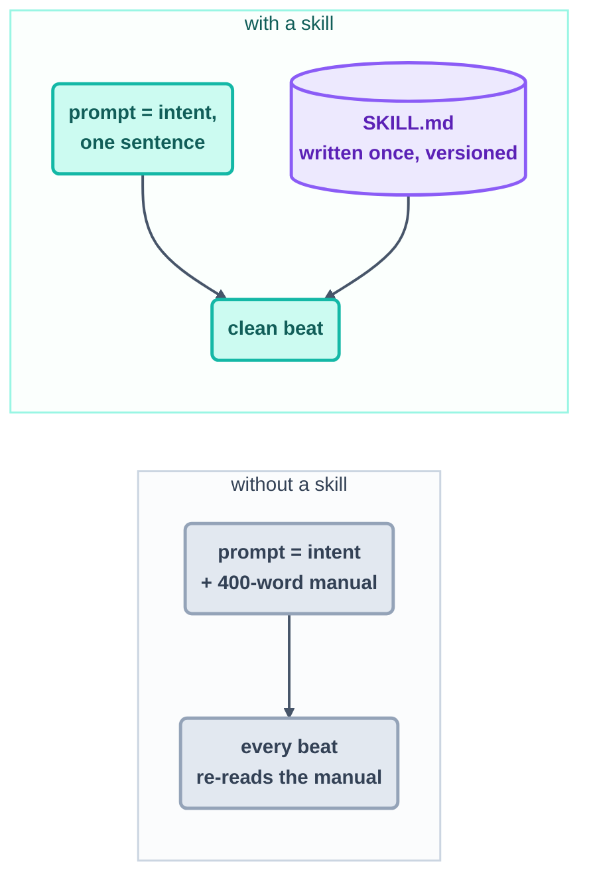
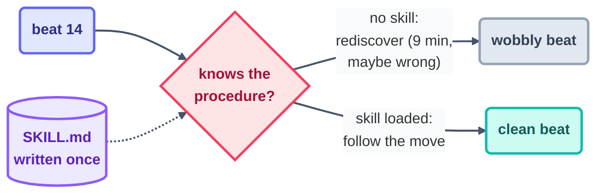

# Step 9 · Skills

> A loop is reborn with amnesia at the start of every beat. A skill is how you hand that
> newborn a cheat sheet — write the move down once, and no future beat ever has to
> improvise it.

## The hook

Imagine hiring a brilliant temp who forgets everything the instant their shift ends. Monday
they work out, from first principles, how your release process runs — and mostly get there.
Tuesday, the same person, the same puzzle, the same hour lost. Wednesday too. That is your
loop without skills: capable every beat, but condemned to solve the identical procedure over
and over because nothing it learns is allowed to stick. The cure is almost insultingly
simple — leave the instructions taped to the workbench where the next shift will find them.

## The cold-start problem (plain English)

Beats don't remember. Each one boots fresh, with none of the working knowledge the last one
earned. Two different kinds of forgetting come out of that, and they have two different
fixes:

- Forgetting **facts** — *what's finished, what's queued, what failed* — is what the spine
  (Step 12) is for.
- Forgetting **procedure** — *the steps to deploy, the review checklist, the shape of a
  release note* — is what a **skill** is for.

A skill is nothing more exotic than a markdown file (conventionally `SKILL.md`, tucked in a
named folder) topped with a description that advertises *when* it applies. The harness reads
those descriptions, offers the matching skill to the agent, and — once invoked — folds the
steps straight into the beat. The immediate payoff shows up in your prompt, which stops
lugging a procedure manual around and collapses down to plain intent:

```text
# without a skill — the prompt smuggles in a manual
/loop Check the queue. To deploy: first build with…, then check…, then
  run…, unless it's Tuesday, in which case…   (400 words of procedure)

# with a skill — the prompt is intent; the skill is procedure
/loop Check the queue. Deploy anything approved, per the deploy skill.
```

Here is that same division of labor drawn out — intent stays in the prompt, the how-to moves
into the skill:



One distinction saves confusion later. A **skill** is *words the model chooses to follow* —
markdown, nothing installed. A **plugin** is *code the harness executes on its own* — hooks,
commands, real software. If what you're capturing is judgment ("here's how we decide"), it's
a skill; if it's a mechanical capability ("do this exact thing, every time, no discretion"),
reach for a plugin.



## The mechanics in each tool

The pattern is identical across tools: one small named file holds the steps, and the prompt
just gestures at it. The deploy example, rendered in each:

```claude
# Claude Code — live docs: https://docs.claude.com/en/docs/claude-code
# .claude/skills/deploy/SKILL.md
#   ---
#   name: deploy
#   description: How to deploy this repo. Use for any deploy request.
#   ---
#   1. npm run build && npm run smoke
#   2. ./scripts/deploy.sh staging  → verify  → promote
# Invoke by name (/deploy) or let the description auto-trigger it.
# This repo dogfoods the pattern: see .claude/skills/loop-constraints/.
```

```opencode
# OpenCode — live docs: https://opencode.ai/docs
# Same idea: reusable instruction files the agent loads per task —
# see "skills"/custom commands in the live docs. Minimal portable form:
#   skills/deploy.md  (the procedure, in imperative steps)
#   opencode run "Deploy the approved queue. Follow skills/deploy.md."
```

> [!NOTE]
> **Going deeper:** a skill is also where a loop's quality becomes something you can *edit*.
> Trace a bad beat back to a fuzzy instruction, sharpen the line in the skill file, and every
> beat from then on inherits the correction — no re-training, no re-prompting. That is the
> quiet beginning of the hill-climbing idea in
> [Step 12](../06-part-4-the-spine/12-state-between-runs.md): you improve the machine, not
> just its latest output.

## Check yourself

**Q: A loop's prompt has ballooned to 600 words — nearly all of it procedure — and beats
*still* drop a step now and then. What does this page tell you to do, and what two wins
does that buy?**

<details><summary>Answer</summary>

Lift the procedure out into a **skill**, and let the prompt fall back to intent plus a
pointer. Two wins: beats become **consistent** (they follow one written move instead of
reinventing it each time), and the knowledge becomes **maintainable** (it now lives in a
single versioned, reviewable file you fix once — and the prompt is free to stay short
forever).

</details>

## Try With AI

Notice the next task you find yourself explaining to your agent for the third time — that
repetition is your signal. Capture it as a skill: a name, a one-line note on *when it should
fire*, then the steps written as commands. Run a beat that leans on it, then rephrase the
request in completely different words and check that the skill still catches. Congratulations
— you just turned something that lived only in your head into shared infrastructure.

## When it goes wrong

| Symptom | Cause | Fix |
| --- | --- | --- |
| Beats keep re-deriving the same routine | The procedure isn't written down anywhere | Capture it as a skill; leave only intent in the prompt |
| The skill sits unused | Its description doesn't say when it applies | Phrase the description in the words a real task would use |
| It fires on tasks it shouldn't | The description casts too wide a net | Tighten the scope — keep skills few and sharp |
| Bloated prompt *and* bloated skill | You pasted the manual instead of distilling it | A skill is a checklist, not an essay: steps, limits, a done-check |

---

*Glossary terms used on this page:* **skill**, **cold-start problem**, **plugin**,
**rules file** — see the [glossary](../02-foundations/glossary.md).

*Sources:* skills and the cold-start problem come from Panaversity's *Loop Engineering: A
Crash Course* ([S1](https://agentfactory.panaversity.org/docs/loop-engineering-crash-course))
and *Agentic Coding Crash Course*
([S2](https://agentfactory.panaversity.org/docs/agentic-coding-crash-course)). Full
attribution: [resources/sources.md](../../resources/sources.md).
