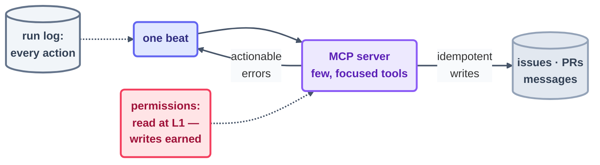

# Step 10 · Connectors (MCP)

> Strip a loop of connectors and it can only *describe* the world. Give it connectors and it
> can *change* the world — issues, PRs, messages. That single upgrade is why connector rules
> are the tightest rules anywhere in the body.

## The hook

Four nights running, your triage loop files the same immaculate sentence: "issue #482 looks
like a duplicate of #291 — suggest closing." Four nights, zero closures. Not because it's
timid — because *suggesting* is the ceiling of what it can reach. Now hand it a wire into the
issue tracker and watch the very same beat rewrite itself: linked, labeled, closed, one tidy
line in the log. The brain didn't change. It grew hands.

## Act vs. talk (plain English)

**MCP (Model Context Protocol)** is the shared socket agents use to plug into outside
systems. An MCP server takes something — GitHub, a database, a mailbox — and re-exposes it as
a handful of **tools** the agent is allowed to call. So connectors are, quite literally, the
loop's **hands**: the organ that reaches past the repo and touches the wider world.

Hands are also where mistakes stop being cheap. Botch a file and git has your back. Botch an
*email* and nobody does. That asymmetry is why every connector you build should obey three
non-negotiables:

1. **Few, focused tools.** Hand the loop the five tools its job requires, never the fifty the
   API happens to publish. Each spare tool is one more wrong turn a distracted beat can take.
   An issue-triage loop wants `search`, `label`, `comment`, `link`, `close` — and has no
   earthly need for `delete_repository`.
2. **Idempotent writes.** Beats retry; events fire twice (Step 7). So an action done twice
   has to land exactly like an action done once. Prefer "make sure label X is on issue N"
   over "add label X," and check the spine before you commit anything.
3. **Actionable errors.** A failed call should tell the *model* its next move — "rate-limited,
   wait 60s and retry," "issue locked, skip and log" — not just collapse. At 3 am there's
   nobody around to decode an anonymous `400`.



## The mechanics in each tool

Both tools register MCP servers in config and treat their write tools like any other
permission you have to grant. Notice where the allowlist discipline sits:

```claude
# Claude Code — live docs: https://docs.claude.com/en/docs/claude-code
# Register an MCP server (project-scoped, in .mcp.json or via CLI):
claude mcp add github -- npx -y @modelcontextprotocol/server-github
# Loop beats then see tools like mcp__github__* — gate them the same
# way as files: allow reads at L1; writes are earned, per-tool, in
# /permissions. GitHub also works tool-free via the gh CLI — prefer
# the smallest hands that do the job.
```

```opencode
# OpenCode — live docs: https://opencode.ai/docs
# MCP servers are configured in opencode.json ("mcp": { … }) — same
# protocol, same servers. Same discipline: register few servers,
# allow write tools explicitly, log every action the beat takes.
```

> [!NOTE]
> **Going deeper:** connectors are exactly where the L1→L2→L3 ladder earns its keep — this
> repo deliberately kept its own loops *file-only* through Days 1–2 so the worst possible
> outcome stayed "a weird commit." The rules for handing over real hands live in
> [10-operating/safety.md](../10-operating/safety.md); the per-tool mapping is in the
> [primitives matrix](../02-foundations/primitives-matrix.md).

## Check yourself

**Q: A retried beat just posted an identical PR comment twice, and last week a beat reached
for a `delete_branch` tool nobody recalls granting. Which two of the three connector rules
got broken?**

<details><summary>Answer</summary>

**Idempotent writes** — a retry must never double-post; the beat should have asked "is my
comment already here?", or the tool should have been an "ensure-comment." And **few, focused
tools** — `delete_branch` had no place in a comment loop's toolbox; every surplus tool is a
live round for a confused beat. (The third rule, actionable errors, is the one that keeps a
failure from quietly becoming a no-op.)

</details>

## Try With AI

Plug one read-only connector into a throwaway project — the GitHub MCP server pointed at a
scratch repo does nicely. Run an L1 beat: "list the open issues, propose labels, take no
action." Then read the full tool list that server handed over, and count how many of those
tools your loop's actual job needs. Write down the allowlist you'd grant *before* this loop
ever earned a single write. That short list is your connector design.

## When it goes wrong

| Symptom | Cause | Fix |
| --- | --- | --- |
| Duplicate comments/labels after retries | Writes aren't idempotent | Reshape actions as "ensure X"; dedupe against the spine before acting |
| Beat did something no one authorized | Tool surface far too broad | Expose few, focused tools; allowlist each write explicitly |
| Loop freezes on every API hiccup | Errors are opaque | Return errors that name the next move; add retry/skip/escalate logic |
| An email/comment escaped that shouldn't have | Hands granted before trust was earned | External writes are L3-grade — grant them last, guard them hardest |

---

*Glossary terms used on this page:* **MCP**, **connector**, **idempotent**,
**blast radius** — see the [glossary](../02-foundations/glossary.md).

*Sources:* connectors and the three connector rules come from Panaversity's *Loop
Engineering: A Crash Course* ([S1](https://agentfactory.panaversity.org/docs/loop-engineering-crash-course))
and *Agentic Coding Crash Course*
([S2](https://agentfactory.panaversity.org/docs/agentic-coding-crash-course)). Full
attribution: [resources/sources.md](../../resources/sources.md).
