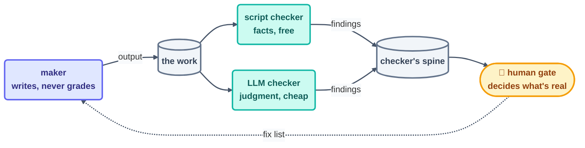

# Step 11 · Maker–Checker

> Banking figured this out centuries ago: whoever writes the entry is never the one who signs
> it off. Port that single rule to loops and one cheap, read-only grader turns "looks fine to
> me" into an actual system.

## The hook

On Day 1 of building *this course*, the run log caught a small, perfect moment:
`items_found: 3, actions_taken: 0`. The checker loop had spotted three problems in the
maker's pages — and repaired exactly none of them, because repair was never its job. The
maker cleaned them up on the following beat. Those two unglamorous numbers are the entire
pattern, working as designed.

## Writer ≠ grader (plain English)

Hand a loop the job of grading its own output and, sooner or later, it will pronounce that
output good. Not out of ego — out of a shared blind spot. The very misreading that produced
the bug is sitting there to wave the self-review through. The **maker–checker** split
dismantles that blind spot with structure instead of hope:

- The **maker** produces the work. It writes its files, ticks its own spine — and it is
  flatly forbidden from declaring the work good.
- The **checker** measures the work against a rubric. It is **read-only on the work**, which
  means it can't touch a thing — and that powerlessness is precisely what makes its verdict
  worth trusting.

A checker comes in three grades, from cheapest to dearest:

- **A script** — a link checker, a linter. Costs nothing and holds no opinions.
- **A read-only LLM session with a rubric** — LLM-as-judge, for the judgment-shaped problems
  a script will never see.
- **A human** — the gate itself: final, costly, and saved for what genuinely warrants it.

Reach for the cheapest checker that can still catch the failure you're actually afraid of. A
read-only LLM beat runs at a sliver of a maker beat's cost — this repo's Day 1 checker burned
roughly 3% of its token budget in a single run.

**A word on dynamic workflows:** a *workflow* — fixed steps in a deterministic order — is not
the enemy of a loop. A workflow is simply **the body of one beat**. The loop rules on *when*
and *whether*; the workflow inside the beat handles *how*; the checker judges what dropped out
the other end.



## The mechanics in each tool

Permissions enforce the split — not good manners. Two loops, two permission sets, and a
checker that cannot write the work no matter what verdict it reaches:

```claude
# Claude Code — live docs: https://docs.claude.com/en/docs/claude-code
# Maker (may write docs/):
> /loop Read state.md. Write the FIRST unchecked page. Check it off.
# Checker (separate loop/agent, read-only on docs/ by permissions):
> /loop 20m Grade each newly finished page against the rubric in
  loop.md. Write PASS/FAIL to YOUR OWN state.md. Never edit the pages.
# Subagents work too: a read-only "verifier" agent graded per beat.
```

```opencode
# OpenCode — live docs: https://opencode.ai/docs
# Same split as two runs with different permissions (opencode.json):
opencode run "Write the next unchecked page per state.md…"          # maker
opencode run "READ-ONLY: grade the newest pages against rubric.md;
  append PASS/FAIL to review-notes.md; never edit the pages."       # checker
```

> [!NOTE]
> **Going deeper:** this pattern is alive in the repo you're reading right now —
> [`loops/day2/template-checker/`](../../loops/day2/template-checker/loop.md) grades this very
> page against a 9-row rubric it has no power to edit. And whenever the checker *can* be a
> plain script, let it: see the link-check loop's
> [provability note](../../loops/day1/link-check/loop.md).

## Check yourself

**Q: To trim tokens, a team fuses maker and checker into one loop that "self-reviews before
committing." Reviews come back 100% clean for a month. Why does that number argue *against*
the design instead of for it?**

<details><summary>Answer</summary>

Because a perfect pass rate from a self-grader measures nothing but *agreement with itself*.
The same blind spot that lets a defect through is the one nodding along at the review — the
failures aren't being caught, they're being co-signed. A real separate checker proves its
worth in exactly the reports a self-review would never write: `items_found > 0` alongside
`actions_taken: 0`.

</details>

## Try With AI

Grab any finished piece of agent work and turn a read-only checker loose on it: give a fresh
session a five-row rubric and the standing order "grade only — you may not fix." Then set its
findings next to what the maker claimed about its own work in the transcript. The gap between
those two accounts *is* the value of the split — and you just measured it, on your own repo.

## When it goes wrong

| Symptom | Cause | Fix |
| --- | --- | --- |
| Checker "fixed" the pages itself | It has write access to the work | Permissions, not promises: read-only on the work, write-only to its own spine |
| Findings evaporate between runs | Checker reports to chat / an uncommitted file | Findings land in the checker's **committed** spine (this repo learned that the hard way) |
| Checker rubber-stamps everything | No rubric — just "review this" | Spell out rubric rows; PASS/FAIL each, one line on what's missing |
| Checker costs as much as the maker | Full-context grading of everything | Grade the diff, not the repo; scripts for facts, LLM only for judgment |

---

*Glossary terms used on this page:* **maker–checker**, **LLM-as-judge**,
**workflow**, **human gate** — see the [glossary](../02-foundations/glossary.md).

*Sources:* maker–checker and LLM-as-judge come from Panaversity's *Loop Engineering: A Crash
Course* ([S1](https://agentfactory.panaversity.org/docs/loop-engineering-crash-course)) and
*Agentic Coding Crash Course*
([S2](https://agentfactory.panaversity.org/docs/agentic-coding-crash-course)); the
verification-loop framing from Sydney Runkle's *The Art of Loop Engineering*
([S6](https://www.langchain.com/blog/the-art-of-loop-engineering)). Full attribution:
[resources/sources.md](../../resources/sources.md).
