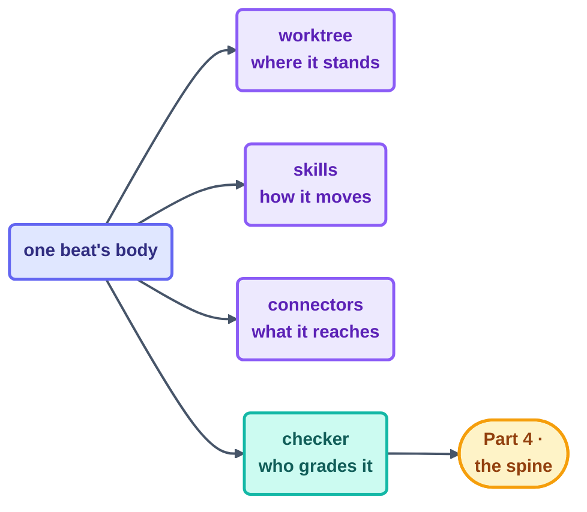

# Part 3 · The Body

> What a beat may *do* and *touch* — and how to keep many hands from colliding: isolation,
> taught moves, hands on the world, and the split that keeps work honest.

## The steps

| Step | Page | Organ | One-line takeaway |
| --- | --- | --- | --- |
| 08 | [Worktrees](08-worktrees.md) | elbow room | overlapping files → worktree; disjoint ownership → shared tree is fine |
| 09 | [Skills](09-skills.md) | trained moves | procedure lives in a skill, written once; the prompt carries intent |
| 10 | [Connectors (MCP)](10-connectors-mcp.md) | hands | few focused tools · idempotent writes · actionable errors |
| 11 | [Maker–Checker](11-maker-checker.md) | second pair of eyes | the hand that writes never approves; cheapest checker that catches the failure |

## The thread through all four

The body is where **blast radius** gets decided — and every page in this part is really
the same rule wearing a different hat. Give a beat exactly the standing room, the moves,
and the reach its job needs, and not one inch more. Put the grading outside the hands that
did the work. What the body *remembers* between beats is
[Part 4](../06-part-4-the-spine/README.md)'s problem, not this one's.

## Check your understanding

[Take the Part 3 quiz](quiz.md) · [drill the flashcards](flashcards.md)

*This part belongs to track [T2 · Practitioner](../00-start-here/learning-tracks.md).*

*Sources:* Part 3 draws on Panaversity's *Loop Engineering: A Crash Course*
([S1](https://agentfactory.panaversity.org/docs/loop-engineering-crash-course)),
*Agentic Coding Crash Course*
([S2](https://agentfactory.panaversity.org/docs/agentic-coding-crash-course)), and Sydney
Runkle's *The Art of Loop Engineering*
([S6](https://www.langchain.com/blog/the-art-of-loop-engineering)). Full attribution:
[resources/sources.md](../../resources/sources.md).
