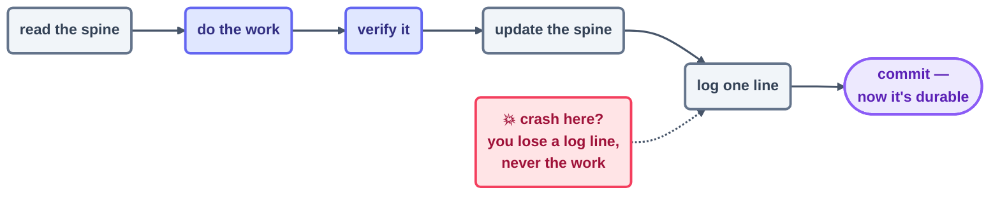
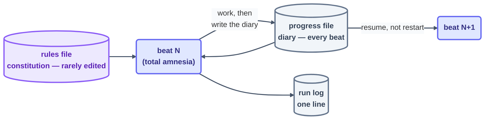

# Step 12 · State Between Runs

> Between beats, the model remembers nothing at all. The spine is the part that does — and
> the whole gap between a real loop and an expensive way to start over is a single committed
> file.

## The hook

This repo carries a scar, and it's worth showing you. On Day 1 the loops kept their state in
files that were gitignored — and then, predictably, lost. The pages themselves lived on. But
the checker's three findings, the whole record of *what got decided and why*, evaporated. The
reconstruction notice in
[`loops/day1/page-writer/state.md`](../../loops/day1/page-writer/state.md) puts it without
flinching: **a spine that isn't committed isn't a spine.** By Day 2 every loop committed its
state on every beat — which is why this page can be written by a loop whose memory you're
free to go read.

## The intern's diary (plain English)

Picture a genuinely brilliant intern cursed with total amnesia. Each morning they show up
having forgotten yesterday entirely. You wouldn't waste effort trying to cure the amnesia —
you'd give them a **diary**: here's what's finished, here's what's next, here's what we
learned the hard way. They read it first thing, do the day's work, and jot the next entry
before they leave.

That diary is the **spine**, and it arrives as two files carrying two different jobs:

- The **rules file** (`CLAUDE.md` / `AGENTS.md`) — the *constitution*: the things that never
  move, like conventions, boundaries, and how work is done around here. You write it, every
  beat reads it, and it barely ever changes.
- The **progress file** (`state.md`, `STATE.md`) — the *diary*: the things that shift on every
  beat, like the checklist, what's done, what's stuck, and what the last beat discovered. The
  loop writes it, exactly one owner per file, updated before the beat is allowed to end.

One detail inside a beat carries real weight: **do the work, then update the spine, then
log** — in that order. Get it right and an interruption costs you a log line rather than the
work itself. And treat the spine as a *record*, not a scratchpad: escalations, mismatches,
and hard-won lessons all belong in it, because the spine is what the next beat — and the
human — will genuinely sit down and read.

Here is that ordering as a single picture. A crash at any point only forfeits whatever came
after it:





## The mechanics in each tool

Both tools pair a constitution file the harness loads for you with a diary file your prompt
reads first and writes last. The commit is where durability actually happens:

```claude
# Claude Code — live docs: https://docs.claude.com/en/docs/claude-code
# Constitution: CLAUDE.md (auto-loaded every session/beat)
# Diary: a state.md your loop prompt reads FIRST and updates LAST:
> /loop Read state.md. Do the FIRST unchecked item. Update state.md,
  append one line to run-log.md, commit both. Stop when all checked.
# The commit in the prompt is not decoration — it IS the durability.
```

```opencode
# OpenCode — live docs: https://opencode.ai/docs
# Constitution: AGENTS.md (project rules, loaded per run)
# Diary: same state.md pattern; the shell wrapper enforces the commit:
opencode run "Read state.md; do the first unchecked item; update it."
git add state.md run-log.md && git commit -m "beat: $(date -u +%H:%M)"
```

> [!NOTE]
> **Going deeper — the loop that improves the loop:** once lessons start collecting in the
> spine ("beat 7 failed because that lint rule was ambiguous"), a slower loop can read *those*
> and go edit the rules file or the skills — **hill-climbing**: the work loop gets better
> without getting bigger. Keep two ideas apart here. **Self-learning** (the spine piles up
> facts and lessons) is safe — do it from day one. **Self-improving** (the loop rewrites its
> own prompt or rules) is powerful — so gate every such change behind a human review. The
> advanced tier (Day 3) takes on the second kind.

## Check yourself

**Q: Your loop crashed at beat 7 of 20. On restart it re-ran beats 1–6 — redundantly, and at
real cost. The prompt already says "continue from where you left off." Why didn't that save
you, and what's the actual fix?**

<details><summary>Answer</summary>

"Where you left off" lived in the model's memory, and that memory died with the crash — beats
are amnesiac by nature. The fix is structural, not a turn of phrase: a **progress file** the
loop reads when the beat starts and updates (and commits) when it ends. Then resume-vs-restart
stops hanging on anyone's recollection — beat 8 opens the diary and picks up at item 8,
because items 1–7 are *written down* as done.

</details>

## Try With AI

Hand your agent a 6-item checklist task under the spine discipline: read `state.md` first, one
item per beat, update and commit before ending. After beat 3, kill the session mid-task on
purpose. Open a fresh session with the same prompt and watch it resume at item 4 without being
told a thing. Then read your own `state.md` history in `git log`: that's a loop's memory, made
auditable.

## When it goes wrong

| Symptom | Cause | Fix |
| --- | --- | --- |
| Restart repeats finished work | No progress file — state kept in memory | Diary read first, updated last, on every beat |
| Spine says done, the work disagrees | Spine updated before the work was verified | Work → verify → spine → log, strictly in that order |
| The state file survived, the lessons didn't | Spine used only as a checkbox list | Record escalations, mismatches, lessons — it's a record, not a scratchpad |
| The file existed and *still* got lost | Never committed (this repo, Day 1) | **Commit the spine every beat** — uncommitted state is already lost |

---

*Glossary terms used on this page:* **spine**, **rules file**, **progress file**,
**hill-climbing** — see the [glossary](../02-foundations/glossary.md).

*Sources:* state-between-runs and the intern's-diary metaphor come from Panaversity's *Loop
Engineering: A Crash Course* ([S1](https://agentfactory.panaversity.org/docs/loop-engineering-crash-course))
and *Agentic Coding Crash Course*
([S2](https://agentfactory.panaversity.org/docs/agentic-coding-crash-course)); the
hill-climbing loop from Sydney Runkle's *The Art of Loop Engineering*
([S6](https://www.langchain.com/blog/the-art-of-loop-engineering)). Full attribution:
[resources/sources.md](../../resources/sources.md).
