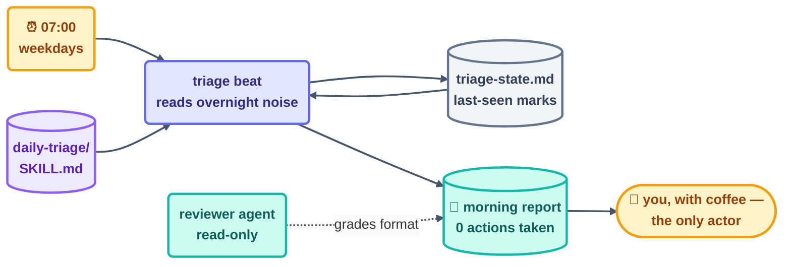

# Step 13 · Build the Morning-Triage Loop — Twice

> Everything from Steps 1–12 finally clicks together into one working loop: a morning triage
> that reads your repo's overnight noise and leaves a report next to your coffee. You'll build
> it twice — Claude Code and OpenCode — to prove that the *shape* is what matters.

## The hook

Tomorrow at 7:00 am, a loop will comb through every issue, PR, and CI failure that arrived
overnight. It will separate the genuinely urgent from the safely-ignorable and drop a
five-line report where your eyes will land first. And it will do **nothing else**. That isn't
a toy demo — it's the smallest possible loop that still has all six organs, and both
walkthroughs in this part ship it for real.

## The design (plain English)

**The job:** triage the repo, every morning. **The shape** falls straight out of the
pattern-picker logic in the methods layer
([09-methods/pattern-picker.md](../09-methods/pattern-picker.md)):

- The work comes back on a calendar, so the heartbeat is a **schedule**.
- The beat only reads, so it runs **L1 report-only**.
- The output is a judgment call, so a **human gate** reads the report.

Here are the six parts, filled in:

| Part | The triage loop's answer |
| --- | --- |
| Heartbeat | schedule: weekdays 07:00 (your timezone) |
| Body | read issues/PRs/CI via the SCM CLI; **write only the report + log** |
| Spine | `triage-state.md` — last-seen timestamps, so beats never re-triage |
| Stopping condition | one beat = one report written; daily cap 1 |
| Checker | the report *format* is script-checkable; content graded by you |
| Human gate | you read the report; nothing acts until you do |

Both tools lean on two artifacts you write exactly once. A **`daily-triage/SKILL.md`** holds
the procedure — what to read, how to rank it, the report template. A **`reviewer` agent**
definition is the read-only grader both tools point at the finished report. The two
walkthroughs part ways on only one thing: the heartbeat plumbing — a cloud Routine or
`claude -p` cron ([13a](13a-claude-code-walkthrough.md)) versus cron/GitHub Actions
([13b](13b-opencode-walkthrough.md)).



## The minimum-safe checklist (before EITHER version runs)

Seven items. This repo's own loops clear this list before every first run, and so does yours
— or it doesn't get to run:

1. Provable success condition (report file exists, matches template)
2. Run limit (daily cap: 1)
3. Spine written **first**, committed
4. Report-only (L1) — no write permissions beyond report + spine
5. Human gate placed (you, reading the report)
6. One log line per beat, no silent runs
7. Kill switch you've actually tested (schedule off / pause flag)

## The skill both versions share

A single skill file carries the entire procedure, and one reviewer definition grades what it
produces. Both walkthroughs use these two verbatim:

```claude
# daily-triage/SKILL.md — used verbatim by BOTH walkthroughs
# name: daily-triage
# description: Morning repo triage. Read-only. Produces the 5-line report.
# 1. Read: new/updated issues, PRs, CI runs since state's last-seen marks.
# 2. Rank: broken-main > failing-CI > stale-urgent-PRs > new-issues > rest.
# 3. Write triage-report.md: ≤5 lines, most urgent first, one line each:
#    [rank] what · why it matters · suggested (NOT taken) action.
# 4. Update triage-state.md last-seen marks. Take NO other action.
```

```opencode
# The reviewer agent both tools run over the report (read-only grader):
# reviewer: "Check triage-report.md: ≤5 lines? ranked? each line has
#   what/why/suggested-action? last-seen marks updated? PASS/FAIL + why."
# In Claude Code this is a subagent definition; in OpenCode an agent
# config — see each walkthrough. Neither may edit the report.
```

> [!NOTE]
> **Going deeper:** "one real morning" is the graduation rule — a loop earns trust by running
> for real, watched, at L1, at least once before you're allowed to stop checking it daily. The
> promotion ladder past L1 (labeling issues at L2, and what would ever justify L3) is
> [Step 14](../08-part-6-human-control/14-staying-the-engineer.md)'s subject. Go build it now:
> [13a — Claude Code](13a-claude-code-walkthrough.md) ·
> [13b — OpenCode](13b-opencode-walkthrough.md).

## Check yourself

**Q: While it's reading, the triage loop could trivially label the issues too — it would save
you clicks. The design says don't. What justifies leaving obvious value on the table on day
one?**

<details><summary>Answer</summary>

Trust hasn't been earned yet — and **labels are writes on a shared system** other people see.
Starting at L1 means the loop's judgment gets audited, through reports, across real mornings
before it's ever handed a pair of hands. If the ranking logic is subtly wrong, you learn it
from one wrong *report*, not from a hundred wrong labels. The saved clicks are the tuition.
Promotion to labeling-at-L2 comes only after the reports have been boringly correct for a
while.

</details>

## Try With AI

Before you open either walkthrough, fill in the six-part table above for **your** repo: the
real ranking rules (what actually counts as urgent *here*?), the real report destination, the
real cap. Then ask your agent to red-team that design against the 7-item checklist. Every
mismatch it turns up now is a 7 am surprise it just spared you.

## When it goes wrong

| Symptom | Cause | Fix |
| --- | --- | --- |
| Report re-triages the same items daily | Spine has no last-seen marks | Record the marks; beat reads them first, updates them last |
| Report ballooned to 40 lines | No format contract | The skill's template is the contract; reviewer FAILs oversized reports |
| Loop labeled/closed things at 7 am | Writes granted before they were earned | L1: body = report + spine only; promotion is a human decision |
| Beautiful reports, wrong priorities | The skill's ranking ≠ your ranking | Fix the skill (once), not the report (daily) — that's the entire point of skills |

---

*Glossary terms used on this page:* **minimum-safe checklist**, **L1 (report-only)**,
**routine**, **human gate** — see the [glossary](../02-foundations/glossary.md).

*Sources:* the morning-triage build and the minimum-safe checklist come from Panaversity's
*Loop Engineering: A Crash Course*
([S1](https://agentfactory.panaversity.org/docs/loop-engineering-crash-course)). Full
attribution: [resources/sources.md](../../resources/sources.md).
