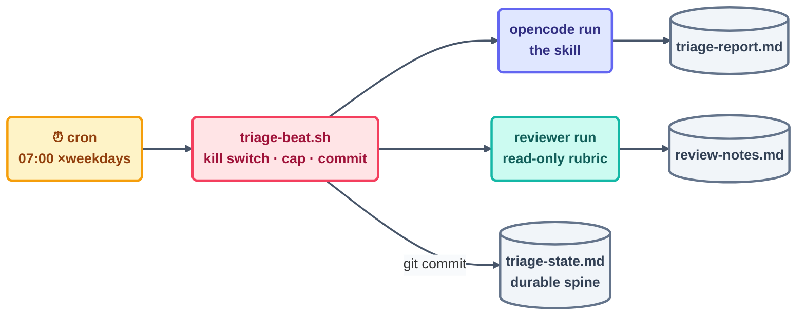

# Step 13b · The Morning-Triage Loop in OpenCode

> The very same loop as [13a](13a-claude-code-walkthrough.md) — same skill text, same rubric,
> same spine — except the heartbeat and the guardrails are now built from parts you can
> actually see: cron, a shell wrapper, and a permissions file. Nothing is magic the second
> time around.

## The hook

If 13a felt like assembling flat-pack furniture, 13b is cutting the same piece from raw
lumber. Every organ the platform quietly handed you back there, you'll now wire up by hand.
That's exactly why the exercise is to build the loop *twice*: only after this second pass can
you say, with confidence, which parts were the tool and which parts were the **shape**.

## Build order (same order, different lumber)

**1. The spine** — an identical file under an identical rule: `triage-state.md`, committed
before the first beat ever fires.

**2. The skill** — the same `daily-triage` text from [Step 13](13-build-the-loop-twice.md),
stored this time as `skills/daily-triage.md`. OpenCode picks up project instructions from
`AGENTS.md`, so add a single line there: *"For morning triage, follow `skills/daily-triage.md`
exactly."*

**3. The reviewer** — the same rubric, expressed either as an agent config (see agents in the
live docs) or, in its simplest portable form, as a second read-only run whose entire prompt
*is* the rubric.

**4. The heartbeat + the beat wrapper** — cron (or any scheduler) calling a wrapper script
that wraps the loop discipline around the agent run:

```opencode
# OpenCode — live docs: https://opencode.ai/docs
# triage-beat.sh — the BODY of one beat, discipline included:
#!/usr/bin/env bash
set -euo pipefail
cd "$(dirname "$0")"
grep -q "pause: on" loop-pause 2>/dev/null && exit 0        # kill switch
[ -f ".ran-$(date +%F)" ] && exit 0                          # daily cap: 1
opencode run "Follow skills/daily-triage.md. Report only."   # the beat
opencode run "READ-ONLY: grade triage-report.md against the rubric in
  skills/daily-triage.md; append PASS/FAIL to review-notes.md."
touch ".ran-$(date +%F)"                                     # cap marker
git add triage-report.md triage-state.md review-notes.md
git commit -qm "triage beat $(date -u +%F)"                  # spine durability
# crontab: 0 7 * * 1-5 /home/you/repo/triage-beat.sh
```

```claude
# (The Claude Code twin of this build — Routine or `claude -p` cron,
#  permissions via /permissions — is 13a:)
# → 13a-claude-code-walkthrough.md
```

**5. Permissions** — in `opencode.json`, clamp down the tool access for this project:
read-broad, write-narrow (the same three files). And the wrapper throws up a second fence —
even a thoroughly confused beat can't slip past a `set -euo pipefail` script that only ever
commits three paths.



## The first real morning

The graduation rule is the same one from 13a: run `./triage-beat.sh` by hand tonight, watch
it, and grade what comes out. On a PASS, arm the crontab line. And if your machine happens to
be asleep at 7 am — that's not a flaw in the loop, it's simply a fact about cron. Lift the same
wrapper into a GitHub Actions `schedule:` job and it runs with the machine off. That's the
Step 6 trade-off, made completely concrete.

> [!NOTE]
> **Going deeper — what building it twice actually taught you:** set the two builds
> side by side. The **shape** (six parts, L1 first, spine-first, rehearse-then-arm) turned up
> in both, untouched. Only the **plumbing** moved: Routine ↔ cron, `/permissions` ↔
> `opencode.json` + wrapper, subagent ↔ second run. That divide — durable shape, swappable
> plumbing — is the course's "lasting vs. mechanical layer" rule made physical, and it's
> precisely why the loop library (Day 3) can ship per-tool kits from one shared `LOOP.md` spec.

## Check yourself

**Q: The wrapper script implements three of the seven minimum-safe checklist items itself,
with no cooperation from the agent. Which three, and why does it matter that they live in bash
rather than in the prompt?**

<details><summary>Answer</summary>

The **kill switch** (the pause-file check), the **run limit** (the daily-cap marker file), and
the **spine durability** (the unconditional `git commit`). Sitting in bash makes them
*harness-layer guarantees* — they hold even if the model has the worst beat of its life. Sitting
in the prompt, they'd be mere requests to the very process they're supposed to bound. It's the
Step 2 lesson again: guarantees live below the layer they constrain.

</details>

## Try With AI

Build it: the wrapper, the skill file, the `AGENTS.md` line, the crontab entry — then run the
rehearsal beat. When it comes back PASS, do one thing 13a couldn't offer you: `cat
triage-beat.sh` and label each line with the loop organ it implements. A loop you can annotate
line by line is a loop you genuinely understand.

## When it goes wrong

| Symptom | Cause | Fix |
| --- | --- | --- |
| Beat ran twice on the same day | Cap marker not written (script died early) | `set -euo pipefail` + write the marker only after the commit succeeds |
| Cron fired, nothing happened | The environment differs under cron (PATH, cwd) | Absolute paths in the wrapper; `cd` first; log stderr to a file |
| Report/spine changes vanished | No commit in the wrapper | The commit line is an organ, not housekeeping |
| Machine asleep at 7 am | Local cron's nature | GitHub Actions `schedule:` for machine-off mornings |

---

*Glossary terms used on this page:* **wrapper**, **kill switch**, **daily cap**,
**lasting vs. mechanical layer** — see the [glossary](../02-foundations/glossary.md).

*Sources:* the walkthrough follows Panaversity's *Loop Engineering: A Crash Course*
([S1](https://agentfactory.panaversity.org/docs/loop-engineering-crash-course)); commands are
pointers to OpenCode's live documentation (attribution policy rule 3). Full attribution:
[resources/sources.md](../../resources/sources.md).
