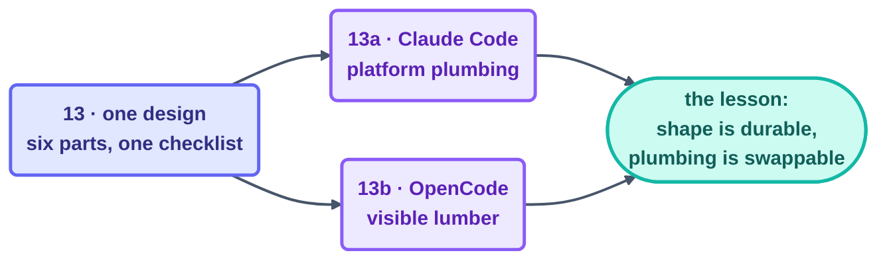

# Part 5 · A Complete Loop, Twice

> The capstone of the build track: every organ from Parts 1–4 wired together into one
> production loop — and then wired together *again* in a second tool, so you can finally see
> where the shape ends and the plumbing begins.

## The steps

| Step | Page | One-line takeaway |
| --- | --- | --- |
| 13 | [Build the Morning-Triage Loop](13-build-the-loop-twice.md) | the design: six parts filled in + the 7-item minimum-safe checklist |
| 13a | [Claude Code walkthrough](13a-claude-code-walkthrough.md) | skill · reviewer agent · Routine/cron · permissions · one real morning |
| 13b | [OpenCode walkthrough](13b-opencode-walkthrough.md) | same skill, same rubric — cron + wrapper script as visible lumber |

## Why build it twice?

Because the second build is what finally lets you answer the one portability question that
actually counts: *if you switched tools tomorrow, what would carry over?* (Every one of the
six organs, the checklist, the L1 discipline.) *And what wouldn't?* (Every command you typed.)
Commit the first list to memory; look the second one up when you need it. That's the
lasting-vs-mechanical rule this course keeps hammering on — and here you get to watch it play
out live.

## Check your understanding

[Take the Part 5 quiz](quiz.md) — *(this part has no flashcards on purpose: the exercise IS
the two builds).*

Then onward to the final part: [Part 6 · Human Control](../08-part-6-human-control/README.md).

*This part belongs to track [T3 · Engineer](../00-start-here/learning-tracks.md).*

*Sources:* Part 5 draws on Panaversity's *Loop Engineering: A Crash Course*
([S1](https://agentfactory.panaversity.org/docs/loop-engineering-crash-course)). Full
attribution: [resources/sources.md](../../resources/sources.md).
