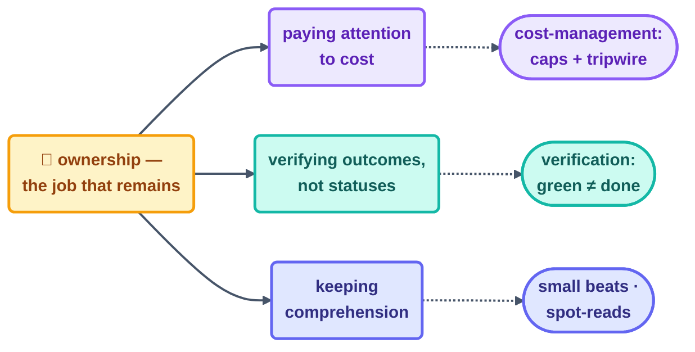
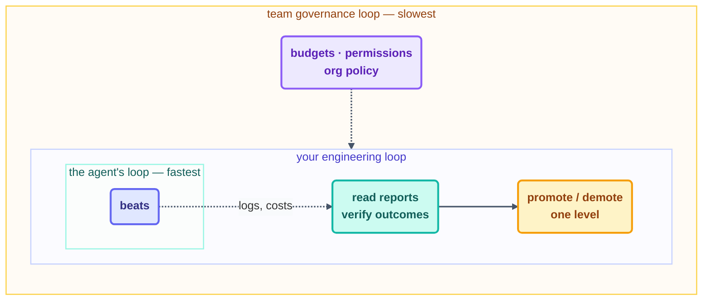

# Step 14 · Staying the Engineer

> The final step isn't really about loops at all. It's about you — the person who still has to
> understand, still has to verify, and still has to answer for whatever the fleet got up to
> while you weren't watching.

## The hook

Fast-forward six months: your loops work. That's the exact moment the real danger begins — and
it isn't the doom loop, because you'd spot that. It's the quiet slide. Reports stop getting
read because they're always fine. Promotions happen because pausing to ask felt slow. And then
one day a question arrives — *"why did the system do that?"* — and the honest answer is that
nobody can say anymore. Nothing crashed. You simply stopped being the engineer.

## The job that remains (plain English)

Steps 1–13 automated the typing. What no step can ever automate is **ownership**, and it
breaks down neatly into the three things loops are worst at:

- **Paying attention to cost.** Tokens are the fleet's grocery bill, and loops keep eating on
  schedule whether or not the work is worth it. The budget, the caps, and the blunt question
  "is this loop worth what it burns?" are all yours — [cost-management](cost-management.md) is
  the practice that keeps them yours.
- **Verifying outcomes, not statuses.** A green run tells you the loop *finished*, not that the
  work is *right* — **green ≠ done** is the observability rule that makes run logs worth
  opening at all. [verification](verification.md) is the practice.
- **Keeping comprehension.** Every beat you don't understand quietly adds to the comprehension
  debt you first met in [concepts](../02-foundations/concepts.md) — and loops run that meter up
  at machine speed. Small beats, reports you actually read, and the occasional spot-read are
  how you stay solvent.

Here are the three pillars at a glance, each paired with the practice that keeps it upright:



The frame that holds all three together is [the three nested loops](the-three-nested-loops.md):
the agent's loop runs inside *your* engineering loop, which runs inside the *team's* governance
loop. Autonomy levels, promotions, and budgets are decisions made in the outer loops **about**
the inner one — and never, ever by it.

Two rules from those outer loops are non-negotiable:

1. **Prove before overnight.** No loop runs unattended until a human has watched a full, real
   run succeed at its current autonomy level. Promotion moves one level at a time, and
   demotion after any incident is automatic (step 5 of the recovery playbook).
2. **Resist AI gravity.** That's the steady pull to hand the system the next decision just
   because it nailed the last one — scope quietly creeping from "label issues" to "close stale
   ones" while nobody actually decided anything. Every expansion of capability is an explicit,
   written-down human decision, or it simply doesn't happen.



## The engineer's beat, in each tool

Your loop has beats too. Here's a weekly 15-minute one, in each tool:

```claude
# Claude Code — live docs: https://docs.claude.com/en/docs/claude-code
# YOUR loop has beats too. A weekly 15-minute one:
> Read shared/loop-run-log.md for the week. For each loop: runs, cost,
  escalations, anything promoted/demoted? Summarize in 5 lines.
# /cost and the run log are your instruments; the promotion decision
# is yours alone — never delegate it to the loop being promoted.
```

```opencode
# OpenCode — live docs: https://opencode.ai/docs
# Same weekly beat, script-assisted:
grep '"pattern"' shared/loop-run-log.md | tail -50   # what actually ran
opencode run "READ-ONLY: summarize this week's run-log: cost per loop,
  escalations, anomalies. 5 lines."
```

> [!NOTE]
> **Going deeper:** at org scale these habits harden into policy — shared budgets, a loop
> registry, review requirements for L3, incident playbooks. That's the T4 track (`advanced/`,
> Day 3). And the three companion pages dig deeper into each pillar:
> [cost-management](cost-management.md) · [verification](verification.md) ·
> [the-three-nested-loops](the-three-nested-loops.md).

## Check yourself

**Q: A teammate proposes: "our loops have been green for a quarter — let's stop reviewing their
PRs and auto-merge." Name the two Step-14 rules this breaks and the failure it invites.**

<details><summary>Answer</summary>

It surrenders to **AI gravity** (a capability expansion justified by a streak rather than a
decision) and it abolishes the **human gate** that keeps comprehension debt payable. The
failure it invites: the first confidently-wrong change merges at machine speed into a codebase
whose owners have spent a quarter *not reading it* — maximum blast radius, minimum
understanding. A green streak argues for *trust in the current level*, never for skipping the
gate.

</details>

## Try With AI

Run your first engineer's beat on this very repo: ask your agent to summarize
`shared/loop-run-log.md` — cost per loop, escalations, the self-throttle event. Then answer,
yourself, on paper: which of this repo's loops would you promote, which would you leave at L1
forever, and why? (There's a defensible "L1 forever" answer somewhere in this fleet — go find
it.)

## When it goes wrong

| Symptom | Cause | Fix |
| --- | --- | --- |
| Reports unread because "always fine" | Attention decayed alongside success | Shrink reports (5 lines max); one weekly engineer's beat, on the calendar |
| Loop quietly doing more than designed | AI gravity — scope crept | Capability changes are written decisions; audit body vs. loop.md |
| "Why did it do that?" — nobody knows | Comprehension debt compounding | Small beats, spot-reads per part, run log as narrative |
| First unattended night was a disaster | Promotion skipped the proof | One real watched run per level; demote on incident, automatically |

---

*Glossary terms used on this page:* **green ≠ done**, **AI gravity**,
**comprehension debt**, **promotion/demotion** — see the
[glossary](../02-foundations/glossary.md).

*Sources:* the stay-the-engineer principle comes from Addy Osmani's *Loop Engineering*
([S5](https://addyosmani.com/blog/loop-engineering/)); the cost/verification/comprehension
framing from Panaversity's *Loop Engineering: A Crash Course*
([S1](https://agentfactory.panaversity.org/docs/loop-engineering-crash-course)); the
nested-loops and success-criteria ideas from Andrew Ng & Andrej Karpathy's public statements
([S9](https://x.com/karpathy)). Full attribution:
[resources/sources.md](../../resources/sources.md).
