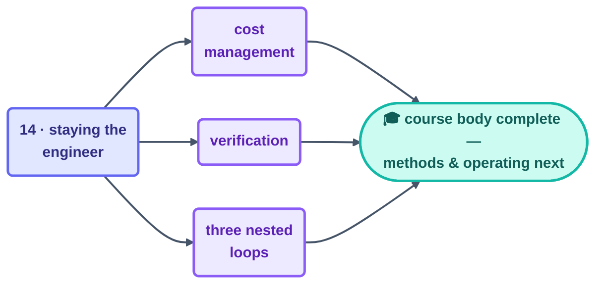

# Part 6 · Human Control

> The course ends exactly where accountability lives: with you. Four pages on the one job
> that can't be handed off — paying for, verifying, and understanding what your loops do —
> held inside a structure that keeps every real decision in human hands.

## The steps

| Step | Page | One-line takeaway |
| --- | --- | --- |
| 14 | [Staying the Engineer](14-staying-the-engineer.md) | cost + verification + comprehension; prove before overnight; resist AI gravity |
| — | [Cost Management](cost-management.md) | caps before first run; the 80% tripwire; budgets stop runaway cost, you stop pointless cost |
| — | [Verification](verification.md) | green ≠ done: scripts → checker → outcome check → human spot-read |
| — | [The Three Nested Loops](the-three-nested-loops.md) | agent < engineer < governance; every arrow points inward |

## Where to next

The 14 steps taught you the *shape*. Two more layers turn that shape into daily practice: the
[methods pages](../09-methods/make-your-own-loop.md) (design a loop of your own, A through F)
and the [operating handbook](../10-operating/operating-loops.md) (running fleets without
nasty surprises). Both belong to this part's track.

## Check your understanding

[Take the Part 6 quiz](quiz.md) · [drill the flashcards](flashcards.md)

*This part belongs to track [T3 · Engineer](../00-start-here/learning-tracks.md).*

*Sources:* Part 6 draws on Panaversity's *Loop Engineering: A Crash Course*
([S1](https://agentfactory.panaversity.org/docs/loop-engineering-crash-course)), Addy Osmani's
*Loop Engineering* ([S5](https://addyosmani.com/blog/loop-engineering/)), and Andrew Ng &
Andrej Karpathy's public statements ([S9](https://x.com/karpathy)). Full attribution:
[resources/sources.md](../../resources/sources.md).
