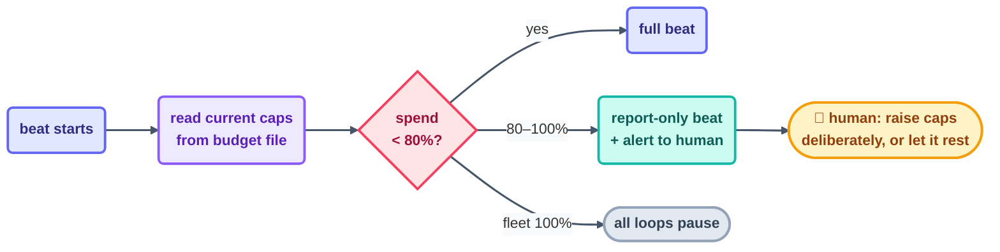

# Cost Management

> A loop spends tokens the way a leaky tap spends water: quietly, on a schedule, and without
> end — unless somebody owns the meter. That somebody is you.

## The hook

Mid-afternoon on Day 1 of building this course, the page-writer loop pulled its own emergency
brake: *≈79% of the daily token cap, 6 items left, switching to report-only.* No human was
staring at the meter — the meter was watching itself, because a budget rule had planted a
tripwire right there. The human read the alert, raised the caps on purpose, and the loop
wrapped up. That alert is still sitting in [`shared/loop-budget.md`](../../shared/loop-budget.md)
— cost management, caught in the act of working.

## The practice (plain English)

- **Budget per loop, cap per day.** Every loop declares its max runs/day and max tokens/day
  *before it ever runs the first time* — a loop with no cap is just a blank check with a
  heartbeat. Keep the numbers in one shared file the entire fleet reads.
- **The 80% tripwire.** Cross 80% of any cap and the loop drops to report-only and announces
  it. (Measure against the cap *as it reads right now* — this repo once sailed to 90% because
  the tripwire was checking a stale number. The fix was a single line in the budget file.)
- **Know your loop economics.** Read-only checkers run an order of magnitude cheaper than
  makers — this repo's Day 1 checker spent roughly 3% of its budget while the maker chewed
  through about 90% of its raised one. The corollary is handy: when in doubt, add a checker,
  not a fatter maker beat.
- **Estimate, then measure.** Before a loop runs, do the back-of-envelope: rough tokens/beat ×
  beats/day. After a week, the run log's `tokens_estimate` column tells you what it *actually*
  costs — and whether it's earning its bill.



## The meters in each tool

Each tool hands you a per-session meter. Fleet-level accounting is the run log, summed per
loop:

```claude
# Claude Code — live docs: https://docs.claude.com/en/docs/claude-code
/cost                     # current session spend
# Fleet accounting = your run log, by design:
#   every beat appends {"tokens_estimate": …} — grep and sum per loop.
# Budget discipline as a skill: this repo's loop-budget skill reads
# shared/loop-budget.md before and after every run.
```

```opencode
# OpenCode — live docs: https://opencode.ai/docs
# Per-run usage appears in output/logs (see live docs); fleet-level is
# the same run-log discipline:
grep step-writer shared/loop-run-log.md \
  | grep -o '"tokens_estimate": [0-9]*' | awk '{s+=$2} END {print s}'
```

> [!NOTE]
> **Going deeper:** cost is never only tokens — it's also your attention (the reports you have
> to read) and CI minutes (loops that get promoted into workflows). The same cap-and-tripwire
> shape covers all three. The fleet-level budget arithmetic — priority order, which loop to
> pause first — lives in [multi-loop](../10-operating/multi-loop.md).

## Check yourself

**Q: Your nightly loop costs 60k tokens, and in three weeks its report has changed your
behavior exactly zero times. The cap says it may keep running. Should it?**

<details><summary>Answer</summary>

No — the cap only ever answers "may it spend?", never "is it worth it?" A report nobody acts on
is a loop whose *value* is zero while its cost compounds night after night. Retire it, shrink
its cadence, or change what it reports until it actually changes decisions. Budgets stop
runaway cost; only the engineer stops pointless cost.

</details>

## Try With AI

Work out this repo's real Day 2 bill: have your agent sum `tokens_estimate` per pattern from
`shared/loop-run-log.md`, then hold it up against the caps in `shared/loop-budget.md`. Which
loop came closest to its tripwire? Would you have set the caps differently — and what would you
set for *your* first loop, given these actual numbers?

## When it goes wrong

| Symptom | Cause | Fix |
| --- | --- | --- |
| Surprise bill at month's end | No caps, or caps nobody reads | Caps in one shared file, read at every beat start |
| Loop blew past its tripwire | Tripwire measured a stale cap | 80% of the cap *as currently written* — re-read it each beat |
| Fleet starves the important loop | No priority order in the budget | Rank the loops; pause lowest-value first (labs before checkers) |
| Caps raised in a panic mid-run | The alert had no process behind it | Alert → human reads context → deliberate, logged raise (like Day 1's) |

---

*Glossary terms used on this page:* **token budget**, **tripwire**, **report-only**,
**kill switch** — see the [glossary](../02-foundations/glossary.md).

*Sources:* cost discipline draws on Panaversity's *Loop Engineering: A Crash Course*
([S1](https://agentfactory.panaversity.org/docs/loop-engineering-crash-course)) and Addy
Osmani's *Loop Engineering* ([S5](https://addyosmani.com/blog/loop-engineering/)). Full
attribution: [resources/sources.md](../../resources/sources.md).
