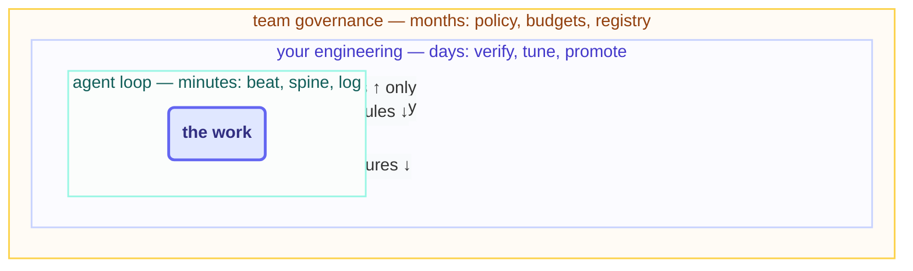

# The Three Nested Loops

> The agent's loop is the innermost and smallest of three. Yours turns more slowly around it.
> The team's turns more slowly still. And nearly every safety property this course teaches
> lives in the gap between two of them.

## The hook

"Who decided the triage loop could close issues?" Four people glance at one another. The loop
certainly didn't decide — loops can't. Either somebody promoted it, or nobody did and it simply
drifted. And the question that unearths the truth is always the same one: *which loop was
supposed to make that call, and when did it last actually turn?*

## The three loops (plain English)

1. **The agent's loop — turns in minutes.** Beat, spine, log, repeat. Everything from Parts
   1–5. It produces *work* — and it is structurally incapable of judging whether it should
   exist, what it ought to cost, or what it may reach for next.
2. **Your engineering loop — turns in days.** Read the run log, verify outcomes, tune skills
   and rubrics, promote or demote by a single level, retire whatever stopped earning its cost.
   It produces *decisions about loops*. Step 14's weekly beat is this loop's heartbeat.
3. **The team's governance loop — turns in weeks or months.** Budgets, permission policy, the
   loop registry, what L3 demands, what happens after an incident. It produces *rules about
   deciding*. At org scale this is where accountability provably sits — a named owner per loop,
   or the loop doesn't run at all.

Here's the property that carries the whole design: **every arrow points inward.** Outer loops
configure inner ones. Inner loops *report* outward but never reach up and configure anything
above them. Break that nesting and you get an anti-pattern with a name:

- **A loop raising its own caps** — the inner loop writing the outer loop's files. It's why
  this repo's budget file is human-owned, full stop.
- **A loop promoting itself** — "well, the reviews were all passing anyway." That's AI gravity
  hardened into architecture.
- **A team letting the fleet's behavior define the policy** because nobody ever wrote one —
  governance by drift.



## The outer loops, made concrete

Loop 2 is a weekly beat you can actually run. Loop 3 is a set of human-owned files the fleet
reads but is never allowed to write:

```claude
# Claude Code — live docs: https://docs.claude.com/en/docs/claude-code
# Loop 2 (yours) is literally runnable — a weekly engineer's beat:
> Read shared/loop-run-log.md and each loops/*/state.md. Per loop:
  cost, escalations, incidents. Recommend promote/hold/demote/retire
  with one line of reasoning each. I decide; you draft.
# Loop 3 (team) lives in files like this repo's LOOP.md ownership map
# and loop-constraints.md — human-owned, loop-read, never loop-written.
```

```opencode
# OpenCode — live docs: https://opencode.ai/docs
# Same shape — outer loops are prompts + human-owned config:
opencode run "READ-ONLY: audit loops/*/loop.md against what each loop
  actually did per the run log. Flag any capability drift."
# Governance artifacts: AGENTS.md, the budget file, the ownership map —
# version-controlled, reviewed like code, owned by named humans.
```

> [!NOTE]
> **Going deeper:** the outer two loops are the whole reason this course insists loop
> engineering is a *discipline*, not an automation trick — the T4 track (`advanced/`, Day 3) is
> devoted entirely to loops 2 and 3: hill-climbing (loop 2 systematically improving loop 1),
> fleet coordination, enterprise governance. The recovery playbook in
> [operating](../10-operating/recovery-playbook.md) is loop 2's incident procedure.

## Check yourself

**Q: This repo's Day 1 page-writer hit its token tripwire, stopped, and asked. A human raised
the caps and it finished. Walk that event through the three loops — what did each one do?**

<details><summary>Answer</summary>

**Loop 1** detected 79% spend, self-throttled to report-only, wrote the alert, and stopped —
reporting *upward*, changing nothing above itself. **Loop 2** (the human) read that alert in
context, judged the work worth more budget, and raised the caps — the *outer* loop
reconfiguring the inner. **Loop 3** had already made that exchange inevitable: the rule "budget
file is human-owned; 80% → report-only" was governance written *before* the incident. Every
arrow pointed inward. That's precisely why the story is boring — and boring was the goal.

</details>

## Try With AI

Sketch the three loops for your own situation — even if loop 1 doesn't exist yet. Loop 2: what
would your weekly engineer's beat check, in five lines? Loop 3: who besides you would have to
agree before your first loop earned write access — and where would that decision be recorded?
If loop 3's answer is "nobody, and nowhere," you've just found your actual first task.

## When it goes wrong

| Symptom | Cause | Fix |
| --- | --- | --- |
| Loop raised its own limits | Inner loop writing the outer loop's files | Ownership map: budgets/policy human-owned; harness-enforce it |
| Capabilities grew, no decision on record | Loop 2 stopped turning; drift filled the gap | Calendar the engineer's beat; capability changes are written decisions |
| "Whose loop is this?" has no answer | Loop 3 never existed | Registry with a named owner per loop; no owner, no run |
| Policy is whatever the fleet already does | Governance by drift | Write the rules the fleet must fit — then audit fit, don't ratify drift |

---

*Glossary terms used on this page:* **nested loops**, **promotion/demotion**,
**governance**, **hill-climbing** — see the [glossary](../02-foundations/glossary.md).

*Sources:* Ng's three nested loops and Karpathy on success criteria — Andrew Ng & Andrej
Karpathy's public statements ([S9](https://x.com/karpathy)) — anchor this page, with the
stay-the-engineer principle from Addy Osmani's *Loop Engineering*
([S5](https://addyosmani.com/blog/loop-engineering/)). Full attribution:
[resources/sources.md](../../resources/sources.md).
