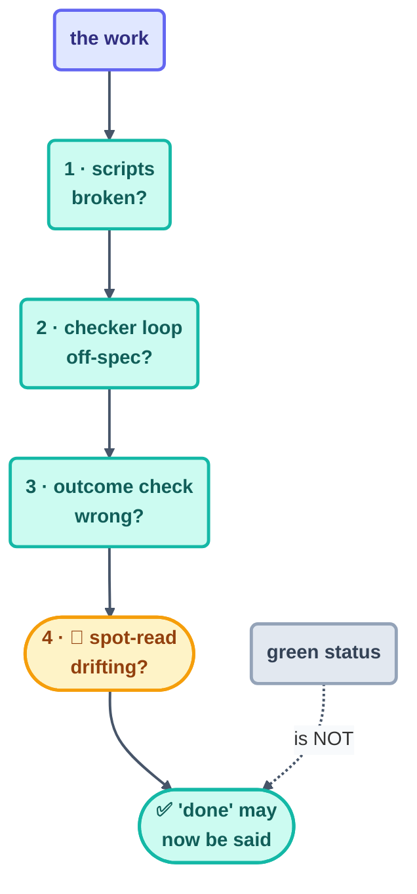

# Verification

> Green ≠ done. A loop's status only tells you it *finished*; verification is the one thing
> that tells you it was *right* — and those two part company at precisely the worst moment.

## The hook

The run log reads `outcome: success` twenty beats in a row. Meanwhile the website that loop was
supposedly "maintaining" has been serving a blank page since Tuesday. Nobody lied to you: the
loop finished every beat, updated its spine, exited zero. Finishing was simply never the same
thing as working — and not one beat anywhere had the job of noticing the difference.

## The practice (plain English)

Verification is a **layered** habit, and each layer catches exactly what the one beneath it
can't see:

1. **Script checks** — the free layer. Links resolve, tests pass, the build exits 0, the report
   matches its template. Run them every beat, and never trust a beat that skipped them.
   *Catches: broken.*
2. **Checker loops** — the cheap layer. A read-only grader with a rubric
   ([Step 11](../05-part-3-the-body/11-maker-checker.md)) checking shape and consistency.
   *Catches: malformed, off-spec.*
3. **Outcome checks** — the layer scripts can't reach: is the *actual goal* being served? The
   deployed page renders, the triage ranking really matches what mattered, the "fixed" bug
   stays fixed. Drive the affected flow end to end — don't just inspect its artifacts.
   *Catches: wrong.*
4. **The human spot-read** — the gate. Sample the work the way an editor would: one page per
   part, one PR per day, chosen *by you* rather than by the loop. *Catches: drift you never
   thought to write a rule against.*

The thread binding all four: **verify before declaring, at every level.** A loop verifies
before ticking its spine. A checker verifies before it says PASS. The human verifies before the
checkpoint. This repo's rulebook compresses the whole idea into four words — *the maker never
grades its own work* — and its checkpoints exist precisely because rule 12 of
[`CLAUDE.md`](../../CLAUDE.md) forbids declaring "done" before verification has happened.



## The habit in each tool

Bake layer 1 into the beat itself, and give layer 3 a small loop of its own. In each tool:

```claude
# Claude Code — live docs: https://docs.claude.com/en/docs/claude-code
# Bake layer 1 into the loop prompt itself:
> /loop … After writing the page, RUN the link check and lint before
  ticking the box. A beat that skips verification is a failed beat.
# Layer 3 as its own small loop (this is Day 4's render-checker):
> /loop Read render-state.md. Load the next page's route; confirm it
  renders with no console errors. Check it off; log failures.
```

```opencode
# OpenCode — live docs: https://opencode.ai/docs
# Layer 1 in the wrapper (the beat fails if verification fails):
opencode run "Write the next page per state.md" && \
  npx markdownlint-cli2 "docs/**/*.md" && \
  lychee --offline "docs/**/*.md" || echo "beat FAILED verification"
```

> [!NOTE]
> **Going deeper:** the observability instruments that make verification cheap — the run log
> read as a narrative, escalations treated as signal, a whole fleet's week digested in five
> minutes — get their own page in
> [10-operating/observability.md](../10-operating/observability.md). And the failure this
> practice heads off has both a name and a page of its own: *green ≠ done* in
> [failure modes](../10-operating/failure-modes.md).

## Check yourself

**Q: Your CI is green, your checker loop PASSes every page, and your users tell you the search
feature the loop "finished" last week returns nothing. Which verification layer was missing, and
why didn't layers 1–2 catch it?**

<details><summary>Answer</summary>

Layer 3 — the **outcome check**. The scripts verified artifacts (files exist, lint passes) and
the checker verified *shape* (pages match the template). Neither one ever exercised the actual
behavior — running a search and looking at what came back. Layers 1–2 can only catch failures
that live in the artifacts they inspect; "finished but doesn't work" lives in the running
system, which only an end-to-end check ever visits.

</details>

## Try With AI

Take any "done" item from a recent agent session and verify it across all four layers: run the
scripts, grade it against a rubric in a fresh read-only session, drive the actual flow end to
end, then spot-read the diff with your own eyes. Score each layer pass/fail. Most people turn up
their first "green but wrong" within three tries — and finding yours now, deliberately, is the
entire point of the drill.

## When it goes wrong

| Symptom | Cause | Fix |
| --- | --- | --- |
| "Success" for weeks, product broken | Only layer-1 checks ever existed | Add the outcome check — drive the flow, not the artifacts |
| Checker PASSes garbage | Rubric checks shape while the goal drifted | Human spot-reads sample *content*; update the rubric when drift shows |
| Verification skipped when beats run long | Verification was optional in the prompt | Make it the beat's exit condition: no verify, no tick |
| Human gate rubber-stamps | The gate reviews everything, and attention died | Sample small, sample randomly, sample *deliberately* |

---

*Glossary terms used on this page:* **green ≠ done**, **outcome check**,
**spot-read**, **checkpoint** — see the [glossary](../02-foundations/glossary.md).

*Sources:* the verification ladder draws on Panaversity's *Loop Engineering: A Crash Course*
([S1](https://agentfactory.panaversity.org/docs/loop-engineering-crash-course)), Addy Osmani's
*Loop Engineering* ([S5](https://addyosmani.com/blog/loop-engineering/)), and the
verification-loop layer of Sydney Runkle's *The Art of Loop Engineering*
([S6](https://www.langchain.com/blog/the-art-of-loop-engineering)). Full attribution:
[resources/sources.md](../../resources/sources.md).
