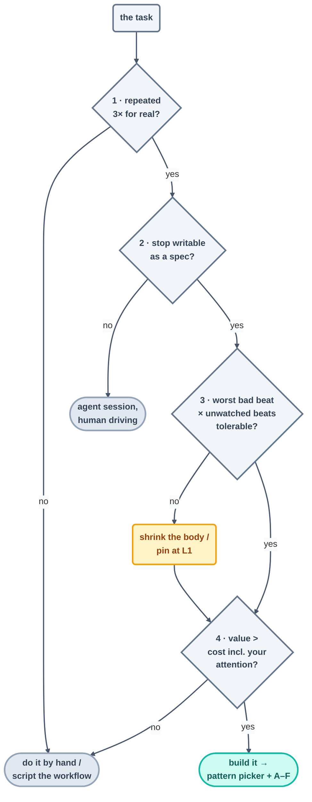

# The Decision Framework — Should This Be a Loop at All?

> The pattern picker takes for granted that a loop is warranted. This page is the checkpoint
> that comes before it: four tests a task has to clear before it earns a heartbeat — because the
> priciest loop in the world is the one that should never have existed.

## The four tests

### 1 · The repetition test

Has this task genuinely happened three times? Not "it's bound to recur" — *has recurred*.
Building a loop for a repetition you're only predicting is speculative infrastructure. The third
real occurrence is the moment a prediction turns into data. (A one-off with lots of steps? That's
a **workflow** — script it, don't loop it.)

### 2 · The specification test

Can you write the stopping condition as a machine-checkable spec *today*? If the goal exists only
as taste ("make the docs better"), a loop will happily manufacture plausible-looking progress
until the heat death of the universe. Judgment-shaped goals want a human in the driver's seat
with the agent as hands — a session, not a loop.

### 3 · The tolerance test

Do the multiplication: (worst realistic bad beat) × (beats per week nobody watches). A weekly
report loop's worst case is one silly report — loop it freely. An auto-merge loop's worst case is
machine-speed damage to a shared codebase. The tolerance test draws the line: not until the
checker-and-gate structure is *stronger than your best reviewer*. If that product frightens you,
the answer isn't "no" — it's "L1, and a smaller body."

### 4 · The economics test

Loop cost = build + (tokens × beats) + **your attention on its reports, forever**. Loop value =
human minutes saved × how often + errors prevented. The term everyone forgets is the attention
one: a loop whose report you have to read daily has quietly *hired you*. If value comes in under
cost, the by-hand version was fine all along.

## The honest outcomes

Something like half of all candidate tasks ought to end at one of the gray boxes — and when they
do, that's the framework *succeeding*, not failing:

| Outcome | It means |
| --- | --- |
| **Do it by hand** | rare, or cheaper than a loop's true cost |
| **Script the workflow** | many steps, one pass, no recurrence — determinism beats a heartbeat |
| **Agent session, human driving** | recurs but can't be specified — judgment work |
| **Build it, smaller** | loop-worthy, but body/level shrunk until the tolerance test passes |
| **Build it** | all four passed — proceed to the [pattern picker](pattern-picker.md) and [A–F](make-your-own-loop.md) |

## The anti-pattern this page exists to stop

**Reaching for the biggest loop** — automating the most *impressive* version of the task instead
of the most *repeated* one, at maximum autonomy, because the demo felt good. Its fingerprints:
no third real occurrence, a stop written as vibes, a tolerance product nobody bothered to
multiply, and attention costs airily waved away. Every one of those has a named failure mode
lying in wait in the [operating handbook](../10-operating/failure-modes.md).

*Course context:* this framework is Question Zero of the capstone — before the rubric grades your
loop, it asks whether you should ever have built one.

*Sources:* the decision framework distills Panaversity's *Loop Engineering: A Crash Course*
([S1](https://agentfactory.panaversity.org/docs/loop-engineering-crash-course)) and Addy Osmani's
*Loop Engineering* ([S5](https://addyosmani.com/blog/loop-engineering/)). Full attribution:
[resources/sources.md](../../resources/sources.md).
