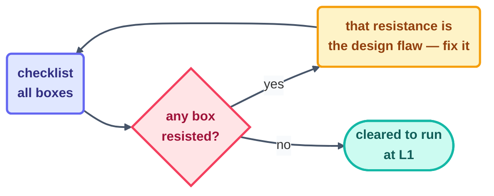

# The Loop Design Checklist

> A print-and-fill companion to [the A–F method](make-your-own-loop.md). If any box refuses a
> one-line answer, the design isn't finished — that resistance *is* the finding.

## Identity

- [ ] **Name:** `___________` (verb-noun, like every loop in this repo's `loops/`)
- [ ] **Job in one sentence:** `___________`
- [ ] **Owner (a named human):** `___________` — no owner, no run
- [ ] **Shape** (circle one): ends → conditional · repeats → schedule / event · once → **stop, don't build a loop**

## The six parts

- [ ] **Heartbeat:** exact cadence / condition / event: `___________`
- [ ] **Body:** may touch exactly these paths/tools: `___________` — everything else read-only
- [ ] **Spine:** state file path: `___________` — written and **committed before beat 1**
- [ ] **Stopping condition (as a spec):** `___________` — machine-checkable, no adjectives
- [ ] **Checker:** script / read-only LLM / human: `___________` — never the maker
- [ ] **Human gate:** placed at: `___________`

## The three stops

- [ ] Success = the spec above
- [ ] Limit = max `____` runs/day (would the number embarrass you if it were hit? good)
- [ ] No progress = 3 unchanged beats → log and stop

## Guardrails

- [ ] Token cap/day: `____` · 80% tripwire → report-only (measured against the cap *as currently written*)
- [ ] Kill switch exists and has been **tested once**: `___________`
- [ ] One run-log line per beat — silent runs are a failure mode
- [ ] Writes are idempotent (safe to retry / double-fire)
- [ ] Blast radius written down: worst realistic bad beat does: `___________`

## Trust plan

- [ ] Starts at **L1 report-only**, watched, on real work
- [ ] Promotion rule: one level per proven level; who decides: `___________`
- [ ] Demotion rule: any incident → drop one level, run the [recovery playbook](../10-operating/recovery-playbook.md)

## The seven-item minimum before the FIRST run

The very same list every loop in this repo clears
(cf. [Step 13](../07-part-5-complete-loop/13-build-the-loop-twice.md)):

| # | Item | ✔ |
| - | ---- | - |
| 1 | Provable success condition | ☐ |
| 2 | Run limit | ☐ |
| 3 | Spine written first, committed | ☐ |
| 4 | Report-only (L1) start | ☐ |
| 5 | Human gate placed | ☐ |
| 6 | One log line per beat | ☐ |
| 7 | Kill switch tested | ☐ |

*Rather fill blanks than start from an empty page? This checklist comes pre-poured as a
copyable kit — see [scaffold-from-template](scaffold-from-template.md) and
[`starters/_template/`](../../starters/_template/README.md).*

*Live examples of filled-in designs: every `loop.md` under
[`loops/`](../../loops/README.md) is this checklist, answered for real.*

*Sources:* the checklist condenses the minimum-safe practice of Panaversity's *Loop Engineering:
A Crash Course* ([S1](https://agentfactory.panaversity.org/docs/loop-engineering-crash-course))
and the `cobusgreyling/loop-engineering` reference repo
([S7](https://github.com/cobusgreyling/loop-engineering), MIT). Full attribution:
[resources/sources.md](../../resources/sources.md).
