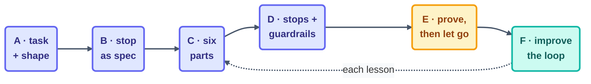

# Make Your Own Loop — the A–F Method

> The 14 steps taught you the organs. This page is the surgery manual: six moves, A through F,
> that turn "I keep doing this by hand" into a loop you can actually trust.

## When to reach for this page

The moment you notice you're doing the same agent-assisted task for the third time. Three is
the magic number — once is just work, twice is coincidence, and three times is a loop you
haven't built yet.

## The method

### A · Pick the task and its shape

State the task in one sentence, then let the way it *ends* choose the heartbeat for you:

- The work **ends** (a list empties, a suite goes green) → **conditional** run-until-done.
- The work **repeats** (every morning, every PR) → **schedule** or **event**.
- The work happens **once** → **no loop.** Just do it. (The most common mistake in the book:
  looping a one-off because loops are fun to build.)

### B · Write the stopping condition as a spec

Before you touch a prompt: one sentence a machine can verify. *"Every box in `state.md` is
checked."* *"`npm test` exits 0."* If you can't write that sentence, you don't have a loop task
yet — you have a wish. Keep sharpening the task until the stop practically writes itself.

### C · Assemble the six parts

Fill in the table — every row, even when the honest answer is small:

| Part | Your answer must name… |
| --- | --- |
| Heartbeat | the exact trigger (cadence / condition / event) |
| Body | the paths + tools it may touch, and *nothing else* |
| Spine | the state file, created and committed **before** the first beat |
| Stopping condition | the spec from B, verbatim |
| Checker | script, read-only LLM, or human — the cheapest that catches the failure you fear |
| Human gate | where a person decides (review, approve, promote) |

### D · Add the three stops and the guardrails

Success (straight from B) · **limit** (max runs — pick a number that would embarrass you if it
were ever hit) · **no-progress** (3 unchanged beats → stop and log). Then bolt on the
guardrails: budget caps plus the 80% tripwire, a kill switch, and one log line per beat.

### E · Prove it, then let go — one level at a time

**L1 report-only** for real, watched runs → **L2 assisted** (writes, human reads every output)
→ **L3 unattended** (writes, human samples). One promotion per proven level, and automatic
demotion on any incident. Never skip a rung because the streak was looking good.

### F · Improve the loop, not just the work

When a beat lets you down, fix the *skill*, the *rubric*, or the *spec* — never the individual
output. Output fixes evaporate by morning; loop fixes compound. (This is the seed of
hill-climbing: see [Step 12](../06-part-4-the-spine/12-state-between-runs.md).)

## Worked in 90 seconds

*Task:* "changelog entries pile up unwritten." **A:** it repeats per merge → event loop.
**B:** "every merged PR since the last beat has a changelog line." **C:** body = `CHANGELOG.md`
only; spine = last-processed PR number; checker = a script (does every merged PR number show
up?); gate = the release manager reads it before tagging. **D:** limit 10/day; no-progress = 3
beats stuck on an unprocessable PR → escalate. **E:** one week of L1 drafts-as-comments before
it's ever allowed to commit. **F:** the entries came out too terse → fix the skill's template,
not Tuesday's individual entry.

## Use it against real paper

- The method applied to a full project, decision by decision:
  [worked-example-dependency-sweeper](worked-example-dependency-sweeper.md)
- Blank six-part table + checklist: [loop-design-checklist](loop-design-checklist.md)
- A ready-made kit to copy and fill: [scaffold-from-template](scaffold-from-template.md)
- Which heartbeat/pattern fits: [pattern-picker](pattern-picker.md)
- Should this be a loop at all: [decision-framework](decision-framework.md)

*Course context:* this method is the bridge from
[Part 5's build](../07-part-5-complete-loop/13-build-the-loop-twice.md) to loops of your own
design — and the capstone assessment asks you to walk A–F cold.

*Sources:* the A–F method is original to this course, synthesizing Panaversity's *Loop
Engineering: A Crash Course*
([S1](https://agentfactory.panaversity.org/docs/loop-engineering-crash-course)),
stopping-condition-as-spec from *Spec-Driven Development*
([S3](https://agentfactory.panaversity.org/docs/spec-driven-development-crash-course)), and the
L1-report-only-first rule of the `cobusgreyling/loop-engineering` reference repo
([S7](https://github.com/cobusgreyling/loop-engineering), MIT). Full attribution:
[resources/sources.md](../../resources/sources.md).
