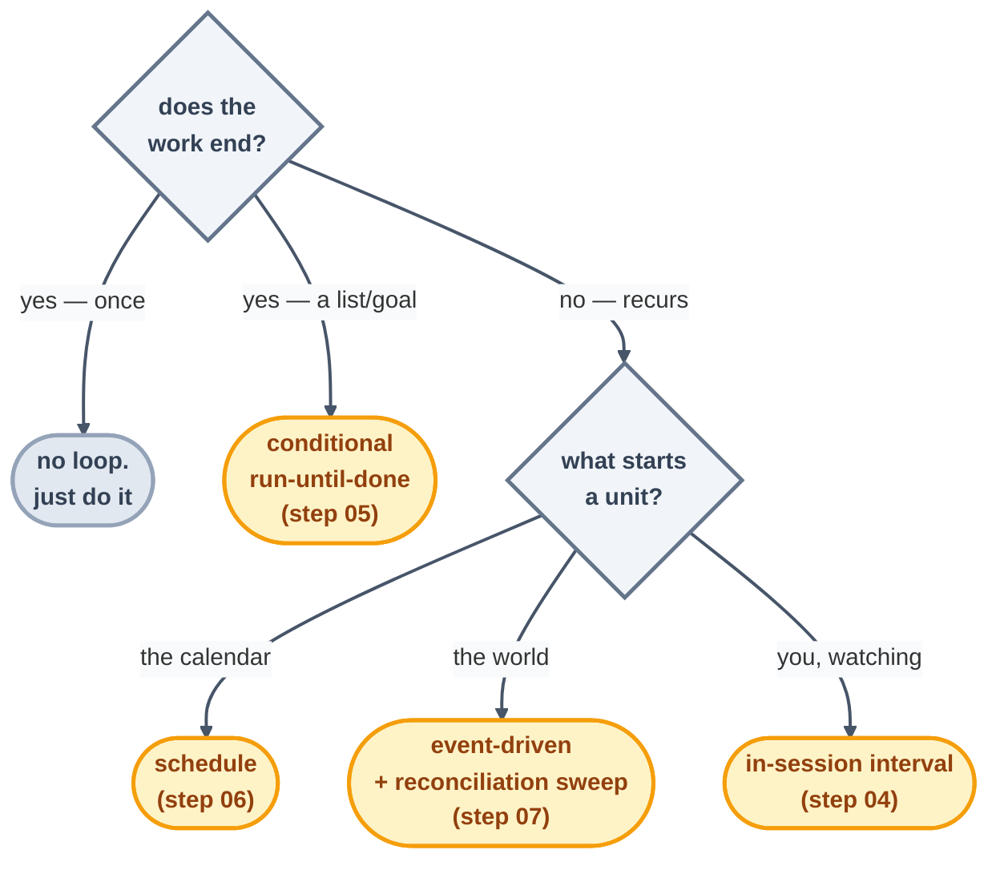

# The Pattern Picker

> Answer four questions about the *task* and read straight off the heartbeat, the level, and the
> checker. Loop design is mostly classification — and this page is the classifier.

## The four questions

1. **Does the work end?** A finite list, a green suite, a resolved queue — or does it keep
   recurring for as long as the repo draws breath?
2. **What kicks off a unit of work?** Time passing · a condition that's still false · an external
   event (a PR, a message, a release)?
3. **How bad is a wrong beat?** A weird report (harmless) · a bad commit (revertible) · an
   external action a stranger can see (unrecallable)?
4. **Can a script judge success?** Exit codes and diffs — or does done-ness genuinely need
   judgment?

## The decision tree

Questions 3 and 4 leave the heartbeat alone — what they set is the **level** and the **checker**:

| Q3 · worst wrong beat | Start at | Human gate |
| --- | --- | --- |
| a report nobody needed | L1, promote normally | samples reports |
| a bad-but-revertible write | L1 longer; L2 with every output read | reads every diff |
| an external, visible action | L1 indefinitely; writes are a governance decision | approves each action class |

| Q4 · can a script judge? | Checker |
| --- | --- |
| yes (links, tests, schema) | **script** — prefer it every time |
| partly | script for the facts + read-only LLM for the shape |
| no (tone, priority, taste) | LLM rubric + human spot-read — and ask whether the task is loop-ready at all |

## The picker, run on familiar loops

| Task | Q1 | Q2 | Q3 | Q4 | → Pattern |
| --- | --- | --- | --- | --- | --- |
| "empty this page checklist" | ends | condition | revertible | partly | conditional maker at L2 + LLM checker (this repo's `step-writer`) |
| "keep links honest" | recurs | calendar | harmless | yes | scheduled L1 + script checker (this repo's `link-check` → promoted to CI) |
| "review each PR" | recurs | event | visible | partly | event L1 + reconciliation sweep, comments-only |
| "morning repo triage" | recurs | calendar | harmless | partly | scheduled L1 report ([Step 13](../07-part-5-complete-loop/13-build-the-loop-twice.md)) |

## Two classification mistakes to catch early

- **A workflow mistaken for a loop.** Fixed steps, one pass, deterministic order? That's the
  *body of one beat* ([Step 11](../05-part-3-the-body/11-maker-checker.md)), not a loop. Loops
  decide *whether and when*; workflows decide *how*.
- **Reaching for the biggest loop.** Unattended-event-driven-with-writes is the most powerful
  pattern there is — and the wrong first answer to nearly everything. Pick the smallest pattern
  that does the job; promotion exists for a reason.

*Next:* shape chosen → fill the [design checklist](loop-design-checklist.md). Unsure the task
deserves a loop at all → the [decision framework](decision-framework.md).

*Sources:* the pattern set follows the seven patterns of the `cobusgreyling/loop-engineering`
reference repo ([S7](https://github.com/cobusgreyling/loop-engineering), MIT) and the loop shapes
of Panaversity's *Loop Engineering: A Crash Course*
([S1](https://agentfactory.panaversity.org/docs/loop-engineering-crash-course)). Full
attribution: [resources/sources.md](../../resources/sources.md).
