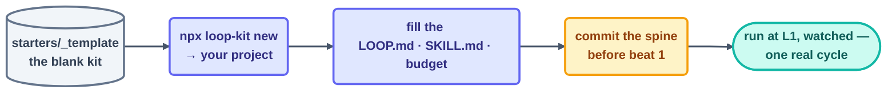

# Scaffold a Loop from the Template

> [The A–F method](make-your-own-loop.md) tells you *what* to decide; [the design
> checklist](loop-design-checklist.md) is the blank form. This page is the shortcut between
> them: a ready-made kit you copy and fill, so a new loop starts as a folder of blanks to
> complete rather than an empty directory to invent.

## The idea

Every loop is the same short list of small files — a definition, a spine, a budget, a
constitution, a skill, and a read-only checker. Writing them from scratch each time is how
loops get born missing an organ. So the repo ships a canonical kit,
[`starters/_template/`](../../starters/_template/README.md), with every file pre-poured and
every decision marked as an `<ANGLE-BRACKET>` blank. One `npx` command drops it into any
project — no clone required — and once the blanks are filled the seven-item minimum is
most of the way done for you.

## Scaffold in six moves

```text
1. npx @loop-engineering/loop-kit new <loop-name>       # install the kit, name substituted
2. read what landed: loops/<loop-name>/ + .claude/      # definition, spine, skill, checker
3. fill every <ANGLE-BRACKET> in LOOP.md                # the six parts + three stops
4. write the procedure into the SKILL.md                # intent in the prompt, steps in the skill
5. git add + commit the spine BEFORE the first beat     # uncommitted state is pre-lost
6. run at L1, watched, for one real cycle               # prove before overnight
```

Move 1 is the only one a machine can do for you. The exact command, and the three ways
to run it, are in [Getting Started with a Starter Kit](../../starters/getting-started.md);
it writes the files into whatever project you run it from — no clone, no global install,
Node 18+ and nothing else — and substitutes your loop's name through the spine, the
skill, and the OpenCode permission block. Moves 3 and 4 are the design work, and no CLI
can shortcut them.

> [!NOTE]
> Working *inside this repo*, adding a kit to the library rather than to a project of your
> own? Then the copy is local: `cp -r starters/_template starters/<loop-name>`, or
> `node scripts/new-loop-scaffold.mjs <loop-name>` to do the copy and the substitution in
> one step. Same files either way — only the destination differs.



## What each file in the kit is for

| File | You fill it with | Guided by |
| --- | --- | --- |
| `LOOP.md` | the six parts, the prompt, limits, ownership, the three stops | [A–F method](make-your-own-loop.md) |
| `<loop-name>-state.md` | the spine — checklist, run history, findings, lessons | [Step 12 · Spine](../06-part-4-the-spine/12-state-between-runs.md) |
| `loop-budget.md` | caps + the 80% tripwire | [Cost management](../08-part-6-human-control/cost-management.md) |
| `loop-constraints.md` | the constitution — nevers and always | [Safety](../10-operating/safety.md) |
| `loop-run-log.md` | the append-only line format | [Observability](../10-operating/observability.md) |
| `.claude/skills/loop-task/SKILL.md` · `skills/loop-task.md` | the procedure (Claude Code · OpenCode) | [Step 9 · Skills](../05-part-3-the-body/09-skills.md) |
| `.claude/agents/loop-verifier.md` | the read-only checker + its rubric | [Step 11 · Maker–Checker](../05-part-3-the-body/11-maker-checker.md) |
| `opencode.json.example` | write-narrow permissions (OpenCode) | [Safety](../10-operating/safety.md) |

## Worked in 60 seconds — a `link-sentinel` loop

*Install:* `npx @loop-engineering/loop-kit new link-sentinel`. *Fill `LOOP.md`:* heartbeat =
schedule, every 30m; body = runs a link checker, **read-only on `docs/`**; spine =
`link-sentinel-state.md`; stop = "a pass over `docs/` with zero broken links"; checker = a
**script** (a link either resolves or it doesn't — the strongest checker there is); gate =
a human reads the findings. *Fill the skill:* the three-line link-check procedure. *Commit*
the spine. *Run at L1.* That's a complete production loop — and it's exactly the shape of
this repo's own [`link-check`](../../loops/day1/link-check/loop.md), which was later
promoted into CI.

## Before the first run

Walk the copied kit against the seven-item minimum — the same list every loop in this repo
clears (and the same one in [the design checklist](loop-design-checklist.md)):

1. Provable success condition
2. Run limit
3. Spine written first, committed
4. Report-only (L1) start
5. Human gate placed
6. One log line per beat
7. Kill switch tested

Any blank you can't fill in a sentence isn't a formatting gap — it's a design decision you
haven't made yet. Make it before beat 1.

*Next:* not sure this task even deserves a loop? → the [decision framework](decision-framework.md).
Unsure which heartbeat fits? → the [pattern picker](pattern-picker.md). Want to see the kit
built live in two tools? → [Part 5 · A Complete Loop](../07-part-5-complete-loop/13-build-the-loop-twice.md).

*Sources:* the starter-kit model and the `loop-init` scaffold shape are adapted from the
`cobusgreyling/loop-engineering` reference repo
([S7](https://github.com/cobusgreyling/loop-engineering), MIT); the loop anatomy the kit
encodes is from Panaversity's *Loop Engineering: A Crash Course*
([S1](https://agentfactory.panaversity.org/docs/loop-engineering-crash-course)). Full
attribution: [resources/sources.md](../../resources/sources.md).
