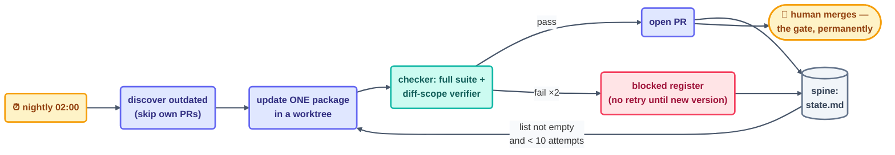

# Worked Example — Designing the Dependency-Update Loop

> [Make-your-own-loop](make-your-own-loop.md) defines the six moves, A through F. This page
> applies them to one substantial, real project — automated dependency updates — so you can
> watch each design decision being made, and see why it was made. The result is a **scheduled
> maker–checker loop with a conditional body**: the schedule decides *when* work starts, a
> provable condition decides *when it is finished*, and a separate checker decides *whether it
> was done right.*

## The project

Every active repository carries the same recurring obligation: dependencies fall behind, and
each postponed update raises both the security exposure and the eventual cost of catching up.
Done by hand, the work is identical every time — check for new versions, update one package,
run the tests, open a pull request, repeat. Identical, recurring, verifiable: exactly the
profile of work a loop should own. The catalog calls this loop the **dependency-sweeper**
(Part V, category A). We will design it from a blank page.

## A · Pick the task and its shape

State the task in one sentence: *"Keep this repository's dependencies current without breaking
the build."*

Then let the way the work *ends* choose the heartbeat:

- The backlog of outdated packages **empties** within a run — that part is conditional.
- New versions **keep arriving** — so the loop as a whole must repeat.

Both are true, which identifies the shape precisely: a **schedule** heartbeat (nightly is
sufficient; version churn is a per-day phenomenon, not per-minute) wrapping a
**run-until-done body** (each beat works its list to empty or to a limit). This two-layer shape
is common in production loops and worth recognizing: *scheduled outside, conditional inside.*

Two alternatives were considered and rejected, and the rejections are part of the design:

- **Event-driven** (trigger on each upstream release) — rejected: it multiplies beats without
  multiplying value, and each beat would update one package in isolation, losing the chance to
  test related updates together.
- **A one-off "update everything" session** — rejected: the work recurs by nature; a one-off
  merely resets the clock.

## B · Write the stopping condition as a spec

The inner, conditional body needs a stop a machine can verify:

> A beat is complete when every outdated production dependency has either **(a)** an open pull
> request in which the full test suite passes, or **(b)** a `blocked` entry in the spine
> recording the version, the failing check, and the retry count.

Note the second clause. The first draft — "all dependencies are up to date" — fails the spec
test, because some updates *cannot* succeed (a major version with breaking changes, a
transitively pinned conflict). A stop that ignores that fact leaves the loop with unfinishable
work, which is [infinite-loop scenario 2](../10-operating/infinite-loops.md) — the unprovable
stop. The `blocked` clause converts "impossible today" from an endless retry into a recorded,
human-visible outcome.

## C · Assemble the six parts

| Part | Decision | Rationale |
| --- | --- | --- |
| **Heartbeat** | schedule, nightly 02:00 | shape from A; runs while CI capacity is idle |
| **Body** | read manifest + lockfiles; write only inside a dedicated worktree; open PRs; never touch `main` | the loop writes code, so isolation is not optional ([Step 8](../05-part-3-the-body/08-worktrees.md)) |
| **Spine** | `loops/dependency-sweeper/state.md` — per-package status, PR numbers, retry counts, `blocked` register | committed every beat; an interrupted beat resumes its list instead of restarting it |
| **Stopping condition** | the spec from B, verbatim | — |
| **Checker** | the full test suite plus a read-only verifier agent that confirms the diff touches *only* manifest and lockfiles | the maker never grades its own work; the scope check catches the failure tests cannot — an update that "fixed" a failing test by editing it |
| **Human gate** | every PR is merged by a person; the loop opens, updates, and annotates PRs but has no merge permission | the blast radius of a bad dependency justifies a mandatory gate |

Part C is also where the **single-loop vs multi-loop** question is settled
([one loop or many?](../10-operating/multi-loop.md)). Updating dependencies and merging them are
different jobs at different trust levels — so the merge is *not* a second loop; it is the human
gate. A second loop becomes justified later, if at all, for a genuinely separate job (for
example, a security-advisory triage loop feeding this one's priority list), and it would arrive
under the fleet contract with its own spine. One job, one owner, one loop.

## D · Add the three stops and the guardrails

Every feedback path in the design gets an explicit bound
([infinite-loops.md](../10-operating/infinite-loops.md)):

- **Per-beat limit:** at most 10 update attempts per beat. A number this low is deliberate —
  it caps cost, keeps PRs reviewable, and turns a pathological night into a small incident.
- **Per-package retry bound:** an update whose tests fail is retried once with a clean
  worktree, then written to the `blocked` register and **not retried again until its version
  changes upstream**. This single rule eliminates the most likely failure: one breaking major
  version becoming a nightly doom loop (scenario 1).
- **No-progress stop:** three consecutive beats in which the spine's package list is unchanged
  → the beat logs `no-change` and exits within seconds instead of re-running discovery.
- **Ping-pong guard:** the loop ignores its *own* open PRs during discovery, so it never
  re-processes work it has already produced (scenario 3, removed by design rather than by
  filter).
- **Budget:** a per-beat token cap with the 80% tripwire, one line per beat in the shared run
  log, and the fleet kill switch checked before any work.

## E · Prove it, then let go

- **Week 1 — L1, report-only.** The loop discovers, tests in its worktree, and *reports* what
  it would have opened. A human confirms the reports against reality.
- **Week 2 — L2, assisted.** The loop opens real PRs; a human reviews every one. This is the
  loop's permanent operating level — the human gate on merge is a design feature, not a
  temporary training measure.
- **L3 is explicitly out of scope.** Auto-merge of dependency updates is a decision about the
  *repository's* risk tolerance, not the loop's competence, and it is not this loop's call to
  make.

## F · Improve the loop, not just the work

When a merged update later breaks production, the correction is never limited to reverting the
package. The loop itself is strengthened — the checker gains the test that would have caught the
break, or the skill gains a rule ("hold packages named on the risk list for manual review").
Each incident, once processed this way, permanently narrows the class of failures the loop can
repeat. That is the compounding the spine exists to support.



## The finished design, on one screen

The entire design compresses into a `loop.md` a teammate could operate without asking a single
question:

```markdown
# loop: dependency-sweeper
type:       scheduled maker–checker loop, conditional body
heartbeat:  schedule · nightly 02:00
body:       read manifests/lockfiles · write in worktree only · open PRs ·
            no merge permission · never touches main
spine:      loops/dependency-sweeper/state.md
beat-done:  every outdated prod dependency has a green-suite PR
            or a `blocked` entry (version, failing check, retries)
checker:    full test suite + read-only diff-scope verifier
bounds:     10 attempts/beat · retry ×1 then blocked-until-new-version ·
            3 unchanged beats → no-change exit · skip own PRs
gate:       human merges every PR (permanent)
level:      L1 week 1 → L2 permanent · L3 out of scope
budget:     per-beat cap · 80% tripwire · kill switch first
```

Read the spec back against the method: every line traces to one of the six moves, and every
move produced at least one line. That correspondence is the test of a finished design — a line
with no move behind it is decoration; a move with no line is a gap. To build the loop for real,
take this spec to [scaffold-from-template](scaffold-from-template.md) and clear the
[design checklist](loop-design-checklist.md) before beat 1.

*Sources:* the worked design applies this course's A–F method (original — see
[make-your-own-loop](make-your-own-loop.md)) to the `dependency-sweeper` catalog entry,
following Panaversity's *Loop Engineering: A Crash Course*
([S1](https://agentfactory.panaversity.org/docs/loop-engineering-crash-course)) for the six
parts and the three stops, *Spec-Driven Development*
([S3](https://agentfactory.panaversity.org/docs/spec-driven-development-crash-course)) for the
stopping-condition-as-spec discipline, Sydney Runkle's *The Art of Loop Engineering*
([S6](https://www.langchain.com/blog/the-art-of-loop-engineering)) for the verification-loop
framing, and the `cobusgreyling/loop-engineering` reference repo
([S7](https://github.com/cobusgreyling/loop-engineering), MIT) for the L1-first rule and kit
shape. Full attribution: [resources/sources.md](../../resources/sources.md).
