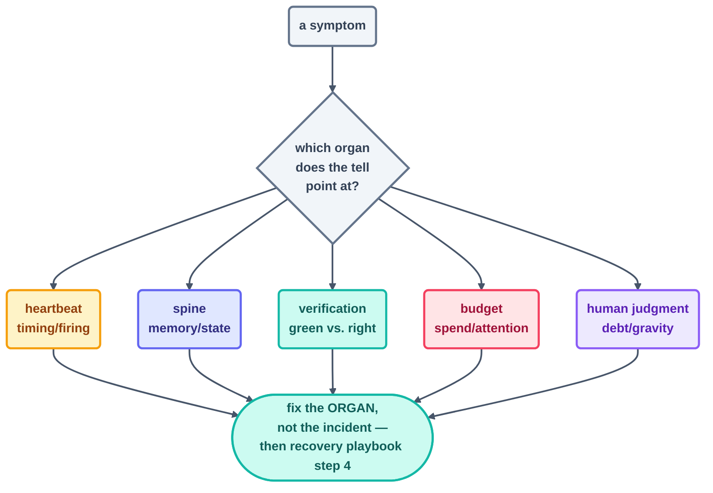

# Failure Modes

> When a loop misbehaves, the single fastest diagnostic is a name. This catalog gives every
> operational failure its name, its tell in the instruments, and its fix — sorted by the organ
> that broke.

## How to use this page

Something feels off? Hunt down the symptom in the tables below. The failure's *organ* tells you
where the fix belongs. (Design-time mistakes have a catalog of their own in
[anti-patterns.md](anti-patterns.md); the specific ways a loop runs *forever* get a deep dive in
[infinite-loops.md](infinite-loops.md); a failure that's already unfolding goes straight to the
[recovery playbook](recovery-playbook.md).)

## Heartbeat failures

| Failure | The tell | The fix |
| --- | --- | --- |
| **Doom loop** | same item retried beat after beat; log shows effort, spine shows no progress | per-item retry cap; no-progress stop; escalate after N attempts |
| **Runaway heartbeat** | beats far more frequent than designed (retrying webhook, overlapping crons) | idempotent beats keyed on event id; dedupe; one scheduler per loop |
| **Task didn't fire** | expected log line missing; "it worked yesterday" | session-scoped timer died with the session; promote to a real schedule |
| **Didn't survive restart** | silence after a reboot/deploy | schedules must live outside the machine's memory (cron file, CI, cloud routine) |
| **Dropped events assumed queued** | gaps during bursts, zero errors | reconciliation sweep ([Step 7](../04-part-2-heartbeat/07-event-driven.md)) |

## Spine failures

| Failure | The tell | The fix |
| --- | --- | --- |
| **No spine** | restart repeats finished work | state file read first, updated last, every beat |
| **Uncommitted spine** | state fine locally, gone when needed most | commit every beat — this repo's Day 1 scar ([Step 12](../06-part-4-the-spine/12-state-between-runs.md)) |
| **Spine drift** | spine says done, world disagrees | verify before ticking; reconcile spine vs. log weekly |
| **Two writers, one file** | interleaved/clobbered state | one owner per file, enforced; second writer gets its own spine |

## Verification failures

| Failure | The tell | The fix |
| --- | --- | --- |
| **Green ≠ done** | statuses perfect, product broken | outcome checks that drive the flow ([verification](../08-part-6-human-control/verification.md)) |
| **Maker grading itself** | 100% pass rates, zero findings ever | separate checker; `items_found>0, actions_taken:0` is health |
| **Silent errors** | beats "succeed" fast and do nothing | actionable errors; a beat that catches an exception must log it |
| **Checker rubber-stamp** | PASSes everything including planted defects | rubric rows; periodically plant a defect and confirm it's caught |

## Budget & attention failures

| Failure | The tell | The fix |
| --- | --- | --- |
| **Runaway spend** | tokens far above estimate; no tripwire fired | caps + 80% line measured against the *current* cap (this repo's Day 1 gap) |
| **Report fatigue** | reports unread for a week; then a surprise | shrink reports to 5 lines; alert only on silence and escalations |
| **Zombie loop** | runs forever, influences nothing | economics test ([decision framework](../09-methods/decision-framework.md)); retire it |

## Human-judgment failures

| Failure | The tell | The fix |
| --- | --- | --- |
| **Cognitive surrender** | "the loop probably knows better" ends investigations | the loop is never the authority on itself; instruments are |
| **Comprehension debt** | nobody can explain a subsystem the fleet built | smaller beats; spot-reads; pause expansion until understanding catches up |
| **Intent debt** | output matches spec, misses the point repeatedly | fix the spec, not the output; constitution grows one hard-won line at a time |
| **AI gravity** | capabilities grew without a written decision | audit body vs. `loop.md`; every expansion is a named human's decision |
| **Same loop, opposite results** | pattern worked in repo A, misfires in repo B | context differs; re-run the L1 proving period per deployment — trust doesn't transfer |

*The rule underneath the whole page: incidents keep repeating until the organ is fixed. Patch the
output and all you've done is reschedule the failure — which is exactly the argument of
[recovery playbook](recovery-playbook.md) step 4.*

*Sources:* the failure catalog is drawn from the `cobusgreyling/loop-engineering` reference repo
([S7](https://github.com/cobusgreyling/loop-engineering), MIT) and the essays of Addy Osmani's
*Loop Engineering* ([S5](https://addyosmani.com/blog/loop-engineering/)) and Sydney Runkle's *The
Art of Loop Engineering* ([S6](https://www.langchain.com/blog/the-art-of-loop-engineering)). Full
attribution: [resources/sources.md](../../resources/sources.md).
