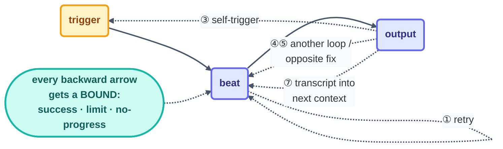

# Infinite Loops — the Eight Ways a Loop Runs Forever

> A loop has no natural end. The model's only built-in stop is its own opinion of itself, and an
> opinion is not a bound. Every infinite loop in production traces back to the same root — a
> feedback path someone forgot to cap — and it always wears one of eight faces. Learn the faces
> and you can spot the missing bound at the whiteboard, before it spends a night of tokens.

## Why loops trend toward forever

The inner loop ([Step 2](../03-part-1-the-shift/02-the-four-layers.md)) is literally
`while True:` with a model deciding when to break. Static analysis of real-world agent projects
keeps finding the same thing: every class of infinite agentic loop — retry cycles, unbounded tool
calls, agent-to-agent chatter, workflow cycles — shares a single root cause, a **missing strong
bound** on a path that feeds back into execution. Nothing exotic. Just an arrow that points
backward with no counter on it.

So the operating question for this page is never "will my loop misbehave?" It is: **which arrows
in my loop point backward, and what bound covers each one?**

## The eight scenarios

### 1 · The doom loop — retry without a bound

The classic, and by measurement the most common. A beat fails — a flaky test, an unparseable
error, a malformed tool result — and the loop's answer is *try again*. Same item, same approach,
same failure, every beat. The log shows relentless effort; the spine shows a flat line.
**Bound:** a per-item retry cap plus the no-progress stop — three unchanged beats means stop and
escalate, not try harder ([Step 5](../04-part-2-heartbeat/05-conditional-run-until-done.md)).

### 2 · The unprovable stop — "make it better"

Give a loop a stopping condition no machine can verify — *improve the docs*, *clean up the code*
— and it will manufacture plausible progress for as long as you fund it. There is always another
sentence to rephrase. This one is fully self-inflicted: the loop is behaving perfectly against a
spec that never ends. **Bound:** a stopping condition written as a checkable spec
([the A–F method, move B](../09-methods/make-your-own-loop.md)). If you can't write the sentence,
you don't have a loop task yet.

### 3 · The self-triggering heartbeat

An event loop whose *output* re-fires its own *trigger*: the on-push loop that commits a fix,
which is a push, which fires the loop, which commits… CI systems learned to guard this years ago
(actor filters, `[skip ci]`); event loops must relearn it. The tell is a beat cadence that
exactly matches the loop's own write cadence. **Bound:** filter out the loop's own events (by
actor, branch, or path) and make writes idempotent — "ensure X" never re-fires on X
([Step 7](../04-part-2-heartbeat/07-event-driven.md)).

### 4 · The ping-pong pair

Two loops — or two agents in one conversation — where each one's output is the other's input.
A delegates to B, B hands back to A; formatter-loop reformats what linter-loop just changed, and
the reverse, forever. Multi-agent frameworks meet this as the group chat with no turn limit.
**Bound:** a turn/handoff cap on any agent-to-agent path, and the fleet contract's ownership map
— two loops writing the same path is a design error, not a race to referee
([multi-loop.md](multi-loop.md)).

### 5 · The oscillator

Nastier than the doom loop because every beat *looks* productive. Fixing A breaks B; fixing B
breaks A. Files change every beat, so a naive "did anything change?" progress check passes
forever while the system orbits between two states. **Bound:** measure progress against the
*goal*, not the diff — a shrinking work-list in the spine, a rising pass count — and compare each
proposed action against the beat history; a loop about to repeat an action it already took is
oscillating, not working.

### 6 · The runaway heartbeat

Here the loop body is innocent; the *trigger* is infinite. A webhook that retries on timeout, two
overlapping schedulers, a queue that redelivers — beats arrive faster than they finish, and each
one is "legitimate." The tell: beat frequency far above design, with no code change.
**Bound:** dedupe beats on an event id, keep exactly one scheduler per loop, and cap concurrent
beats at one ([failure-modes.md](failure-modes.md)).

### 7 · The swelling context

The slow-motion infinite loop. Each beat appends its transcript to the next beat's context; the
context grows, beats get slower and vaguer, the model loses the goal in its own history, and the
loop asymptotically approaches never-finishing — while burning more per beat than the beat
before. **Bound:** fresh context every beat, with continuity carried by the spine instead
([Step 12](../06-part-4-the-spine/12-state-between-runs.md)), plus a hard context/size guard.

### 8 · The maker–checker standoff

The separation that keeps quality honest can also lock: the checker rejects for a reason the
maker cannot fix (a rubric row the task can never satisfy, an environment-broken test), the maker
resubmits its best attempt, the checker rejects again. Both sides are doing their jobs; the pair
is doing nothing. **Bound:** a rejection cap — N straight FAILs on the same item stops the pair
and escalates the *disagreement* to the human gate
([Step 11](../05-part-3-the-body/11-maker-checker.md)).

## Quick reference

| # | Scenario | The tell | The bound |
| - | --- | --- | --- |
| 1 | Doom loop | effort in the log, flat spine | retry cap + no-progress stop |
| 2 | Unprovable stop | "progress" forever, goal never nearer | stop written as a checkable spec |
| 3 | Self-trigger | beat cadence = loop's own write cadence | filter own events; idempotent writes |
| 4 | Ping-pong pair | two loops alternating on one surface | turn cap + one owner per path |
| 5 | Oscillator | diffs every beat, states repeat | goal-based progress; action-history check |
| 6 | Runaway heartbeat | beats above design frequency | dedupe on event id; one scheduler |
| 7 | Swelling context | beats slower and vaguer each round | fresh context per beat; spine carries state |
| 8 | Maker–checker standoff | same item, N straight FAILs | rejection cap → human escalation |

## The universal rule

All eight collapse into one sentence: **every path that feeds back into execution carries an
explicit bound.** The course's three stops — success condition met, run limit hit, no progress
for 3 beats ([Step 5](../04-part-2-heartbeat/05-conditional-run-until-done.md)) — are exactly
that rule applied to the loop as a whole; scenarios 3–8 are the reminder to apply it to every
*internal* arrow too: retries, handoffs, event paths, context growth. At the whiteboard, walk
each backward arrow of a new `loop.md` down the table above; an arrow with no bound is homework
before beat 1. And if one of these is already running away, stop reading — the
[recovery playbook](recovery-playbook.md) step 1 is *stop the loop first*.

*Sources:* the doom loop, the three stops, and no-progress discipline come from Panaversity's
*Loop Engineering: A Crash Course*
([S1](https://agentfactory.panaversity.org/docs/loop-engineering-crash-course)) and its
scheduled-tasks companion
([S4](https://agentfactory.panaversity.org/docs/loop-engineering-crash-course));
stopping-condition-as-spec from *Spec-Driven Development*
([S3](https://agentfactory.panaversity.org/docs/spec-driven-development-crash-course)); the
verification and multi-agent feedback paths from Sydney Runkle's *The Art of Loop Engineering*
([S6](https://www.langchain.com/blog/the-art-of-loop-engineering)) and the
`cobusgreyling/loop-engineering` reference repo
([S7](https://github.com/cobusgreyling/loop-engineering), MIT). The missing-strong-bound root
cause and the measured prevalence of retry, tool-call, and agent-chat loops are from the study
*When Agents Do Not Stop: Uncovering Infinite Agentic Loops in LLM Agents*
([arXiv:2607.01641](https://arxiv.org/abs/2607.01641)). Full attribution:
[resources/sources.md](../../resources/sources.md).
