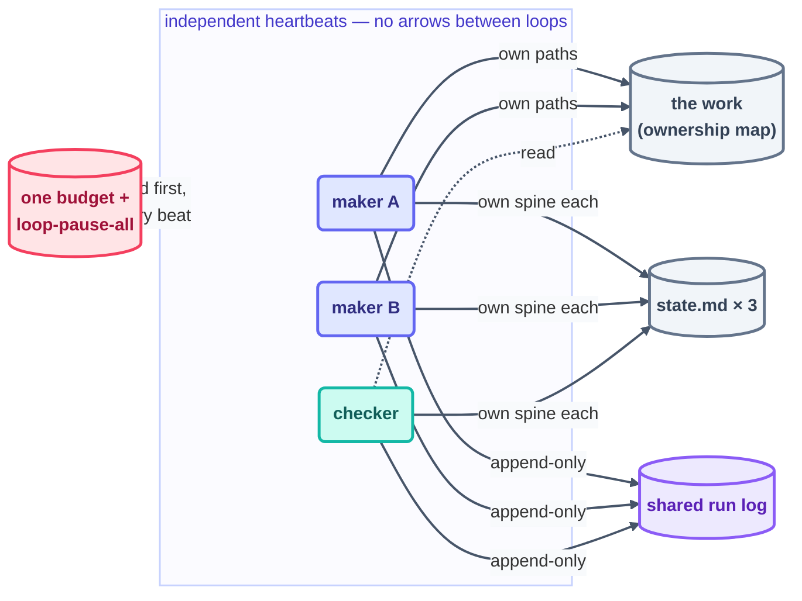

# Multi-Loop Coordination

> One loop is a tool; several are a fleet — and a fleet needs a contract. Four clauses keep loops
> from fighting: ownership, separate spines, priority, and one shared budget. Everything past that
> is just commentary.

## The hook

The fleet that wrote this course ran a maker, a checker, and a link-checker all at once. On Day 2
it ran *two* makers simultaneously. There was no orchestrator, no message bus, and not once did
any loop call another. Nothing collided. The entire trick is a four-clause contract, written down
before the second loop ever drew its first breath.

## One loop or many?

Before the contract, the prior question: should there be a second loop at all? A **single-loop
system** is one heartbeat, one body, one spine, one bill — everything this course teaches through
Step 13. A **multi-loop system** is several of those running side by side, each still a complete
six-part loop, coordinated only by the contract below. The fleet is not a new kind of loop; it is
ordinary loops plus an agreement.

What actually changes when you go from one to many:

| Dimension | Single loop | Multi-loop fleet |
| --- | --- | --- |
| **State** | one spine tells the whole story | one spine *per loop*; fleet state is their sum |
| **Failure surface** | the loop breaks, work stops — simple | one loop fails, the rest keep beating — but new failure classes appear (collisions, ping-pong, ownership gaps) |
| **Throughput** | serial; bounded by one heartbeat | parallel across independent surfaces |
| **Cost** | one budget, easy to reason about | multiplies fast — Anthropic measured multi-agent systems at roughly **15× the tokens** of a single chat |
| **Observability** | read one log | one *shared* log, or you lose the fleet's timeline |
| **Design overhead** | the six parts | the six parts × N, plus the four-clause contract |

**Reach for a single loop when** the work is one job with one owner: a coherent task stream
(triage, a sweep, a nightly report), sequential by nature, or anything still in its L1 proving
period. One loop with a good spine outperforms a fleet whose coordination you haven't earned yet
— and every failure on [the infinite-loops page](infinite-loops.md) gets strictly harder to
diagnose with each loop you add.

**Reach for a multi-loop system when** the *jobs* genuinely differ — not the workload size:

- **Different cadences.** A self-paced maker and a 20-minute checker cannot share one heartbeat.
- **Maker–checker independence.** The grader must not live inside the loop it grades
  ([Step 11](../05-part-3-the-body/11-maker-checker.md)); at fleet scale that means separate
  loops, separate spines.
- **Parallel, disjoint surfaces.** Two makers on two ownership zones (docs and CI, say) that
  never touch the same path.
- **Different trust levels.** A proven L3 sweeper and a brand-new L1 reporter shouldn't ride one
  loop's permissions.

The wrong reason to split is theater — one "role" per loop because roles demo well. Splitting
pays only when the boundaries are real: each loop ownable, each output verifiable on its own.
The practical path is the one this repo took: run one loop to done, prove it, then add the
*second* loop under the contract below — never design a fleet on day one.

## The coordination contract

### 1 · One owner per path

Every file and folder has exactly one loop allowed to write it. Everyone else is read-only. The
map lives in the human-owned rulebook (this repo's [`LOOP.md`](../../LOOP.md)), and the harness
enforces whatever the map declares. Two writers both needing the same *file* is not a negotiation
— it's a design error. Split the file, or hand one maker a
[worktree](../05-part-3-the-body/08-worktrees.md).

### 2 · Separate spines, one shared log

Each loop keeps its own `state.md`, and no loop ever writes another's. The *only* shared write
surface is the run log, and it's **append-only** — the one kind of file concurrent writers can
share without stepping on each other. Fleet state is the sum of the spines; fleet history is the
single log.

### 3 · A priority order for conflicts

Settle the order before the first conflict, because in the middle of one nobody agrees on
anything. **Red main blocks everything:** a broken build pauses every maker until it's green.
Checkers outrank makers — finding problems beats making more of them. Under pressure, the
lowest-value maker pauses first. Write the order into the rulebook. A fleet without one resolves
its conflicts by whoever happened to beat last.

### 4 · One budget, fleet-wide

Per-loop caps plus a **fleet total** live in one shared file
([`shared/loop-budget.md`](../../shared/loop-budget.md)). At 80% of any cap, that loop drops to
report-only. At 100% of the fleet total, *everyone* pauses. That budget file is also where the
fleet-wide kill switch (`loop-pause-all`) lives — one flag, checked by every loop, first thing
every beat.

## Coordination through files, never through calls

The deeper principle beneath all four clauses: loops meet **only through durable files** —
spines, the log, the work itself. No loop triggers, calls, or waits on another. Yes, that costs
you some latency. Here's what it buys back:

- **Independent failure.** The checker crashing costs you checking — and nothing else. The maker
  never even notices. There's no chain to snap and no orchestrator to become the single point of
  failure.
- **Independent heartbeats.** Each loop's cadence fits its own job — a self-paced maker, a
  20-minute checker — with no scheduling to negotiate.
- **Auditability for free.** Every interaction *is* a file change, which means the fleet's entire
  coordination history is just `git log`.

Sequencing still happens — but through state, not signals. This repo's quiz-writer starts a part
only once the checker's spine reads PASS. That's a *gate on durable state*: readable, replayable,
and never once a call.

## Growing a fleet without growing chaos

- **Add loops one at a time.** Each new loop clears the full
  [design checklist](../09-methods/loop-design-checklist.md) and serves its own L1 proving period.
  A fleet's trust is earned per-loop, never wholesale.
- **Update the contract first.** A new loop gets its ownership rows, its budget line, and its
  priority slot *before* beat 1 — in the very same commit as its `loop.md`.
- **Watch the seams.** Fleet incidents live where ownerships touch: one loop's output is another
  loop's input. The weekly engineer's beat audits the seams, not just the loops.
- **Know the scale ceiling.** The moment the contract file stops fitting on one screen, you've
  crossed into governance territory. The T4 track (`advanced/`, Day 3) picks up registries, org
  policy, and fleets-of-fleets.

*The live example is one directory up: [`loops/`](../../loops/README.md) — two days of real
fleets, contracts, spines, and one shared log, arranged exactly as this page prescribes.*

*Sources:* multi-loop coordination draws on the reference repo's own `multi-loop.md` (the
`cobusgreyling/loop-engineering` reference repo,
[S7](https://github.com/cobusgreyling/loop-engineering), MIT), Sydney Runkle's *The Art of Loop
Engineering* ([S6](https://www.langchain.com/blog/the-art-of-loop-engineering)), and Anthropic's
multi-agent essays — [*Building Effective
Agents*](https://www.anthropic.com/research/building-effective-agents) and [*How we built our
multi-agent research
system*](https://www.anthropic.com/engineering/built-multi-agent-research-system), the latter
the source of the ~15× token measurement. Full attribution:
[resources/sources.md](../../resources/sources.md).
