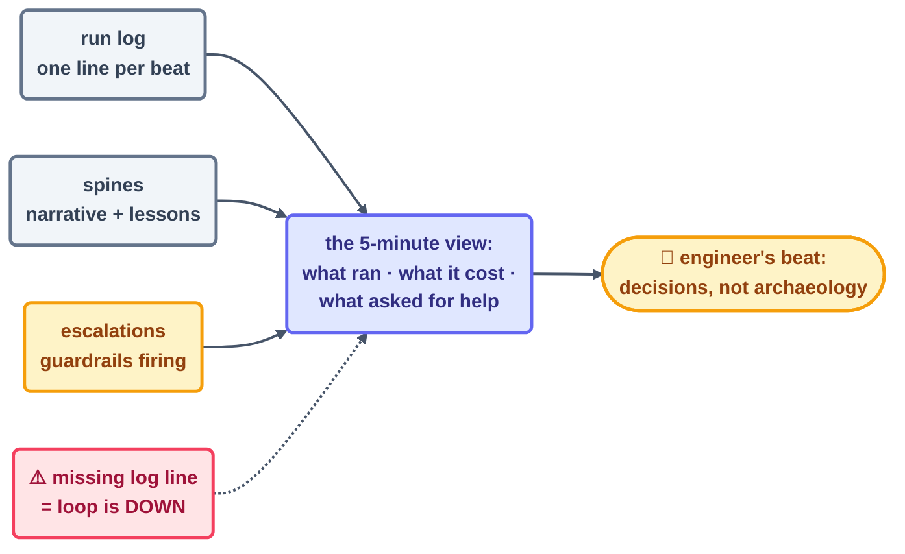

# Observability

> You can't stay the engineer of a fleet you can't see. Observability for loops boils down to
> three artifacts — the run log, the spines, the escalations — and the discipline of reading them
> *before* they get interesting.

## The three instruments

### 1 · The run log — the fleet's heartbeat monitor

One shared, append-only file. **One line per beat, no exceptions.** Here's this repo's format
([`shared/loop-run-log.md`](../../shared/loop-run-log.md)):

```text
{"run_id": "2026-07-16T10:31:10Z", "pattern": "checker", "duration_s": 120,
 "items_found": 3, "actions_taken": 0, "escalations": 0,
 "tokens_estimate": 15000, "outcome": "report-only"}
```

Every field is pulling its weight. `items_found` sitting next to `actions_taken` proves the
maker–checker split held — 3 found, 0 taken is the compliance record from
[Step 11](../05-part-3-the-body/11-maker-checker.md). `tokens_estimate` feeds
[cost management](../08-part-6-human-control/cost-management.md). `outcome` keeps the line
greppable. And here's the field that isn't there: **silence is the loudest signal of all**. A
loop with no line for a stretch it should have beaten is *down*, and nothing else on earth will
tell you.

### 2 · The spines — per-loop narrative

The run log records *that* things happened; the spine explains *what and why*. A healthy spine
reads like a diary — checklist state, lessons, and discrepancies, all recorded honestly. Read
this repo's Day 1 spines for the live version: they document a beat-count discrepancy rather than
quietly smoothing it over. That, right there, is what trustworthy state looks like.

### 3 · Escalations — the fleet asking for help

An escalation is a loop writing "I need a human" into its own spine and then stopping. That's a
guardrail *succeeding*, not failing. Track the rate. A rate stuck at zero forever means your
limits are too loose to ever trip; a constant stream means the loop's job is misdesigned.

## Green ≠ done, operationalized

A status is a claim about the *loop*. Verification is a claim about the *work*. The two pull
apart, and the [verification ladder](../08-part-6-human-control/verification.md) exists for
precisely that gap. Observability's job here is simpler: park each layer's evidence **in one
visible place**. Checker verdicts live in a committed spine. Script results live in CI. The run
log knits them together by timestamp.



## The five-minute fleet review

The real test of your observability: can you answer these five in five minutes, from files alone,
without asking any model?

1. What ran yesterday, and did anything that *should* have run stay silent?
2. What did each loop cost, and who's closest to their tripwire?
3. Did any maker take an action its checker or level doesn't justify?
4. What escalated, and has a human answered each one?
5. Is any spine's story out of step with the log's numbers?

If any answer requires reconstruction, you've just located your observability gap. Fix it *this
week*. This repo rebuilt its Day 1 spines by reconstruction, and some of that history is gone for
good.

## Practical defaults

- **Retention:** prune run-log entries older than 30 days (this repo's rule). Spines keep their
  narrative — they're the long-term memory.
- **Timestamps:** UTC everywhere, ISO-8601. Anything else turns correlating the log, the spine,
  and CI into archaeology.
- **Dashboards:** optional. Files are the source of truth, and a dashboard that disagrees with the
  run log is wrong by definition.
- **Alerting:** just two rules — page on *silence* (an expected beat missing) and on *escalation*.
  Alert on every beat and you'll train yourself to ignore alerts.

*Next in the handbook: what the instruments catch — [failure-modes.md](failure-modes.md).*

*Sources:* observability and "green ≠ done" draw on Panaversity's *Loop Engineering: A Crash
Course* ([S1](https://agentfactory.panaversity.org/docs/loop-engineering-crash-course)) and Addy
Osmani's *Loop Engineering* ([S5](https://addyosmani.com/blog/loop-engineering/)). Full
attribution: [resources/sources.md](../../resources/sources.md).
