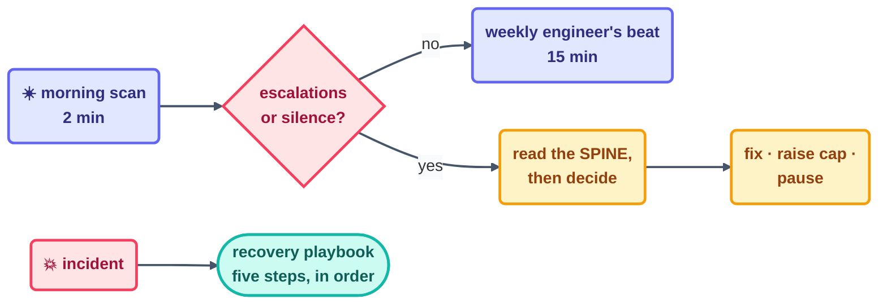

# Operating Loops — the Day-to-Day Handbook

> Designing a loop takes an afternoon. *Operating* loops is every day that comes after — the
> routines that keep a running fleet reassuringly dull. This page is the front door to the
> operating handbook.

## The operator's day (the short version)

- **Morning (2 min):** skim the last 24 hours of the run log. Did every loop that was supposed
  to beat actually beat? Is any `escalations` count sitting above zero? Is any loop silent that
  shouldn't be? Read silence as a *page*, never as relief — no log line means the loop didn't
  run, and you want to know which organ dropped.
- **On every escalation (10 min):** read the loop's spine, not just the alert. The spine holds
  the context the alert leaves out. Then pick exactly one of three moves: fix the cause, raise a
  cap on purpose (the way this repo handled its Day 1
  [budget event](../../shared/loop-budget.md)), or pause the loop.
- **Weekly (15 min):** the engineer's beat from
  [Step 14](../08-part-6-human-control/14-staying-the-engineer.md) — cost per loop, a drift check
  (body vs. `loop.md`), and a promote/hold/demote/retire call per loop.
- **On any incident:** stop reading this page, open the
  [recovery playbook](recovery-playbook.md), and follow the five steps in order.

## The operating invariants

Six rules that hold for every running loop, every day — and every one of them was paid for by a
failure somewhere:

| Invariant | Because otherwise |
| --- | --- |
| One log line per beat, no silent runs | you can't tell "quiet" from "dead" |
| Spine updated + committed every beat | interruption = restart, and state can be lost forever |
| Budget file read at every beat start | caps drift out of sync with reality |
| The maker never grades its own work | failures get co-signed instead of caught |
| Capability changes are written decisions | AI gravity grows the body silently |
| Kill switch tested, not just present | the off button fails exactly once — during the incident |

## The handbook's chapters

| Page | Read it when |
| --- | --- |
| [safety.md](safety.md) | granting any permission, ever |
| [observability.md](observability.md) | you can't answer "what did the fleet do yesterday?" in 5 minutes |
| [failure-modes.md](failure-modes.md) | something feels off and you want its name |
| [infinite-loops.md](infinite-loops.md) | a loop won't stop — the eight scenarios and their bounds |
| [anti-patterns.md](anti-patterns.md) | *before* building — the mistakes catalog |
| [recovery-playbook.md](recovery-playbook.md) | a loop has already failed — five steps, in order |
| [multi-loop.md](multi-loop.md) | running two makers, or your first fleet |

## The mindset

A well-operated fleet is **boring**, and that's the highest compliment there is. Beats land.
Logs pile up. Escalations are rare and, when they come, informative. All the interesting
decisions happen inside *your* loop, never the agent's. If operating your loops starts to feel
exciting, take it as a sign that something in this handbook is quietly being skipped —
excitement is just unhandled risk with better marketing.

*Live example: this repo's own operating artifacts sit one directory up —
[`LOOP.md`](../../LOOP.md), [`shared/loop-budget.md`](../../shared/loop-budget.md),
[`shared/loop-run-log.md`](../../shared/loop-run-log.md), and a spine per loop under
[`loops/`](../../loops/README.md).*

*Sources:* day-to-day operating practice draws on Panaversity's *Loop Engineering: A Crash
Course* ([S1](https://agentfactory.panaversity.org/docs/loop-engineering-crash-course)) and the
`cobusgreyling/loop-engineering` reference repo
([S7](https://github.com/cobusgreyling/loop-engineering), MIT). Full attribution:
[resources/sources.md](../../resources/sources.md).
