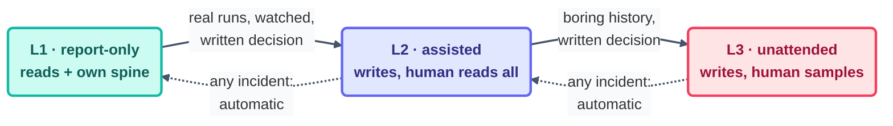

# Safety

> Safety for loops isn't a vibe — it's four mechanisms, each one living somewhere prose can't
> reach: permissions, levels, gates, and switches. Everything else on this page is just how you
> arrange them.

## The first principle: guarantees below the prompt

A rule the model has to *choose* to follow is a request. A rule the harness enforces is a
guarantee. Every safety property you actually care about belongs as low in the stack as it can
possibly go:

| Property | Wrong home | Right home |
| --- | --- | --- |
| "never touch `main`" | the prompt | branch protection + permission rule |
| "never edit secrets" | the prompt | deny-listed paths (`.env*`, `auth/`, `payments/`, `secrets/`, `credentials/`) |
| "one page per beat" | hope | run limit + rubric row the checker enforces |
| "stop if spending too much" | the model's judgment | budget file + 80% tripwire, read every beat |

This repo's [`loop-constraints.md`](../../loop-constraints.md) is the visible half of that. The
permission config enforcing it is the half that keeps working at 3 am.

## The autonomy ladder (levels are earned, not assigned)

- **L1 · report-only.** May read; writes nothing but its report and its own spine. *Every* loop
  begins here, on real work, watched. And some loops rightly stay here forever — this repo's
  checkers have no path to L2 *by design*.
- **L2 · assisted.** May write its owned paths, but a human reads every output (diff, PR, report)
  before it lands anywhere shared.
- **L3 · unattended.** Writes land with sampling in place of per-output review. Only after a
  boring L2 history, only by a written decision that names who decided — and external actions
  (comments strangers see, emails, closes) are a *separate* grant, gated hardest of all.

**Demotion is automatic:** any incident drops the loop one level, and it's re-earned through step
5 of the [recovery playbook](recovery-playbook.md).

## Human gates: placed, not sprinkled

A gate is a spot where work *cannot proceed* without a person. Put them where judgment or
accountability concentrates, and write each placement into `loop.md`:

- **Before anything irreversible or outward-facing** — pushes to shared branches, merges, closes,
  messages. Non-negotiable at every level.
- **At checkpoints** — a day or milestone is "done" only when the human says so (rule 9 of this
  repo's [`CLAUDE.md`](../../CLAUDE.md)).
- **At promotions** — levels change by human decision alone
  ([the three nested loops](../08-part-6-human-control/the-three-nested-loops.md): the arrows all
  point inward).

## Kill switches: the tested kind

Three layers, precisely because switches fail:

- The **pause flag** every beat checks first (this fleet's `loop-pause-all`).
- The **schedule off-switch** — disarm the cron or the routine.
- The **permission revoke** — harness-level, works even on a beat that's already running.

Pull each one once *before* the first unattended run. A kill switch that's never been pulled is
nothing but a hypothesis.

## Secrets and untrusted input

Loops never read or write secret paths (the deny-list above). A loop with both repo access and
secrets access is an exfiltration machine biding its time for a confused beat. And every
externally-triggered loop ([Step 7](../04-part-2-heartbeat/07-event-driven.md)) treats inbound
text — issue bodies, PR comments, chat messages — as **untrusted input that may be trying to
steer it**. Instructions buried inside data are data, never commands.

*The failure catalog for everything this page prevents:
[failure-modes.md](failure-modes.md) · [anti-patterns.md](anti-patterns.md).*

*Sources:* guardrails, caps, and the kill switch draw on Panaversity's *Loop Engineering: A Crash
Course* ([S1](https://agentfactory.panaversity.org/docs/loop-engineering-crash-course)),
*Scheduled Tasks: The Loop Skill & Cron Tools*
([S4](https://agentfactory.panaversity.org/docs/loop-engineering-crash-course)), and the
`cobusgreyling/loop-engineering` reference repo
([S7](https://github.com/cobusgreyling/loop-engineering), MIT). Full attribution:
[resources/sources.md](../../resources/sources.md).
