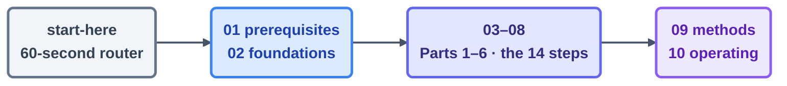

# Course Contents — read in folder order

> New here? Open **[00-start-here/](00-start-here/README.md)** first — the 60-second router
> that drops you onto a track. The folders below are numbered in reading order, so the listing
> you're looking at *is* the syllabus.

## The sequence

| # | Folder | What it teaches |
| - | ------ | --------------- |
| 00 | [00-start-here/](00-start-here/README.md) | The 60-second router: find your track — begin here |
| — | [00-start-here/learning-tracks.md](00-start-here/learning-tracks.md) | The four tracks (T1–T4) with entry checks |
| 01 | [01-prerequisites/](01-prerequisites/environment-setup.md) | Tool setup + agentic-coding and spec-driven primers |
| 02 | [02-foundations/](02-foundations/mental-models.md) | Vocabulary: the six loop parts, four layers, glossary |
| 03 | [03-part-1-the-shift/](03-part-1-the-shift/README.md) | Steps 1–3 · from prompting to looping |
| 04 | [04-part-2-heartbeat/](04-part-2-heartbeat/README.md) | Steps 4–7 · what makes a loop run again |
| 05 | [05-part-3-the-body/](05-part-3-the-body/README.md) | Steps 8–11 · worktrees, skills, MCP, maker–checker |
| 06 | [06-part-4-the-spine/](06-part-4-the-spine/README.md) | Step 12 · state that survives between runs |
| 07 | [07-part-5-complete-loop/](07-part-5-complete-loop/README.md) | Step 13 · build the same loop twice (both tools) |
| 08 | [08-part-6-human-control/](08-part-6-human-control/README.md) | Step 14 · cost, verification, staying the engineer |
| 09 | [09-methods/](09-methods/make-your-own-loop.md) | The A–F method: design a loop of your own |
| 10 | [10-operating/](10-operating/operating-loops.md) | Running loops for real: safety, failure modes, fleets |

## How to move through it

Read the folders top to bottom; each one assumes the vocabulary of the one before it. The path is
deliberate: settle the *foundations* (00–02) before the *fourteen steps* (03–08), and only then
reach for the *practice* layers (09–10), where you design and operate loops of your own. If you
already know where you belong, the router will send you to the right entry point and tell you
what you may safely skip.

Each part folder closes with a `quiz.md` (the bar is 4 of 5) and — every part except Part 5 — a
`flashcards.md` deck. Every page ends with a *Sources:* footer that links the primary sources it
draws on directly to their originals; the full register lives in
[../resources/sources.md](../resources/sources.md).
