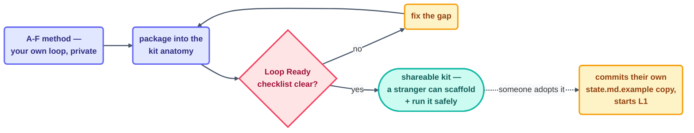

# Advanced · Authoring Your Own Loop

> T4 · Ultra-Pro. [make-your-own-loop.md](../09-methods/make-your-own-loop.md)'s A–F
> method designs a loop **for you**. This page is the next step up: designing a loop **for
> other people to run** — a shareable kit with a shape someone who's never met you can
> trust, scaffold, and operate safely on the first try.

## The hook

`kit-stamper` produced twenty loops in this repo's own starter library, and every one of
them is readable by a stranger without a walkthrough — same six files, same section
headers, same Loop Ready checklist filled in, every time. That consistency isn't an
accident of one author's habits; it's what a **kit anatomy** buys you. A loop that only you
can operate is a personal tool. A loop someone else can pick up from its `README.md` and
run safely by beat one is a contribution — and contributions need a shape that survives
you not being in the room.

## The idea (plain English)

Authoring a shareable loop means answering the A–F questions once, then packaging the
answers into a fixed anatomy so anyone can scaffold, verify, and operate it without asking
you anything:

```text
<loop-name>/
├── LOOP.md                         # what this loop does, its stops, its gate
├── README.md                       # quickstart + Loop Ready notes
├── <loop-name>-state.md.example    # the spine, as a template
├── loop-budget.md · loop-constraints.md · loop-run-log.md
├── .claude/  (skills/<x>/SKILL.md, agents/loop-verifier.md)
├── opencode.json.example + skills/  (OpenCode variant)
```

Four things make this anatomy worth the discipline:

1. **`LOOP.md` carries the six parts and the three stops** — the exact same table the A–F
   method fills in, just published instead of kept private. Anyone should be able to name
   this loop's heartbeat, body, spine, stopping condition, checker, and human gate from
   this one file alone.
2. **A `loop-verifier` agent ships with the kit** — the maker–checker split, packaged.
   Whoever runs your loop gets your loop's checker too, not just its prompt.
3. **A `-state.md.example` is the spine's starting shape** — the person adopting your loop
   commits their own copy before beat one, exactly per the minimum-safe checklist.
4. **Every kit is validated against the Loop Ready checklist** before it's considered
   done — [`success condition · limit · isolated branch/worktree · read-only checker ·
   state file · human gate · a log/notification`](../09-methods/loop-design-checklist.md)
   — the same seven items this course has asked of every loop since Day 1.



```claude
# Claude Code — scaffolding a new kit, this repo's own real practice
> Use scripts/new-loop-scaffold.mjs to generate starters/<loop-name>/
  from _template/. Fill LOOP.md's six parts + three stops from the A-F
  answers. Write the loop-verifier agent as a genuinely separate
  checker, not a restatement of the maker's prompt. Run
  loop-ready-audit.mjs against the new kit before considering it done.
```

```opencode
# OpenCode — the same kit, this tool's variant
# opencode.json.example carries the permission shape;
# skills/<name>/ carries the OpenCode-native prompt equivalent of the
# Claude Code skill — same six parts, same checklist, ported per tool.
```

> [!NOTE]
> **Going deeper:** this repo's own [`starters/_template/`](../../starters/_template/README.md)
> and [scaffold-from-template.md](../09-methods/scaffold-from-template.md) are the live,
> working version of everything on this page — not a hypothetical, but the exact anatomy
> twenty real kits were stamped from.

## Check yourself

**Q: You've written a genuinely good loop for yourself — six parts, real stops, a proven
week of L1 runs. A teammate asks to "just copy your prompt." Why isn't that the same as
authoring it as a shareable kit?**

<details><summary>Answer</summary>

Your prompt encodes decisions you made implicitly — which paths are safe to touch, what
"done" means for *your* repo's structure, which checker script exists only on your
machine. A teammate copying the prompt inherits none of that context and none of your
proven history; they're starting from L1 with someone else's untested assumptions baked
in. Authoring as a kit means writing those implicit decisions down explicitly — the
anatomy's whole job is making sure nothing your teammate needs lived only in your head.

</details>

## Try With AI

Take your capstone loop (Project 8) and package it into the kit anatomy above: a
`LOOP.md` with the six parts and three stops filled in, a `README.md` a stranger could
follow cold, and a `-state.md.example` with the spine's starting shape but no real data.
Hand the three files to someone else (or a fresh AI session with no prior context) and ask
them to tell you, from the files alone, what the loop does and how they'd know if it broke.
If they can't answer both, the kit isn't done yet.

## When it goes wrong

| Symptom | Cause | Fix |
| --- | --- | --- |
| A kit "works on my machine" but fails for whoever adopts it | Implicit assumptions never written into `LOOP.md`/`README.md` | Write every assumption down explicitly — ownership, paths, what "done" means |
| The shipped checker is really just the maker's prompt restated | `loop-verifier` wasn't built as a genuinely separate agent | Give it its own file, its own rubric, and confirm it can fail the maker, not just agree with it |
| Adopters skip the Loop Ready checklist and go straight to L2 | Kit didn't make the checklist a visible, required gate | Ship the checklist filled-in as part of the kit, not as optional reading |

---

*Glossary terms used on this page:* **kit anatomy**, **loop-verifier**, **Loop Ready
checklist** — see the [glossary](../02-foundations/glossary.md).

*Sources:* the kit anatomy and per-tool coverage policy come from
`loop-plan.md` §16, itself grounded in the reference repo's own starter-kit shape
([S7](https://github.com/cobusgreyling/loop-engineering), MIT) and Panaversity's *Loop
Engineering: A Crash Course*
([S1](https://agentfactory.panaversity.org/docs/loop-engineering-crash-course)); the A–F
method this page packages is documented in full at
[make-your-own-loop.md](../09-methods/make-your-own-loop.md). Full attribution:
[resources/sources.md](../../resources/sources.md).
