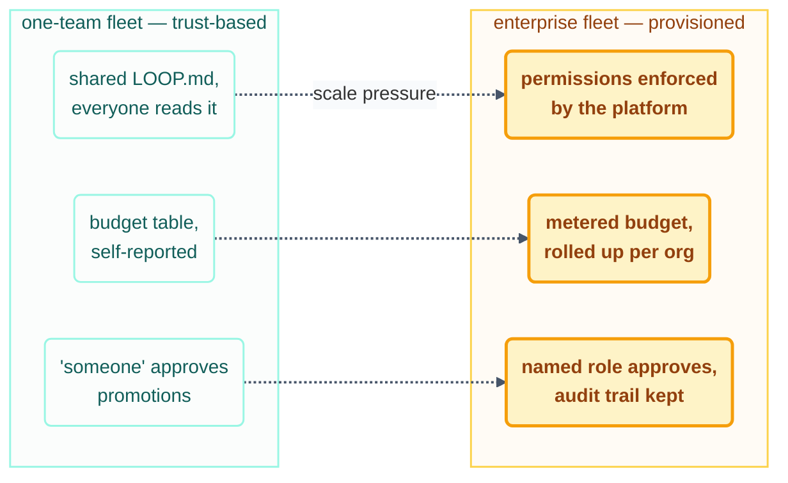

# Advanced · Loops at Enterprise Scale

> T4 · Ultra-Pro. Everything before this page was one loop, or a handful, in one repo you
> personally understand. Enterprise scale is what changes — not the six parts, which don't
> change at all, but the answers to *who owns what, who pays for it, and who's accountable
> when it's wrong* — once "the fleet" means hundreds of loops across teams that don't talk
> to each other daily.

## The hook

A single-team fleet can run on trust: everyone reads `LOOP.md`, everyone knows who owns
what. At a hundred loops across twelve teams, "everyone reads it" stops being true on day
one for anyone new. What replaces trust isn't more documentation — it's the same
mechanisms this course has taught throughout, applied with less slack: ownership becomes
enforced, not requested; budget becomes metered, not estimated; and "the human reviews it"
becomes "which human, by name, with what authority."

## The idea (plain English)

Four things change shape at enterprise scale, though none of them are new ideas:

1. **Ownership becomes provisioning, not convention.** A one-team fleet can rely on a
   shared `LOOP.md` table everyone reads. At scale, ownership is enforced by the platform
   — repo permissions, service-account scopes, branch protection — because a convention
   nobody enforces is a convention that will eventually be violated by accident.
2. **Budget becomes a real cost center.** `shared/loop-budget.md`'s per-loop caps are this
   course's version of what an enterprise needs at every level: team budgets rolling up to
   an org budget, with the same 80%-tripwire and kill-switch mechanics, just metered by a
   platform instead of a human eyeballing a markdown table.
3. **Trust levels become a formal ladder with named approvers.** [safety.md](../10-operating/safety.md)'s
   L1→L2→L3 ladder still applies — what changes is *who* signs off on a promotion. At one
   team, that's whoever's watching. At enterprise scale, it's a named role (a platform
   team, a security reviewer) with an audit trail, because "someone decided" isn't
   accountable enough once the blast radius includes other teams' systems.
4. **The human gate becomes a role, not a person.** "The human reviews it" needs an answer
   to *which* human when the original approver is on vacation, has left the team, or the
   loop now touches a system outside their expertise. Enterprise fleets name gates by role
   (on-call, tech lead, security) rather than by individual.



```claude
# Claude Code — an enterprise-shaped budget/permission check, wired to a platform
> /loop 1h Read this loop's own budget row from the org-level cost API
  (not a local markdown file). If at 80%, drop to report-only. If the
  platform's kill-switch flag is set for this fleet, exit immediately.
  Log the check either way, with the API's own timestamp as the source
  of truth.
```

```opencode
# OpenCode — same discipline, platform-agnostic
opencode run "Query org budget API for this loop's current spend. At 80%,
  switch to report-only for the rest of this run. Check the org kill-switch
  flag first. Log the result." --schedule hourly
```

> [!NOTE]
> **Going deeper:** [governance.md](governance.md) is the next page for a reason — scale
> is the *why*, governance is the *how*: the specific permission models, audit
> requirements, and org policy that provisioned ownership and named approvers actually
> run on.

## Check yourself

**Q: A twelve-team org wants to skip the registry (`multi-loop-coordination.md`) and rely
on each team's own `LOOP.md` staying accurate, "like it does for the course repo." What
breaks first?**

<details><summary>Answer</summary>

Discovery breaks first. A single-repo `LOOP.md` works because there's exactly one place to
look and one small set of people who need to know it. Across twelve teams, "read every
team's `LOOP.md`" doesn't scale — nobody outside a team has time to, and the first
cross-team collision (two loops from different teams both touching a shared library)
happens precisely because no one had a single place to check first. The registry isn't
extra process; it's what makes "one owner per path" checkable across teams instead of only
within one.

</details>

## Try With AI

Take your capstone loop (Project 8) and write one paragraph answering, concretely: if this
loop needed to run across three teams instead of just your own, what would have to become
provisioned instead of conventional — its path ownership, its budget, or its promotion
approval? Naming the specific gap is the whole exercise; you don't need to build the
platform to see where trust-based coordination would first crack.

## When it goes wrong

| Symptom | Cause | Fix |
| --- | --- | --- |
| Two teams' loops silently collide on a shared library | Ownership was a convention, not enforced | Provision path ownership at the platform level — permissions, not a markdown row |
| Nobody can say who approved an L3 promotion | Gate was "someone," not a named role | Require a named-role sign-off with a recorded decision, per [safety.md](../10-operating/safety.md) |
| Org-wide spend is a surprise at month end | Budget was self-reported per team, never rolled up | Meter spend centrally; per-team caps roll into one org ceiling, checked the same way |

---

*Glossary terms used on this page:* **provisioned ownership**, **trust ladder**,
**named-role gate** — see the [glossary](../02-foundations/glossary.md).

*Sources:* this page extends [safety.md](../10-operating/safety.md) and
[multi-loop.md](../10-operating/multi-loop.md)'s contract to organizational scale,
grounded in Panaversity's *Loop Engineering: A Crash Course*
([S1](https://agentfactory.panaversity.org/docs/loop-engineering-crash-course)) and the
reference repo's own scaling notes
([S7](https://github.com/cobusgreyling/loop-engineering), MIT). Full attribution:
[resources/sources.md](../../resources/sources.md).
