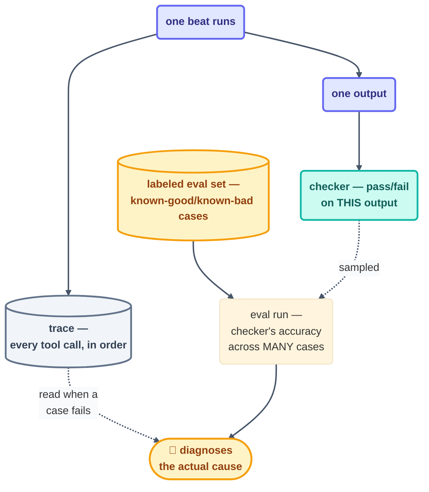

# Advanced · Evals and Traces

> T4 · Ultra-Pro. A checker tells you pass or fail on one run. An **eval** tells you
> whether the checker itself is any good, across many runs. A **trace** is what you read
> when the eval says "fail" and you need to know *why*.

## The hook

`dependency-cve-burndown`'s checker has been passing for three weeks straight. Then it
turns out it's been passing because the test fixture it's grading against never actually
contained a real CVE — a green checker on a broken rubric. Nobody caught it sooner because
no one had ever run the *checker itself* against a labeled set of known-good and
known-bad cases. That's the gap evals close: not "did this run pass," but "does passing
mean what we think it means."

## The idea (plain English)

Three layers, each answering a different question:

1. **A checker** — one loop's read-only grader, answering "did *this* beat's output meet
   the bar?" ([Step 11](../05-part-3-the-body/11-maker-checker.md)).
2. **An eval** — a labeled set of cases (inputs with known-correct outputs) run against the
   checker or the loop itself, answering "how often does this loop/checker get it right,
   over many cases, not just this one?" This is how you catch a checker that's
   systematically too lenient, too strict, or grading the wrong thing entirely.
3. **A trace** — the full, ordered record of one run's tool calls, model turns, and
   intermediate outputs, answering "what actually happened, step by step, in the run that
   failed?" A trace is to one beat what a spine is across beats: the durable, inspectable
   record, not a summary you have to trust.



## Building a minimal eval for a loop's checker

You don't need a platform to start. A minimal eval is a folder of cases and one script:

```claude
# Claude Code — an eval harness is just a loop pointed at labeled fixtures
> /loop Run the checker against every case in evals/dep-cve-burndown/*.json
  (each has an input diff + expected verdict). Compare checker verdict to
  expected. Write evals/results.md: accuracy, false-positive rate,
  false-negative rate. Never touch the fixtures themselves. Stop after
  one full pass.
```

```opencode
# OpenCode — the same eval loop, external schedule for a weekly re-check
opencode run "Run the checker against evals/*.json fixtures. Compare verdicts
  to expected labels. Write evals/results.md with accuracy and error rates.
  Read-only on the fixtures." --schedule weekly
```

Reading a trace after a real failure is the companion skill: pull the failed run's full
tool-call sequence (most harnesses expose this — a session transcript, a `--verbose` log,
or a platform trace viewer) and read it in order, the same discipline as reading a spine —
don't trust the summary, read what actually happened.

> [!NOTE]
> **Going deeper:** evals are the rigorous cousin of this course's own
> [observability instruments](../10-operating/observability.md) — the run log and spines
> tell you *that* something happened; an eval tells you *how often the checker's verdict
> was right*. Build the eval once a checker's accuracy actually matters enough to bet on
> — usually right around when you're considering an L2→L3 promotion.

## Check yourself

**Q: Your checker has passed every one of the last 40 runs. A teammate asks "how do you
know the checker itself isn't just broken in a way that always says pass?" What answers
that question, and what doesn't?**

<details><summary>Answer</summary>

The 40 green runs don't answer it — they're consistent with both "the loop is genuinely
doing great work" and "the checker never actually fails anything." What answers it is an
**eval**: run the same checker against a labeled set that includes cases you already know
should fail, and confirm it actually flags them. A checker that's never seen a
known-bad case is a checker you've never actually tested.

</details>

## Try With AI

Pick a checker you've already built in an earlier project (Project 2 or 4 work well).
Hand-craft three fixture cases: one that should clearly pass, one that should clearly
fail, one genuinely ambiguous. Run the checker against all three and record whether its
verdict matched your label. That three-case set is a real, if tiny, eval — and the
ambiguous case is usually where you learn the most about what the checker is actually
grading.

## When it goes wrong

| Symptom | Cause | Fix |
| --- | --- | --- |
| Checker's been green for weeks, something's clearly still wrong | No eval ever run against known-bad cases | Build even a 3-case eval before trusting a long green streak |
| A failed run's root cause is a mystery | No trace kept, or the summary was trusted instead of the transcript | Persist full traces for failed runs; read the transcript, not the loop's own account of it |
| Eval accuracy looks great but doesn't match real-world experience | Fixture set doesn't represent real cases | Grow the eval set from real failures as they occur, not just hypothetical ones |

---

*Glossary terms used on this page:* **checker**, **eval**, **trace**, **spine** — see the
[glossary](../02-foundations/glossary.md).

*Sources:* the checker-vs-eval-vs-trace distinction extends
[Step 11](../05-part-3-the-body/11-maker-checker.md)'s maker-checker split and this
course's [observability](../10-operating/observability.md) instruments, per Panaversity's
*Loop Engineering: A Crash Course*
([S1](https://agentfactory.panaversity.org/docs/loop-engineering-crash-course)); the
verification-loop framing from Sydney Runkle's *The Art of Loop Engineering*
([S6](https://www.langchain.com/blog/the-art-of-loop-engineering)). Full attribution:
[resources/sources.md](../../resources/sources.md).
