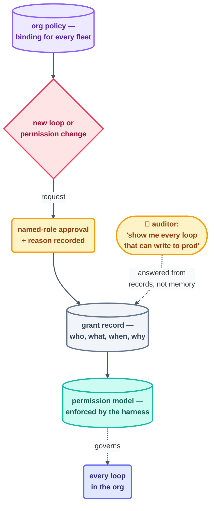

# Advanced · Governance and Permissions

> T4 · Ultra-Pro. [enterprise-scale.md](enterprise-scale.md) named what changes shape at
> scale; this page is the mechanism each of those four things actually runs on:
> permission models, audit trails, and the org policy that turns "should" into "can't."

## The hook

An org rolls out fifteen loops in a month, all reviewed, all well-intentioned. Then a
security audit asks one question nobody can answer cleanly: "show me every loop that can
write to a production branch, and who approved that grant, and when." The individual
loops were fine. The *governance* — the record of who can do what, and why, across all
fifteen at once — didn't exist. Building that record isn't extra bureaucracy layered on
top of loop engineering; it's the same "guarantees below the prompt" principle from
[safety.md](../10-operating/safety.md), applied at the level of *policy* instead of one
loop's permission file.

## The idea (plain English)

Governance is three linked records, each answering a different audit question:

1. **The permission model** — for every loop, exactly which paths, tools, and external
   systems it can touch, enforced by the harness (this course's `.claude/settings.json` /
   `opencode.json` shape, scaled to an org's identity and access platform). Answers: *what
   can this loop do?*
2. **The grant record** — who approved each permission, when, and why — the audit trail
   [enterprise-scale.md](enterprise-scale.md) named as a named-role requirement, made
   concrete. Answers: *who said this loop could do that?*
3. **Org policy** — the rules that apply to *every* loop regardless of team: a shared
   secrets deny-list, a mandatory L1 proving period, a required kill-switch test before
   any unattended run. This repo's [`loop-constraints.md`](../../loop-constraints.md) is
   this idea at single-repo scale; org policy is the same shape, just binding across every
   fleet, not opt-in per team.



```claude
# Claude Code — a governance-audit loop: read-only, answers the audit question directly
> /loop 1d Read every loop's harness permission config under the org's
  loop registry. List every loop with write access to any production
  path or branch-protected repo. For each, confirm a grant record exists
  (who approved, when, why). Flag any without one. Report only — never
  revoke or grant anything yourself.
```

```opencode
# OpenCode — same audit, external schedule
opencode run "Scan every registered loop's permission config for
  production-write access. Cross-check each against the grant-record
  log. Flag ungranted or undocumented access. Read-only, report-only." \
  --schedule daily
```

> [!NOTE]
> **Going deeper:** governance is [safety.md](../10-operating/safety.md)'s "L1 first,
> earn L2/L3" ladder made auditable at scale — the grant record is simply the written
> decision that page already requires for every promotion, kept somewhere a security
> review can actually find it.

## Check yourself

**Q: A team argues their loop doesn't need a grant record because its permissions are
"obviously fine" — read-only, low risk. What's the governance answer?**

<details><summary>Answer</summary>

"Obviously fine" is exactly the judgment governance exists to make checkable instead of
assumed — today's low-risk read-only loop is one permission-file edit away from tomorrow's
higher-risk one, and without a grant record, nobody outside the team can tell whether that
edit was reviewed or slipped in. The record isn't there because anyone doubts the current
grant; it's there so the *next* change to it has to go through the same visible process,
not quietly ride on the original loop's good reputation.

</details>

## Try With AI

Write a one-page governance policy for your own capstone loop (Project 8) as if it were
about to run across a team, not just you: name the permission model (what it can touch),
who would need to approve it, and one org-wide rule it must follow regardless of team
(pick one from this repo's own `loop-constraints.md` as a model). This is the same
document a real platform team would ask for before onboarding your loop.

## When it goes wrong

| Symptom | Cause | Fix |
| --- | --- | --- |
| A security review can't produce a permission inventory | No registry linking loops to their grants | Build the registry ([multi-loop-coordination.md](multi-loop-coordination.md)) before scale forces it |
| A loop's access grew quietly over months | Permission changes weren't gated the same way the original grant was | Every permission change goes through the same named-role approval as the initial grant |
| Org policy exists but isn't actually enforced | Policy lived in a document, not the harness | Encode policy as denied permissions/hooks at the platform level — a document is a request, same as any rules file |

---

*Glossary terms used on this page:* **permission model**, **grant record**, **org
policy** — see the [glossary](../02-foundations/glossary.md).

*Sources:* governance extends [safety.md](../10-operating/safety.md)'s autonomy ladder and
human-gate placement rules to organizational audit requirements, grounded in
Panaversity's *Loop Engineering: A Crash Course*
([S1](https://agentfactory.panaversity.org/docs/loop-engineering-crash-course)) and the
reference repo's own permission-scoping conventions
([S7](https://github.com/cobusgreyling/loop-engineering), MIT). Full attribution:
[resources/sources.md](../../resources/sources.md).
