# Advanced · Hill-Climbing Loops

> T4 · Ultra-Pro. A loop that gets *better* without getting bigger — by reading its own
> spine's lessons and improving the rules that shape the next beat, never the beat's raw
> code. The line between safe and dangerous here is one word: **gated**.

## The hook

Six weeks into running `dependency-sweeper`, its spine has a pattern buried in it: eleven
separate escalations, all variations of "flagged a devDependency bump as risky — it
wasn't." Nobody ever sat down and fixed the rule. Nobody had to. A second, slower loop
reads the spine weekly, notices the pattern, and drafts one line for the rules file:
*devDependency-only bumps skip the risk-review step.* A human reads the diff, approves it,
merges it. The sweeper is measurably smarter next week — and not one line of its own
prompt-writing code changed. That second loop is hill-climbing.

## The idea (plain English)

[Step 12](../06-part-4-the-spine/12-state-between-runs.md) already drew the line this
whole page lives on: **self-learning** is the spine piling up facts — safe, and something
every loop in this course already does from beat one. **Self-improving** is a loop
reaching back and rewriting the thing that shapes its *own future behavior* — its rules
file, its skill, its prompt template. That's powerful, and powerful things need a gate.

A hill-climbing loop is the disciplined version of self-improving: a **separate**, slower
loop whose entire job is reading other loops' spines, noticing a pattern worth encoding,
and drafting — never silently committing — a change to the rules or skills those loops
read. It climbs the hill one small, reviewed step at a time, the same way gradient ascent
takes small steps rather than a leap: the metaphor is deliberate. A big, unreviewed rewrite
is exactly how a loop optimizes itself into something nobody recognizes.

```mermaid
%%{init: {'theme':'base','themeVariables':{'fontFamily':'ui-sans-serif, system-ui, sans-serif','fontSize':'15px','lineColor':'#475569','edgeLabelBackground':'#f8fafc'},'flowchart':{'curve':'basis','nodeSpacing':45,'rankSpacing':55,'padding':12}}}%%
flowchart LR
    W("work loop<br/>(dependency-sweeper)"):::maker -->|"beats, escalations,<br/>lessons"| SP[("its spine")]:::file
    SP -.->|"read-only, weekly"| HC("hill-climbing loop"):::climb
    HC -->|"drafts ONE rule change"| DRAFT[("rules-file diff,<br/>never committed directly")]:::draft
    DRAFT --> H(["🧑 human reviews,<br/>approves, merges"]):::human
    H --> RF[("rules file")]:::cfg
    RF -.->|"read every beat"| W
    linkStyle default stroke:#475569,stroke-width:2px;
    classDef maker fill:#e0e7ff,stroke:#6366f1,stroke-width:2.5px,color:#312e81,font-weight:600;
    classDef file fill:#f1f5f9,stroke:#64748b,stroke-width:2.5px,color:#334155,font-weight:600;
    classDef climb fill:#ede9fe,stroke:#8b5cf6,stroke-width:2.5px,color:#5b21b6,font-weight:600;
    classDef draft fill:#fef3c7,stroke:#f59e0b,stroke-width:2.5px,color:#92400e,font-weight:600;
    classDef human fill:#fef3c7,stroke:#f59e0b,stroke-width:2.5px,color:#92400e,font-weight:600;
    classDef cfg fill:#ccfbf1,stroke:#14b8a6,stroke-width:2.5px,color:#115e59,font-weight:600;
```



## The four-loop stack this sits atop

Sydney Runkle's framing of "loopcraft" stacks four loop types, each one wrapping the
one before it — agent loop (the small loop inside one beat) → verification loop (a
checker) → event loop (something outside triggers the next round) → **hill-climbing loop**
(a slower loop that improves the other three over time). Hill-climbing is the top of that
stack precisely because it's the one loop allowed to touch what the others are *made of*,
not just what they *do*.

```claude
# Claude Code — the hill-climbing loop is its own conditional loop, own spine
> /loop 7d Read the last 7 days of state.md/loop-run-log.md for
  dependency-sweeper. Find any pattern that appears 3+ times (same
  escalation reason, same false-positive shape). Draft ONE proposed
  rules-file change as a PR — never commit directly. Stop after one
  draft; a human decides the rest.
```

```opencode
# OpenCode — same shape, external schedule
opencode run "Read dependency-sweeper's spine + run log from the last 7 days.
  Find a 3+ recurring pattern. Draft ONE rules-file change as a diff for
  human review. Do not apply it." --schedule weekly
```

> [!NOTE]
> **Going deeper:** this is the same maker–checker split from
> [Step 11](../05-part-3-the-body/11-maker-checker.md), applied recursively — the
> hill-climbing loop is a *maker* of rules changes, and the human reviewing the diff is
> its checker. It never gets to also be its own approver, for exactly the reason a work
> loop never grades its own work.

## Check yourself

**Q: A hill-climbing loop notices "risk-review always fails on devDependency bumps" and
commits the rule change directly, without a PR. It's provably correct — the pattern really
did recur 11 times. What's still wrong with what it did?**

<details><summary>Answer</summary>

Being *provably correct this time* isn't the property that matters — the property that
matters is that self-improving changes are gated **by design**, not case by case. A rule
that's right today can be wrong once the underlying job changes, and a human reviewing the
diff is what catches that drift before it ships. Skip the gate once because the answer
looked obviously right, and you've built a loop that decides for itself when the gate
applies — which is the gate gone.

</details>

## Try With AI

In a throwaway repo, hand-write five fake escalation lines into a spine file, three of
them the same recurring false-positive shape. Ask your agent to read the spine and draft
*one* proposed rules-file line addressing the pattern — as a diff, not an edit. Read the
diff yourself before deciding whether you'd approve it. That's the entire loop, run once
by hand before you ever let it run on a schedule.

## When it goes wrong

| Symptom | Cause | Fix |
| --- | --- | --- |
| Rules file drifts unrecognizably over weeks | Hill-climbing loop applies its own drafts | Drafts only — every change ships through a human-reviewed PR, no exceptions |
| Same pattern re-proposed every week, never resolved | No one's actually reading the drafts | Route hill-climbing PRs to a named human reviewer, not a queue nobody owns |
| A "learned" rule contradicts the actual constitution | Hill-climbing loop edited a boundary it shouldn't touch | Scope its write target to specific, narrow rule sections — never the whole rules file |
| It starts proposing changes to its own review process | Self-improvement applied to the gate itself | The gate is out of scope for the loop it gates — treat that boundary as fixed, not learnable |

---

*Glossary terms used on this page:* **hill-climbing**, **spine**, **rules file**,
**maker-checker** — see the [glossary](../02-foundations/glossary.md).

*Sources:* hill-climbing and the four-loop stack (agent → verification → event →
hill-climbing) come from Sydney Runkle's *The Art of Loop Engineering*
([S6](https://www.langchain.com/blog/the-art-of-loop-engineering)); the self-learning vs.
self-improving distinction from [Step 12](../06-part-4-the-spine/12-state-between-runs.md),
grounded in Panaversity's *Loop Engineering: A Crash Course*
([S1](https://agentfactory.panaversity.org/docs/loop-engineering-crash-course)). Full
attribution: [resources/sources.md](../../resources/sources.md).
