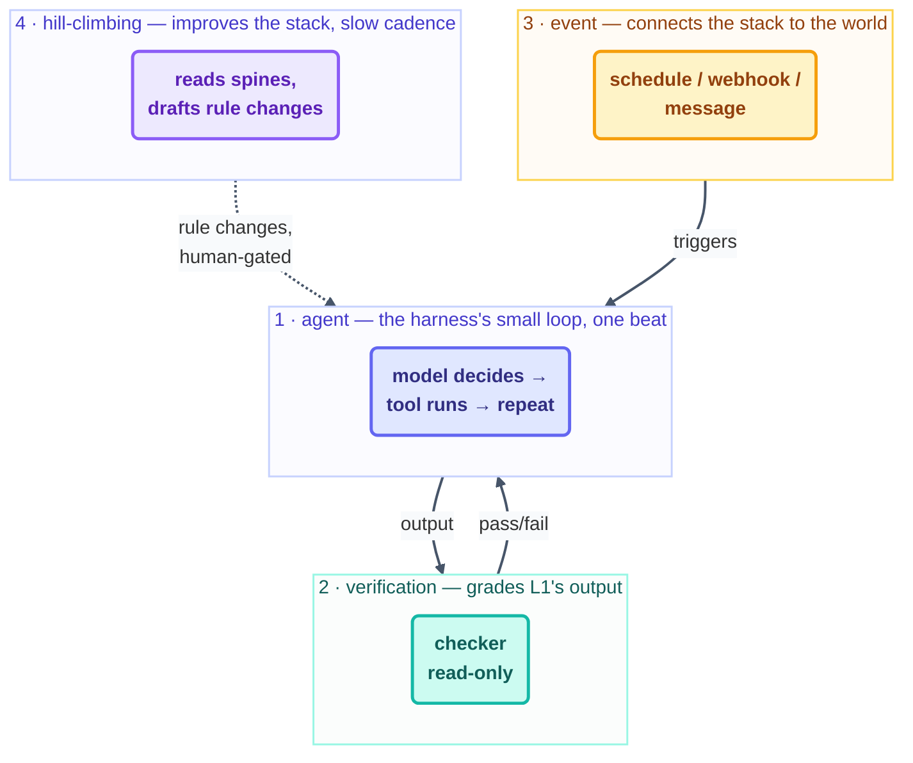

# Advanced · Loopcraft — Stacking Loops

> T4 · Ultra-Pro. "Loopcraft" is Sydney Runkle's name for the discipline of stacking loop
> types deliberately — agent loop inside verification loop inside event loop inside
> hill-climbing loop — instead of building one loop that tries to do all four jobs at once.

## The hook

A team ships one giant agent loop: it writes the fix, tests it, watches for the next PR,
and tunes its own prompt when things go sideways — all in one prompt, one spine, one
"loop.md". It works, until it doesn't, and then nobody can tell which of the four jobs
broke. Compare that to this repo's own Day 3 fleet: `kit-stamper` makes, `audit-loop`
checks, `link-check` watches for drift — three separate loops, three separate jobs, no
loop pretending to be all three. That separation *is* loopcraft.

## The idea (plain English)

Every loop you've built in this course is one of four types, and each type wraps the one
inside it:

1. **The agent loop** — the small loop from [Step 2](../03-part-1-the-shift/02-the-four-layers.md):
   model decides, tool runs, repeat, inside one beat. The harness owns this one.
2. **The verification loop** — a checker reading the agent loop's output against a rubric
   and sending failures back as feedback ([Step 11](../05-part-3-the-body/11-maker-checker.md)).
3. **The event loop** — something outside connects the whole thing to your world: a
   schedule, a webhook, a human message ([Step 7](../04-part-2-heartbeat/07-event-driven.md)).
4. **The hill-climbing loop** — a slower loop that improves the other three over time,
   never inline with their work ([hill-climbing.md](hill-climbing.md)).

**Loopcraft is choosing which of these four jobs a given loop does — exactly one, usually
— and wiring the stack through files, never through one loop's prompt trying to be all
four at once.**



## Naming the stack in this repo's own fleet

| Layer | This repo's Day 3 example |
| --- | --- |
| Agent loop | inside every beat of `kit-stamper`, `audit-loop`, etc. — the harness's own tool-call cycle |
| Verification loop | `audit-loop` and `template-checker` — read-only graders, never the maker |
| Event loop | `link-check`'s 30-minute schedule; this course's event-driven projects |
| Hill-climbing loop | not yet run in this repo — the natural next fleet member once a few weeks of spines exist |

```claude
# Claude Code — three SEPARATE loops, not one prompt doing all three jobs
> /loop 15m Stamp the next unchecked kit from kit-state.md.       # agent+event
> /loop 20m Run loop-ready-audit.mjs against starters/. Log findings. # verification
> /loop 7d Read the fleet's spines for a 3+ recurring pattern; draft ONE rule change. # hill-climbing
```

```opencode
# OpenCode — the same three, wired as three independent schedules
opencode run "..." --schedule 15m   # agent+event
opencode run "..." --schedule 20m   # verification
opencode run "..." --schedule weekly # hill-climbing
```

> [!NOTE]
> **Going deeper:** loopcraft is the design habit; [multi-loop-coordination.md](multi-loop-coordination.md)
> is the operating contract that keeps several stacked loops from colliding once you've
> built them. Read this page for *which* loops to build, that one for *how they share a
> repo*.

## Check yourself

**Q: You've built a single loop that fixes bugs, re-runs the tests itself to confirm, and
also tweaks its own prompt when a fix pattern keeps failing. Someone calls this
"efficient." What's the loopcraft critique?**

<details><summary>Answer</summary>

It's collapsed three of the four loop types — agent, verification, and hill-climbing —
into one prompt with one spine. The checker is no longer independent (it's grading its own
work), and the self-improvement has no separate gate (it's editing its own instructions
inline, unreviewed). "Efficient" here means "unauditable": when it eventually declares a
broken fix "fixed," there's no separate log telling you which of the three jobs lied.

</details>

## Try With AI

Take any loop you've already built in this course's earlier projects and name which one of
the four types it is. If it's doing more than one job, split it: same task, but now as two
loops meeting only through a shared spine file — never a call between them. Run both and
confirm the split cost you nothing but a slightly longer setup.

## When it goes wrong

| Symptom | Cause | Fix |
| --- | --- | --- |
| Can't tell which loop caused a bad outcome | Four jobs collapsed into one loop/prompt | Split by job type; one loop, one layer of the stack |
| Verification always agrees with the maker | Checker loop isn't actually separate | Give the checker its own session/spine, per [Step 11](../05-part-3-the-body/11-maker-checker.md) |
| "Improvements" ship without review | Hill-climbing wired inline instead of as its own gated loop | Route it through [hill-climbing.md](hill-climbing.md)'s draft-then-human-approve shape |

---

*Glossary terms used on this page:* **agent loop**, **verification loop**, **event loop**,
**hill-climbing**, **loopcraft** — see the [glossary](../02-foundations/glossary.md).

*Sources:* the four-loop stack and the term "loopcraft" come from Sydney Runkle's *The Art
of Loop Engineering*
([S6](https://www.langchain.com/blog/the-art-of-loop-engineering)); the six-part loop
definitions each layer builds on come from Panaversity's *Loop Engineering: A Crash
Course* ([S1](https://agentfactory.panaversity.org/docs/loop-engineering-crash-course)).
Full attribution: [resources/sources.md](../../resources/sources.md).
