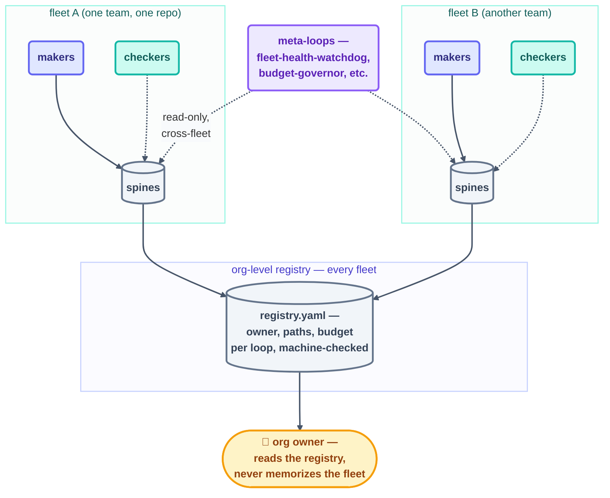

# Advanced · Multi-Loop Coordination

> T4 · Ultra-Pro. [multi-loop.md](../10-operating/multi-loop.md) taught the four-clause
> contract for a handful of loops sharing one repo. This page picks up exactly where that
> one says to: the moment the contract file stops fitting on one screen, and you need a
> **registry**, meta-loops that manage other loops, and — eventually — fleets that
> coordinate other fleets.

## The hook

This repo's own Day 3 fleet is four loops and one contract file, and it fits on a screen.
Now imagine twenty teams each running that shape — eighty-plus loops, no single human who
could recite the ownership map from memory. At that scale "read `LOOP.md`" stops being an
onboarding step and becomes an availability problem. What replaces memorized coordination
is a **registry**: a machine-readable index of every loop, its owner, its paths, its
budget — the same information `LOOP.md`'s table holds today, just queryable instead of
read.

## The idea (plain English)

Three ideas extend the four-clause contract to real scale:

1. **The registry** — this repo already has one in miniature: `kit-state.md` and
   `patterns/registry.yaml` are exactly this pattern, just scoped to one repo's loop
   library. At org scale, the registry becomes the single source of truth for "what loops
   exist, who owns each, what can they touch" — validated by a script
   (`validate-registry.mjs`'s job here, scaled up), not trusted from memory.
2. **Meta-loops** — loops whose *work* is reading other loops' spines and logs, never the
   codebase itself (§15 category R: `fleet-orchestrator`, `loop-collision-sentinel`,
   `fleet-budget-governor`, `fleet-health-watchdog`, `cross-loop-state-reconciler`,
   `human-inbox-escalator`). They stay cheap and safe at L1 because their whole job is
   reading files other loops already write, per the coordination contract.
3. **Fleets of fleets** — once one team's fleet is a proven, contract-following unit, the
   org-level coordination problem is the *same* four clauses one level up: one owner per
   *fleet's* domain, separate registries per fleet with one shared org-level index, a
   priority order across fleets (not just within one), and one org-wide budget ceiling
   that per-fleet budgets roll up into.



```claude
# Claude Code — a fleet-health-watchdog meta-loop: reads, never acts
> /loop 30m Read every loop's state.md and shared/loop-run-log.md under
  loops/. Flag any loop with no log line in 2x its expected cadence
  (silence = down, per observability.md) and any spend past 80% of its
  budget row. Write findings to fleet-health.md. Never edit another
  loop's spine or files.
```

```opencode
# OpenCode — same watchdog, external schedule
opencode run "Read all loops' state.md + the shared run log. Flag silent
  loops (no line in 2x cadence) and budget rows past 80%. Write
  fleet-health.md. Read-only on every other loop's files." --schedule 30m
```

> [!NOTE]
> **Going deeper:** the six coordination-contract loops in §15 category R
> (`loop-plan.md`) are all meta-loops in this exact shape — each one reads spines/logs
> across the fleet and writes only its own findings file, never another loop's territory.
> [multi-loop.md](../10-operating/multi-loop.md) has the four-clause contract these
> meta-loops enforce; this page is what happens once you need software watching the
> contract instead of a human re-reading `LOOP.md` daily.

## Check yourself

**Q: An org wants one `loop-collision-sentinel` to also auto-resolve collisions it finds —
pick a winner, cancel the loser. Why does that break the meta-loop pattern this page
describes?**

<details><summary>Answer</summary>

A meta-loop's safety comes entirely from being **read-only and report-only** — it observes
the fleet and writes findings, never actions. The moment it starts *resolving* collisions,
it's become a maker with write access across every other loop's territory — which
collapses "one owner per path" back down to "one sentinel owns everyone's path," the exact
thing the contract exists to prevent. Collision resolution stays a human decision (or a
narrowly-scoped one-owner loop), never the watchdog's own call.

</details>

## Try With AI

If you've built more than one loop across this course's projects, write a two-line
registry entry for each (`name, owner, paths, budget`) in one file. Then write a single
read-only prompt that reads all your loops' state files and flags any that haven't logged
in "too long" (pick a threshold). That five-line script is a fleet-health-watchdog, built
for real, at the smallest possible scale.

## When it goes wrong

| Symptom | Cause | Fix |
| --- | --- | --- |
| Two fleets both silently modify the same shared library | No org-level "one owner per path," each fleet assumed it alone | Extend the ownership map one level up — a registry entry per shared dependency, not just per repo |
| Nobody notices a fleet has been silently down for days | No cross-fleet meta-loop watching for silence | Add a `fleet-health-watchdog`-shaped loop reading every fleet's logs on a schedule |
| The registry itself drifts from reality | Registry hand-maintained, never validated | Script the check (`validate-registry.mjs`'s role) — a registry nobody verifies is a registry nobody trusts |

---

*Glossary terms used on this page:* **registry**, **meta-loop**, **fleet**,
**coordination contract** — see the [glossary](../02-foundations/glossary.md).

*Sources:* the registry and meta-loop pattern extend the reference repo's own
`multi-loop.md`
([S7](https://github.com/cobusgreyling/loop-engineering), MIT) and this repo's own
`kit-state.md`/`patterns/registry.yaml` precedent; the category-R fleet-orchestration
catalog (fleet-orchestrator, loop-collision-sentinel, fleet-budget-governor,
fleet-health-watchdog, cross-loop-state-reconciler, human-inbox-escalator) is
source-verified per `loop-plan.md` §15R against Anthropic's
[*Building Effective Agents*](https://www.anthropic.com/research/building-effective-agents)
and Sydney Runkle's *The Art of Loop Engineering*
([S6](https://www.langchain.com/blog/the-art-of-loop-engineering)). Full attribution:
[resources/sources.md](../../resources/sources.md).
