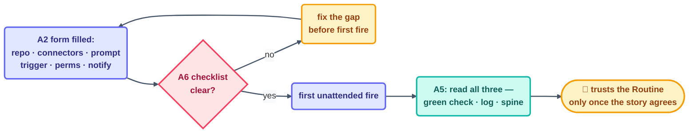

# Appendix · Routines

> Routines are the unattended, cloud-scheduled cousin of `/loop`: you fill in a form once,
> and it fires on its own — with or without you at the keyboard. This appendix is the
> field-by-field reference for using them safely. Six sections, A1–A6.

## A1 · Local vs. cloud

| | Local (`/loop`, a shell timer) | Cloud (a Routine) |
| --- | --- | --- |
| Runs when | your machine is on and the session is live | independent of your machine — a cloud scheduler owns the clock |
| Best for | short-lived, capped, self-paced or interval work you're actively watching | genuinely unattended work: overnight, weekends, "while you're in a meeting" |
| First-run risk | bounded by your attention — you're right there | higher — nothing stops it from firing while you're asleep, so the proving period matters more, not less |
| State | usually a file in your working tree | same convention — a durable file the Routine reads/writes each fire, never in-memory only |

**The rule that decides which one:** if you would be uncomfortable finding out about a bad
beat tomorrow morning instead of watching it happen, it isn't ready to be a cloud Routine
yet. Prove it locally first.

## A2 · The creation form, field by field

Every Routine creation form asks the same six questions, regardless of platform:

1. **Repo(s)** — which codebase(s) it can see. Scope to the minimum; a Routine touching
   four repos "just in case" is four times the blast radius of one that touches one.
2. **Connectors** — which external systems it can reach (SCM, Slack, a database). Each
   connector is a separate credential with its own scope — see A4.
3. **Prompt** — the body of one beat, written the same way you'd write a `/loop` prompt:
   concrete task, explicit scope, explicit stop-or-report shape.
4. **Trigger** — schedule, event, or manual (see A3). Exactly one per Routine; if you need
   two trigger types for one job, that's two Routines coordinated through a shared spine
   ([Drill 11](../projects/11-the-two-routine-gate.md)), not one Routine with two triggers.
5. **Permissions** — read vs. write, per connector, per path. This is the field that
   actually enforces every safety property you write into the prompt — see A4.
6. **Notifications** — where the run's outcome is surfaced (a channel, an email, nothing).
   Silent-by-default is fine for a proven L1 report loop; a brand-new Routine should
   notify loudly until it's earned quiet.

## A3 · The three triggers

- **Schedule** — fires on a cadence (`every 6h`, `daily at 08:00`). Best for periodic
  sweeps where staleness up to one cycle is acceptable — triage, freshness checks,
  digests.
- **Event** — fires on something happening (a push, a PR, an inbound message). Best for
  work that's wrong if it's late — a doorbell loop, a release-note drafter. Comes with
  caps: event floods are typically **dropped, not queued**, past a per-window ceiling, so
  pair an event trigger with a periodic reconciliation sweep that catches anything a cap
  dropped ([Step 7](../04-part-2-heartbeat/07-event-driven.md)).
- **Manual** — fires only when a human explicitly invokes it. Best for anything
  irreversible enough that "on a schedule" is the wrong shape entirely — a release, a
  migration, a mass-close.

## A4 · Secrets, state, identity

- **Secrets never live in the prompt or the repo.** Credentials are connector-scoped and
  injected by the platform at run time — a Routine's prompt should never contain a token,
  and its repo should never contain a real one either (see
  [Drill 10](../projects/10-the-secrets-drill.md)).
- **Identity is the connector's, not "the Routine's."** A GitHub connector authenticates
  as *some* identity — a bot account or an app install — and everything the Routine does
  is attributed to that identity. Know what it's allowed to do before the first beat, not
  after an incident.
- **State is a file, not the platform's run history.** The platform's own run list is a
  log, not a spine — durable decisions (last-seen IDs, attempt counts) belong in a
  committed state file the Routine reads and writes every beat, exactly like a local loop.
- **Least privilege, checked per Routine.** A new Routine inherits nothing from an old
  one's scope by default — grant only what this job's body actually touches.

## A5 · Reading the runs (green ≠ done)

A Routine's dashboard shows a green checkmark the moment the *process* exits without
error. That is not the same claim as "the work was correct" —
[observability.md](../10-operating/observability.md) makes this distinction for loops in
general; it applies to Routines with extra force because nobody was watching live.

- **The green check** means the beat ran to completion without crashing.
- **The run log line** means the beat's outcome was recorded honestly, including a
  "nothing happened" beat.
- **The spine** means the beat's decision was durable — visible to the *next* beat, and to
  you, without reconstruction.

Read all three before trusting a Routine's history, especially the first week. A string of
green checkmarks with a spine that never actually changed is the single most common false
sense of security this appendix exists to prevent.

## A6 · The routine safety checklist

Before a Routine's **first unattended fire**, confirm every line:

- [ ] Prompt is scoped as tightly as a `/loop` prompt would be — no vague verbs.
- [ ] Trigger matches the job (A3) — not "schedule because it was the default."
- [ ] Permissions grant only what the body touches — verified, not assumed (A4).
- [ ] A spine file exists and is committed before the first fire.
- [ ] A run/token cap is set, and the 80%-tripwire behavior is understood.
- [ ] Notifications are **on** for at least the first week.
- [ ] The kill switch (pause/disable the Routine) has been tested once, before it's needed
      for real — per [safety.md](../10-operating/safety.md).
- [ ] A human knows this Routine exists and what "normal" looks like for it.

---

*Sources:* Routines, the creation form, the three triggers, and dropped-not-queued event
caps come from *Scheduled Tasks: The Loop Skill & Cron Tools*
([S4](https://agentfactory.panaversity.org/docs/loop-engineering-crash-course)) and
Panaversity's *Loop Engineering: A Crash Course*
([S1](https://agentfactory.panaversity.org/docs/loop-engineering-crash-course)), §19; the
safety checklist condenses [safety.md](../10-operating/safety.md) and the
[loop design checklist](../09-methods/loop-design-checklist.md) for the Routine case. Full
attribution: [resources/sources.md](../../resources/sources.md).
