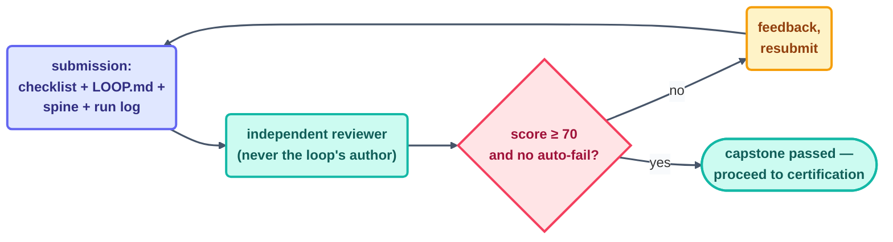

# Capstone Rubric — Grading Project 8

> Project 8, [Your Own Daily Loop](../projects/08-your-own-daily-loop-capstone.md), is the
> course's exit assessment for T3 → T4. Per this course's own rule (§12, "green ≠ done"),
> the capstone is **never self-graded** — this rubric is what a separate reviewer (a
> peer, a mentor, or a genuinely fresh AI session) applies against the submitted loop.

## What gets submitted

1. A filled-in [loop design checklist](../09-methods/loop-design-checklist.md) — every
   box answered, none left blank.
2. The loop's `LOOP.md`-equivalent (or its prompt, if informal) naming the six parts.
3. The loop's `state.md`, showing a real, multi-beat run history.
4. `shared/loop-run-log.md` lines (or equivalent) covering at least 3 real beats.
5. One paragraph: what job this loop does, and why it was chosen.

## Scoring (100 points, 70 to pass)

| Criterion | Points | What earns full credit |
| --- | --- | --- |
| **Heartbeat justified** | 10 | The chosen heartbeat (schedule/conditional/event) is explicitly justified against the job's actual shape — not defaulted |
| **Body scoped and enforced** | 15 | Body's paths/tools are named explicitly, and the scope is enforced by the harness (permissions/deny-list), not just stated in the prompt |
| **Spine committed before beat 1** | 10 | `state.md` exists in the submission's git history *before* the first real beat, not backfilled |
| **Stopping condition is a spec** | 15 | The stop is machine-checkable — a file state, a script's exit code, an empty checklist — with zero adjectives |
| **Checker is genuinely separate** | 15 | The checker is a distinct script, a separate session, or a documented human step — never the maker's own summary of its work |
| **Human gate placed correctly** | 10 | A gate sits where judgment or an irreversible action concentrates — named explicitly, not implied |
| **Three stops demonstrated** | 10 | Success, limit, and no-progress are all shown in the real run history, not just described in the design |
| **Honest spine narrative** | 10 | The spine reads like a diary — includes at least one real discrepancy, lesson, or escalation, not a spotless retelling |
| **Run log discipline** | 5 | One line per real beat, no gaps, including any "nothing happened" beats |

## Automatic point deductions

- **−15** if any beat ran without a committed spine update before the next beat started.
- **−10** if the "checker" and "maker" turn out to be the same session/context with no
  actual independence.
- **−10** if the submission shows only one successful run — a single green beat does not
  demonstrate a proving period, per [safety.md](../10-operating/safety.md).
- **Automatic fail** if the loop wrote outside its declared body scope during the
  submitted run history, regardless of other scores — a scope violation is exactly the
  failure this whole rubric exists to catch.

## Grading process

The reviewer must be someone (or some session) who did **not** author the loop under
review — the same maker≠checker rule this course applies everywhere else, applied one
more time to grading itself.

## When it goes wrong

| Symptom | Cause | Fix |
| --- | --- | --- |
| Author grades their own capstone | No independent reviewer assigned | Route every submission through someone who wasn't in the room when it was built |
| High score despite a scope violation in the run history | Reviewer skipped checking the automatic-fail conditions first | Check auto-fail conditions before scoring anything else — they override the point total |
| Rubric passed, but the loop clearly wouldn't survive a real week of use | Scoring rewarded description over demonstration | Weight run-history evidence over design-document polish, per the point table above |

---

*Sources:* this rubric operationalizes the T4 exit assessment named in
[learning-tracks.md](../00-start-here/learning-tracks.md) ("design, justify, and govern a
... system against the rubric") and the minimum-safe checklist from `CLAUDE.md` rule 5,
both grounded in Panaversity's *Loop Engineering: A Crash Course*
([S1](https://agentfactory.panaversity.org/docs/loop-engineering-crash-course)) and the
maker≠checker principle of [Step 11](../05-part-3-the-body/11-maker-checker.md). Full
attribution: [resources/sources.md](../../resources/sources.md).
