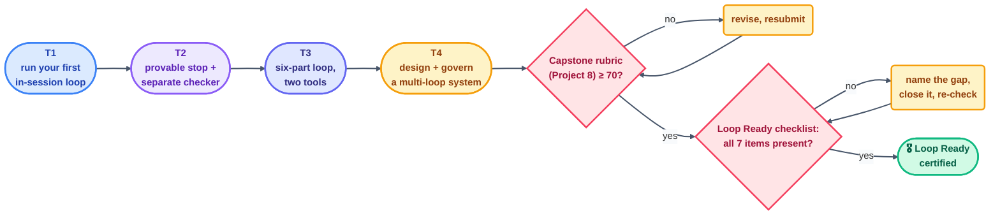

# Loop Ready Certification

> The graduation criteria for this entire course. Where the [final exam](final-exam.md)
> tests what you know and the [capstone rubric](capstone-rubric.md) grades one loop you
> built, this page is the single bar every track's exit assessment has been building
> toward: the **Loop Ready checklist**, applied for real, to a loop you can point at.

## What "Loop Ready" means

Per `loop-plan.md` §17, Loop Ready is an interactive, seven-item checklist — the same
seven items this repo's own [minimum-safe checklist](../../CLAUDE.md) has required of
every loop since Day 1, and the same seven the
[loop design checklist](../09-methods/loop-design-checklist.md) walks you through filling
in:

| # | Item | What proves it |
| - | ---- | -------------- |
| 1 | **Success condition** | Written as a spec, verified against real output — not asserted |
| 2 | **Run limit** | A number in the design, and evidence it was respected across the submitted run history |
| 3 | **Isolated branch/worktree** | The loop never edited the primary working tree directly during a fix/write beat |
| 4 | **Read-only checker** | A checker that is provably separate from the maker, with zero write access |
| 5 | **State file** | A spine, committed *before* beat 1, with a real (not fabricated) history |
| 6 | **Human gate** | Named explicitly, placed where judgment or an irreversible action concentrates |
| 7 | **A log/notification** | One line per beat, including "nothing happened" beats, in a shared or accessible log |

A **score**, not a pass/fail, is standard practice per the reference repo's own
`loop-audit --badge` tooling: each of the seven items scores present/absent/partial, and
the badge names the total. This course's own certification bar is **all seven present**,
not partial credit — a loop that's "mostly" isolated or "usually" logs isn't Loop Ready,
it's a loop with a known gap.

## The certification path

## What to submit for certification

1. Evidence you cleared each track's exit assessment (T1→T4), per
   [learning-tracks.md](../00-start-here/learning-tracks.md) — this can be your own
   project submissions across Projects 1–8.
2. A passing [capstone rubric](capstone-rubric.md) score (≥70) on your Project 8 loop.
3. The Loop Ready checklist, filled in against that same loop, all seven items marked
   present with evidence — not just checked from memory.
4. One written paragraph naming the loop's biggest remaining risk, even after
   certification — a certified loop is not a risk-free loop, and naming the risk honestly
   is itself part of the bar (this course's own "green ≠ done" rule, applied to the
   certificate).

## What certification does *not* mean

- It does not mean the loop may run at L3 unattended — autonomy is still earned
  separately, per [safety.md](../10-operating/safety.md)'s ladder, one proven level at a
  time.
- It does not mean the loop is done forever — a certified loop still needs its budget
  watched, its checker re-evaluated (see [evals-and-traces.md](../advanced/evals-and-traces.md)),
  and its spine read.
- It does not transfer to a different loop — certification is per-loop, not a credential
  that makes your *next* loop exempt from the same checklist.

## When it goes wrong

| Symptom | Cause | Fix |
| --- | --- | --- |
| Certified loop breaks in its second week | Certification checked the loop's design, not its ongoing operation | Pair certification with the observability discipline — read the spine and log weekly, not just once |
| Checklist marked complete without real evidence | Self-certified against memory, not artifacts | Require the same artifacts the capstone rubric requires — spine, log, checker output |
| "Loop Ready" used to justify skipping L1 | Certification conflated with autonomy | Keep the two separate — certification proves the *design*; the autonomy ladder is proven separately, by *history* |

---

*Sources:* the Loop Ready checklist and score-not-pass/fail convention come from
`loop-plan.md` §17, the reference repo's own `loop-audit`/`loop-init` tooling
([S7](https://github.com/cobusgreyling/loop-engineering), MIT), and Panaversity's *Loop
Engineering: A Crash Course*
([S1](https://agentfactory.panaversity.org/docs/loop-engineering-crash-course)); the
track progression it certifies is documented in full in
[learning-tracks.md](../00-start-here/learning-tracks.md). Full attribution:
[resources/sources.md](../../resources/sources.md).
